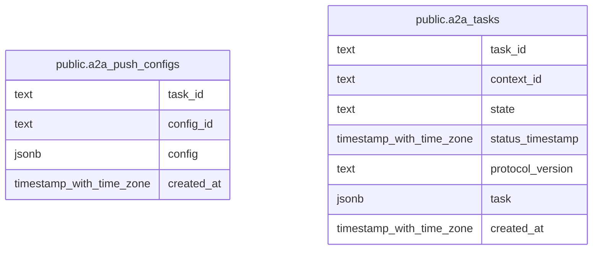

# t-rader agent

## Tables

| Name                                                  | Columns | Comment | Type       |
| ----------------------------------------------------- | ------- | ------- | ---------- |
| [public.a2a_push_configs](public.a2a_push_configs.md) | 4       |         | BASE TABLE |
| [public.a2a_tasks](public.a2a_tasks.md)               | 7       |         | BASE TABLE |

## Relations

---

> Generated by [tbls](https://github.com/k1LoW/tbls)
