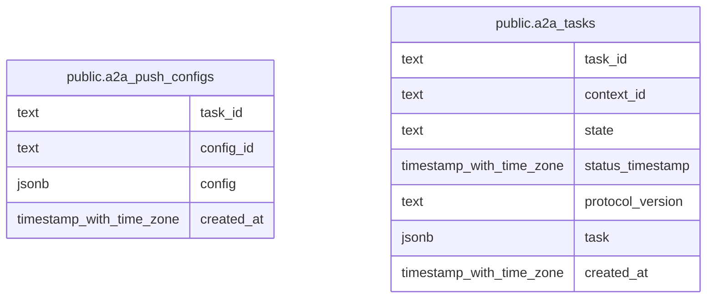

# t-rader agent

## Tables

| Name                                                  | Columns | Comment                                                                    | Type       |
| ----------------------------------------------------- | ------- | -------------------------------------------------------------------------- | ---------- |
| [public.a2a_push_configs](public.a2a_push_configs.md) | 4       | A2A push 通知設定をタスクと設定 ID ごとに永続化するテーブル。              | BASE TABLE |
| [public.a2a_tasks](public.a2a_tasks.md)               | 7       | A2A タスク本体と、状態検索や実行停滞の判定に使う項目を永続化するテーブル。 | BASE TABLE |

## Relations

---

> Generated by [tbls](https://github.com/k1LoW/tbls)
