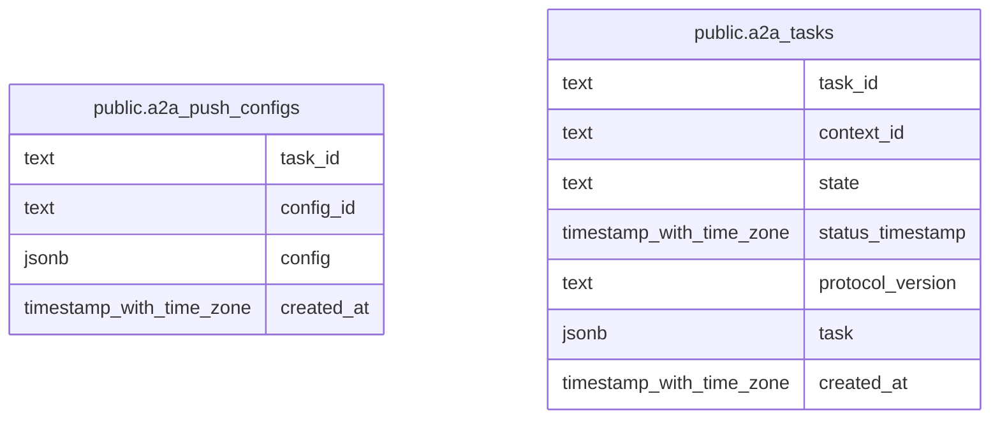

# t-rader agent

## Tables

| Name                                                  | Columns | Comment                                                                    | Type       |
| ----------------------------------------------------- | ------- | -------------------------------------------------------------------------- | ---------- |
| [public.a2a_push_configs](public.a2a_push_configs.md) | 4       | A2A push 通知設定をタスクと設定 ID ごとに永続化するテーブル。              | BASE TABLE |
| [public.a2a_tasks](public.a2a_tasks.md)               | 7       | A2A タスク本体と、状態検索や実行停滞の判定に使う項目を永続化するテーブル。 | BASE TABLE |

## Stored procedures and functions

| Name                                                  | ReturnType     | Arguments                                                                                                                                                                                                                                                                                                                                                                                                                                                                                                                                                                                                                                                          | Type      |
| ----------------------------------------------------- | -------------- | ------------------------------------------------------------------------------------------------------------------------------------------------------------------------------------------------------------------------------------------------------------------------------------------------------------------------------------------------------------------------------------------------------------------------------------------------------------------------------------------------------------------------------------------------------------------------------------------------------------------------------------------------------------------ | --------- |
| public.set_integer_now_func                           | void           | hypertable regclass, integer_now_func regproc, replace_if_exists boolean DEFAULT false                                                                                                                                                                                                                                                                                                                                                                                                                                                                                                                                                                             | FUNCTION  |
| public.detach_chunk                                   | void           | IN chunk regclass                                                                                                                                                                                                                                                                                                                                                                                                                                                                                                                                                                                                                                                  | PROCEDURE |
| public.attach_chunk                                   | void           | IN hypertable regclass, IN chunk regclass, IN slices jsonb                                                                                                                                                                                                                                                                                                                                                                                                                                                                                                                                                                                                         | PROCEDURE |
| public.create_hypertable                              | record         | relation regclass, time_column_name name, partitioning_column name DEFAULT NULL::name, number_partitions integer DEFAULT NULL::integer, associated_schema_name name DEFAULT NULL::name, associated_table_prefix name DEFAULT NULL::name, chunk_time_interval anyelement DEFAULT NULL::bigint, create_default_indexes boolean DEFAULT true, if_not_exists boolean DEFAULT false, partitioning_func regproc DEFAULT NULL::regproc, migrate_data boolean DEFAULT false, chunk_target_size text DEFAULT NULL::text, chunk_sizing_func regproc DEFAULT '_timescaledb_functions.calculate_chunk_interval'::regproc, time_partitioning_func regproc DEFAULT NULL::regproc | FUNCTION  |
| public.create_hypertable                              | record         | relation regclass, dimension _timescaledb_internal.dimension_info, create_default_indexes boolean DEFAULT true, if_not_exists boolean DEFAULT false, migrate_data boolean DEFAULT false                                                                                                                                                                                                                                                                                                                                                                                                                                                                            | FUNCTION  |
| public.set_adaptive_chunking                          | record         | hypertable regclass, chunk_target_size text, INOUT chunk_sizing_func regproc DEFAULT '_timescaledb_functions.calculate_chunk_interval'::regproc, OUT chunk_target_size bigint                                                                                                                                                                                                                                                                                                                                                                                                                                                                                      | FUNCTION  |
| public.set_chunk_time_interval                        | void           | hypertable regclass, chunk_time_interval anyelement, dimension_name name DEFAULT NULL::name                                                                                                                                                                                                                                                                                                                                                                                                                                                                                                                                                                        | FUNCTION  |
| public.set_partitioning_interval                      | void           | hypertable regclass, partition_interval anyelement, dimension_name name DEFAULT NULL::name                                                                                                                                                                                                                                                                                                                                                                                                                                                                                                                                                                         | FUNCTION  |
| public.set_number_partitions                          | void           | hypertable regclass, number_partitions integer, dimension_name name DEFAULT NULL::name                                                                                                                                                                                                                                                                                                                                                                                                                                                                                                                                                                             | FUNCTION  |
| public.drop_chunks                                    | text           | relation regclass, older_than "any" DEFAULT NULL::unknown, newer_than "any" DEFAULT NULL::unknown, "verbose" boolean DEFAULT false, created_before "any" DEFAULT NULL::unknown, created_after "any" DEFAULT NULL::unknown                                                                                                                                                                                                                                                                                                                                                                                                                                          | FUNCTION  |
| public.show_chunks                                    | regclass       | relation regclass, older_than "any" DEFAULT NULL::unknown, newer_than "any" DEFAULT NULL::unknown, created_before "any" DEFAULT NULL::unknown, created_after "any" DEFAULT NULL::unknown                                                                                                                                                                                                                                                                                                                                                                                                                                                                           | FUNCTION  |
| public.add_dimension                                  | record         | hypertable regclass, column_name name, number_partitions integer DEFAULT NULL::integer, chunk_time_interval anyelement DEFAULT NULL::bigint, partitioning_func regproc DEFAULT NULL::regproc, if_not_exists boolean DEFAULT false                                                                                                                                                                                                                                                                                                                                                                                                                                  | FUNCTION  |
| public.add_dimension                                  | record         | hypertable regclass, dimension _timescaledb_internal.dimension_info, if_not_exists boolean DEFAULT false                                                                                                                                                                                                                                                                                                                                                                                                                                                                                                                                                           | FUNCTION  |
| public.enable_chunk_skipping                          | record         | hypertable regclass, column_name name, if_not_exists boolean DEFAULT false                                                                                                                                                                                                                                                                                                                                                                                                                                                                                                                                                                                         | FUNCTION  |
| public.disable_chunk_skipping                         | record         | hypertable regclass, column_name name, if_not_exists boolean DEFAULT false                                                                                                                                                                                                                                                                                                                                                                                                                                                                                                                                                                                         | FUNCTION  |
| public.by_hash                                        | dimension_info | column_name name, number_partitions integer, partition_func regproc DEFAULT NULL::regproc                                                                                                                                                                                                                                                                                                                                                                                                                                                                                                                                                                          | FUNCTION  |
| public.by_range                                       | dimension_info | column_name name, partition_interval anyelement DEFAULT NULL::bigint, partition_func regproc DEFAULT NULL::regproc                                                                                                                                                                                                                                                                                                                                                                                                                                                                                                                                                 | FUNCTION  |
| public.attach_tablespace                              | void           | tablespace name, hypertable regclass, if_not_attached boolean DEFAULT false                                                                                                                                                                                                                                                                                                                                                                                                                                                                                                                                                                                        | FUNCTION  |
| public.detach_tablespace                              | int4           | tablespace name, hypertable regclass DEFAULT NULL::regclass, if_attached boolean DEFAULT false                                                                                                                                                                                                                                                                                                                                                                                                                                                                                                                                                                     | FUNCTION  |
| public.detach_tablespaces                             | int4           | hypertable regclass                                                                                                                                                                                                                                                                                                                                                                                                                                                                                                                                                                                                                                                | FUNCTION  |
| public.show_tablespaces                               | name           | hypertable regclass                                                                                                                                                                                                                                                                                                                                                                                                                                                                                                                                                                                                                                                | FUNCTION  |
| public.refresh_continuous_aggregate                   | void           | IN continuous_aggregate regclass, IN window_start "any", IN window_end "any", IN force boolean DEFAULT false, IN options jsonb DEFAULT NULL::jsonb                                                                                                                                                                                                                                                                                                                                                                                                                                                                                                                 | PROCEDURE |
| public.first                                          | anyelement     | anyelement, "any"                                                                                                                                                                                                                                                                                                                                                                                                                                                                                                                                                                                                                                                  | a         |
| public.last                                           | anyelement     | anyelement, "any"                                                                                                                                                                                                                                                                                                                                                                                                                                                                                                                                                                                                                                                  | a         |
| public.time_bucket                                    | timestamp      | bucket_width interval, ts timestamp without time zone                                                                                                                                                                                                                                                                                                                                                                                                                                                                                                                                                                                                              | FUNCTION  |
| public.time_bucket                                    | timestamptz    | bucket_width interval, ts timestamp with time zone                                                                                                                                                                                                                                                                                                                                                                                                                                                                                                                                                                                                                 | FUNCTION  |
| public.time_bucket                                    | date           | bucket_width interval, ts date                                                                                                                                                                                                                                                                                                                                                                                                                                                                                                                                                                                                                                     | FUNCTION  |
| public.time_bucket                                    | timestamptz    | bucket_width interval, ts uuid                                                                                                                                                                                                                                                                                                                                                                                                                                                                                                                                                                                                                                     | FUNCTION  |
| public.time_bucket                                    | timestamp      | bucket_width interval, ts timestamp without time zone, origin timestamp without time zone                                                                                                                                                                                                                                                                                                                                                                                                                                                                                                                                                                          | FUNCTION  |
| public.time_bucket                                    | timestamptz    | bucket_width interval, ts timestamp with time zone, origin timestamp with time zone                                                                                                                                                                                                                                                                                                                                                                                                                                                                                                                                                                                | FUNCTION  |
| public.time_bucket                                    | date           | bucket_width interval, ts date, origin date                                                                                                                                                                                                                                                                                                                                                                                                                                                                                                                                                                                                                        | FUNCTION  |
| public.time_bucket                                    | timestamptz    | bucket_width interval, ts uuid, origin timestamp with time zone                                                                                                                                                                                                                                                                                                                                                                                                                                                                                                                                                                                                    | FUNCTION  |
| public.time_bucket                                    | timestamp      | bucket_width interval, ts timestamp without time zone, "offset" interval                                                                                                                                                                                                                                                                                                                                                                                                                                                                                                                                                                                           | FUNCTION  |
| public.time_bucket                                    | timestamptz    | bucket_width interval, ts timestamp with time zone, "offset" interval                                                                                                                                                                                                                                                                                                                                                                                                                                                                                                                                                                                              | FUNCTION  |
| public.time_bucket                                    | date           | bucket_width interval, ts date, "offset" interval                                                                                                                                                                                                                                                                                                                                                                                                                                                                                                                                                                                                                  | FUNCTION  |
| public.time_bucket                                    | timestamptz    | bucket_width interval, ts uuid, "offset" interval                                                                                                                                                                                                                                                                                                                                                                                                                                                                                                                                                                                                                  | FUNCTION  |
| public.time_bucket                                    | timestamptz    | bucket_width interval, ts timestamp with time zone, timezone text, origin timestamp with time zone DEFAULT NULL::timestamp with time zone, "offset" interval DEFAULT NULL::interval                                                                                                                                                                                                                                                                                                                                                                                                                                                                                | FUNCTION  |
| public.time_bucket                                    | timestamptz    | bucket_width interval, ts uuid, timezone text, origin timestamp with time zone DEFAULT NULL::timestamp with time zone, "offset" interval DEFAULT NULL::interval                                                                                                                                                                                                                                                                                                                                                                                                                                                                                                    | FUNCTION  |
| public.time_bucket                                    | int2           | bucket_width smallint, ts smallint                                                                                                                                                                                                                                                                                                                                                                                                                                                                                                                                                                                                                                 | FUNCTION  |
| public.time_bucket                                    | int4           | bucket_width integer, ts integer                                                                                                                                                                                                                                                                                                                                                                                                                                                                                                                                                                                                                                   | FUNCTION  |
| public.time_bucket                                    | int8           | bucket_width bigint, ts bigint                                                                                                                                                                                                                                                                                                                                                                                                                                                                                                                                                                                                                                     | FUNCTION  |
| public.time_bucket                                    | int2           | bucket_width smallint, ts smallint, "offset" smallint                                                                                                                                                                                                                                                                                                                                                                                                                                                                                                                                                                                                              | FUNCTION  |
| public.time_bucket                                    | int4           | bucket_width integer, ts integer, "offset" integer                                                                                                                                                                                                                                                                                                                                                                                                                                                                                                                                                                                                                 | FUNCTION  |
| public.time_bucket                                    | int8           | bucket_width bigint, ts bigint, "offset" bigint                                                                                                                                                                                                                                                                                                                                                                                                                                                                                                                                                                                                                    | FUNCTION  |
| public.hypertable_detailed_size                       | record         | hypertable regclass                                                                                                                                                                                                                                                                                                                                                                                                                                                                                                                                                                                                                                                | FUNCTION  |
| public.hypertable_size                                | int8           | hypertable regclass                                                                                                                                                                                                                                                                                                                                                                                                                                                                                                                                                                                                                                                | FUNCTION  |
| public.hypertable_approximate_detailed_size           | record         | relation regclass                                                                                                                                                                                                                                                                                                                                                                                                                                                                                                                                                                                                                                                  | FUNCTION  |
| public.hypertable_approximate_size                    | int8           | hypertable regclass                                                                                                                                                                                                                                                                                                                                                                                                                                                                                                                                                                                                                                                | FUNCTION  |
| public.chunks_detailed_size                           | record         | hypertable regclass                                                                                                                                                                                                                                                                                                                                                                                                                                                                                                                                                                                                                                                | FUNCTION  |
| public.approximate_row_count                          | int8           | relation regclass                                                                                                                                                                                                                                                                                                                                                                                                                                                                                                                                                                                                                                                  | FUNCTION  |
| public.chunk_compression_stats                        | record         | hypertable regclass                                                                                                                                                                                                                                                                                                                                                                                                                                                                                                                                                                                                                                                | FUNCTION  |
| public.chunk_columnstore_stats                        | record         | hypertable regclass                                                                                                                                                                                                                                                                                                                                                                                                                                                                                                                                                                                                                                                | FUNCTION  |
| public.hypertable_compression_stats                   | record         | hypertable regclass                                                                                                                                                                                                                                                                                                                                                                                                                                                                                                                                                                                                                                                | FUNCTION  |
| public.hypertable_columnstore_stats                   | record         | hypertable regclass                                                                                                                                                                                                                                                                                                                                                                                                                                                                                                                                                                                                                                                | FUNCTION  |
| public.hypertable_index_size                          | int8           | index_name regclass                                                                                                                                                                                                                                                                                                                                                                                                                                                                                                                                                                                                                                                | FUNCTION  |
| public.histogram                                      | _int4          | double precision, double precision, double precision, integer                                                                                                                                                                                                                                                                                                                                                                                                                                                                                                                                                                                                      | a         |
| public.generate_uuidv7                                | uuid           |                                                                                                                                                                                                                                                                                                                                                                                                                                                                                                                                                                                                                                                                    | FUNCTION  |
| public.to_uuidv7                                      | uuid           | ts timestamp with time zone                                                                                                                                                                                                                                                                                                                                                                                                                                                                                                                                                                                                                                        | FUNCTION  |
| public.to_uuidv7_boundary                             | uuid           | ts timestamp with time zone                                                                                                                                                                                                                                                                                                                                                                                                                                                                                                                                                                                                                                        | FUNCTION  |
| public.uuid_timestamp                                 | timestamptz    | uuid uuid                                                                                                                                                                                                                                                                                                                                                                                                                                                                                                                                                                                                                                                          | FUNCTION  |
| public.uuid_timestamp_micros                          | timestamptz    | uuid uuid                                                                                                                                                                                                                                                                                                                                                                                                                                                                                                                                                                                                                                                          | FUNCTION  |
| public.uuid_version                                   | int4           | uuid uuid                                                                                                                                                                                                                                                                                                                                                                                                                                                                                                                                                                                                                                                          | FUNCTION  |
| public.time_bucket_gapfill                            | int2           | bucket_width smallint, ts smallint, start smallint DEFAULT NULL::smallint, finish smallint DEFAULT NULL::smallint                                                                                                                                                                                                                                                                                                                                                                                                                                                                                                                                                  | FUNCTION  |
| public.time_bucket_gapfill                            | int4           | bucket_width integer, ts integer, start integer DEFAULT NULL::integer, finish integer DEFAULT NULL::integer                                                                                                                                                                                                                                                                                                                                                                                                                                                                                                                                                        | FUNCTION  |
| public.time_bucket_gapfill                            | int8           | bucket_width bigint, ts bigint, start bigint DEFAULT NULL::bigint, finish bigint DEFAULT NULL::bigint                                                                                                                                                                                                                                                                                                                                                                                                                                                                                                                                                              | FUNCTION  |
| public.time_bucket_gapfill                            | date           | bucket_width interval, ts date, start date DEFAULT NULL::date, finish date DEFAULT NULL::date                                                                                                                                                                                                                                                                                                                                                                                                                                                                                                                                                                      | FUNCTION  |
| public.time_bucket_gapfill                            | timestamp      | bucket_width interval, ts timestamp without time zone, start timestamp without time zone DEFAULT NULL::timestamp without time zone, finish timestamp without time zone DEFAULT NULL::timestamp without time zone                                                                                                                                                                                                                                                                                                                                                                                                                                                   | FUNCTION  |
| public.time_bucket_gapfill                            | timestamptz    | bucket_width interval, ts timestamp with time zone, start timestamp with time zone DEFAULT NULL::timestamp with time zone, finish timestamp with time zone DEFAULT NULL::timestamp with time zone                                                                                                                                                                                                                                                                                                                                                                                                                                                                  | FUNCTION  |
| public.time_bucket_gapfill                            | timestamptz    | bucket_width interval, ts timestamp with time zone, timezone text, start timestamp with time zone DEFAULT NULL::timestamp with time zone, finish timestamp with time zone DEFAULT NULL::timestamp with time zone                                                                                                                                                                                                                                                                                                                                                                                                                                                   | FUNCTION  |
| public.locf                                           | anyelement     | value anyelement, prev anyelement DEFAULT NULL::unknown, treat_null_as_missing boolean DEFAULT false                                                                                                                                                                                                                                                                                                                                                                                                                                                                                                                                                               | FUNCTION  |
| public.interpolate                                    | int2           | value smallint, prev record DEFAULT NULL::record, next record DEFAULT NULL::record                                                                                                                                                                                                                                                                                                                                                                                                                                                                                                                                                                                 | FUNCTION  |
| public.interpolate                                    | int4           | value integer, prev record DEFAULT NULL::record, next record DEFAULT NULL::record                                                                                                                                                                                                                                                                                                                                                                                                                                                                                                                                                                                  | FUNCTION  |
| public.interpolate                                    | int8           | value bigint, prev record DEFAULT NULL::record, next record DEFAULT NULL::record                                                                                                                                                                                                                                                                                                                                                                                                                                                                                                                                                                                   | FUNCTION  |
| public.interpolate                                    | float4         | value real, prev record DEFAULT NULL::record, next record DEFAULT NULL::record                                                                                                                                                                                                                                                                                                                                                                                                                                                                                                                                                                                     | FUNCTION  |
| public.interpolate                                    | float8         | value double precision, prev record DEFAULT NULL::record, next record DEFAULT NULL::record                                                                                                                                                                                                                                                                                                                                                                                                                                                                                                                                                                         | FUNCTION  |
| public.reorder_chunk                                  | void           | chunk regclass, index regclass DEFAULT NULL::regclass, "verbose" boolean DEFAULT false                                                                                                                                                                                                                                                                                                                                                                                                                                                                                                                                                                             | FUNCTION  |
| public.move_chunk                                     | void           | chunk regclass, destination_tablespace name, index_destination_tablespace name DEFAULT NULL::name, reorder_index regclass DEFAULT NULL::regclass, "verbose" boolean DEFAULT false                                                                                                                                                                                                                                                                                                                                                                                                                                                                                  | FUNCTION  |
| public.compress_chunk                                 | regclass       | uncompressed_chunk regclass, if_not_compressed boolean DEFAULT true, recompress boolean DEFAULT false                                                                                                                                                                                                                                                                                                                                                                                                                                                                                                                                                              | FUNCTION  |
| public.convert_to_columnstore                         | void           | IN chunk regclass, IN if_not_columnstore boolean DEFAULT true, IN recompress boolean DEFAULT false                                                                                                                                                                                                                                                                                                                                                                                                                                                                                                                                                                 | PROCEDURE |
| public.decompress_chunk                               | regclass       | uncompressed_chunk regclass, if_compressed boolean DEFAULT true                                                                                                                                                                                                                                                                                                                                                                                                                                                                                                                                                                                                    | FUNCTION  |
| public.convert_to_rowstore                            | void           | IN chunk regclass, IN if_columnstore boolean DEFAULT true                                                                                                                                                                                                                                                                                                                                                                                                                                                                                                                                                                                                          | PROCEDURE |
| public.merge_chunks                                   | void           | IN chunk1 regclass, IN chunk2 regclass, IN "concurrently" boolean DEFAULT false                                                                                                                                                                                                                                                                                                                                                                                                                                                                                                                                                                                    | PROCEDURE |
| public.merge_chunks                                   | void           | IN chunks regclass[]                                                                                                                                                                                                                                                                                                                                                                                                                                                                                                                                                                                                                                               | PROCEDURE |
| public.merge_chunks_concurrently                      | void           | IN chunks regclass[]                                                                                                                                                                                                                                                                                                                                                                                                                                                                                                                                                                                                                                               | PROCEDURE |
| public.split_chunk                                    | void           | IN chunk regclass, IN split_at "any" DEFAULT NULL::unknown                                                                                                                                                                                                                                                                                                                                                                                                                                                                                                                                                                                                         | PROCEDURE |
| public.recompress_chunk                               | void           | IN chunk regclass, IN if_not_compressed boolean DEFAULT true                                                                                                                                                                                                                                                                                                                                                                                                                                                                                                                                                                                                       | PROCEDURE |
| public.timescaledb_pre_restore                        | bool           |                                                                                                                                                                                                                                                                                                                                                                                                                                                                                                                                                                                                                                                                    | FUNCTION  |
| public.timescaledb_post_restore                       | bool           |                                                                                                                                                                                                                                                                                                                                                                                                                                                                                                                                                                                                                                                                    | FUNCTION  |
| public.add_job                                        | int4           | proc regproc, schedule_interval interval, config jsonb DEFAULT NULL::jsonb, initial_start timestamp with time zone DEFAULT NULL::timestamp with time zone, scheduled boolean DEFAULT true, check_config regproc DEFAULT NULL::regproc, fixed_schedule boolean DEFAULT true, timezone text DEFAULT NULL::text, job_name text DEFAULT NULL::text                                                                                                                                                                                                                                                                                                                     | FUNCTION  |
| public.delete_job                                     | void           | job_id integer                                                                                                                                                                                                                                                                                                                                                                                                                                                                                                                                                                                                                                                     | FUNCTION  |
| public.run_job                                        | void           | IN job_id integer                                                                                                                                                                                                                                                                                                                                                                                                                                                                                                                                                                                                                                                  | PROCEDURE |
| public.alter_job                                      | record         | job_id integer, schedule_interval interval DEFAULT NULL::interval, max_runtime interval DEFAULT NULL::interval, max_retries integer DEFAULT NULL::integer, retry_period interval DEFAULT NULL::interval, scheduled boolean DEFAULT NULL::boolean, config jsonb DEFAULT NULL::jsonb, next_start timestamp with time zone DEFAULT NULL::timestamp with time zone, if_exists boolean DEFAULT false, check_config regproc DEFAULT NULL::regproc, fixed_schedule boolean DEFAULT NULL::boolean, initial_start timestamp with time zone DEFAULT NULL::timestamp with time zone, timezone text DEFAULT NULL::text, job_name text DEFAULT NULL::text                       | FUNCTION  |
| public.add_retention_policy                           | int4           | relation regclass, drop_after "any" DEFAULT NULL::unknown, if_not_exists boolean DEFAULT false, schedule_interval interval DEFAULT NULL::interval, initial_start timestamp with time zone DEFAULT NULL::timestamp with time zone, timezone text DEFAULT NULL::text, drop_created_before interval DEFAULT NULL::interval                                                                                                                                                                                                                                                                                                                                            | FUNCTION  |
| public.remove_retention_policy                        | void           | relation regclass, if_exists boolean DEFAULT false                                                                                                                                                                                                                                                                                                                                                                                                                                                                                                                                                                                                                 | FUNCTION  |
| public.add_reorder_policy                             | int4           | hypertable regclass, index_name name, if_not_exists boolean DEFAULT false, initial_start timestamp with time zone DEFAULT NULL::timestamp with time zone, timezone text DEFAULT NULL::text                                                                                                                                                                                                                                                                                                                                                                                                                                                                         | FUNCTION  |
| public.remove_reorder_policy                          | void           | hypertable regclass, if_exists boolean DEFAULT false                                                                                                                                                                                                                                                                                                                                                                                                                                                                                                                                                                                                               | FUNCTION  |
| public.add_compression_policy                         | int4           | hypertable regclass, compress_after "any" DEFAULT NULL::unknown, if_not_exists boolean DEFAULT false, schedule_interval interval DEFAULT NULL::interval, initial_start timestamp with time zone DEFAULT NULL::timestamp with time zone, timezone text DEFAULT NULL::text, compress_created_before interval DEFAULT NULL::interval                                                                                                                                                                                                                                                                                                                                  | FUNCTION  |
| public.add_columnstore_policy                         | void           | IN hypertable regclass, IN after "any" DEFAULT NULL::unknown, IN if_not_exists boolean DEFAULT false, IN schedule_interval interval DEFAULT NULL::interval, IN initial_start timestamp with time zone DEFAULT NULL::timestamp with time zone, IN timezone text DEFAULT NULL::text, IN created_before interval DEFAULT NULL::interval                                                                                                                                                                                                                                                                                                                               | PROCEDURE |
| public.remove_compression_policy                      | bool           | hypertable regclass, if_exists boolean DEFAULT false                                                                                                                                                                                                                                                                                                                                                                                                                                                                                                                                                                                                               | FUNCTION  |
| public.remove_columnstore_policy                      | void           | IN hypertable regclass, IN if_exists boolean DEFAULT false                                                                                                                                                                                                                                                                                                                                                                                                                                                                                                                                                                                                         | PROCEDURE |
| public.add_continuous_aggregate_policy                | int4           | continuous_aggregate regclass, start_offset "any", end_offset "any", schedule_interval interval, if_not_exists boolean DEFAULT false, initial_start timestamp with time zone DEFAULT NULL::timestamp with time zone, timezone text DEFAULT NULL::text, include_tiered_data boolean DEFAULT NULL::boolean, buckets_per_batch integer DEFAULT NULL::integer, max_batches_per_execution integer DEFAULT NULL::integer, refresh_newest_first boolean DEFAULT NULL::boolean                                                                                                                                                                                             | FUNCTION  |
| public.remove_continuous_aggregate_policy             | void           | continuous_aggregate regclass, if_not_exists boolean DEFAULT false, if_exists boolean DEFAULT NULL::boolean                                                                                                                                                                                                                                                                                                                                                                                                                                                                                                                                                        | FUNCTION  |
| public.add_process_hypertable_invalidations_policy    | void           | IN hypertable regclass, IN schedule_interval interval, IN if_not_exists boolean DEFAULT false, IN initial_start timestamp with time zone DEFAULT NULL::timestamp with time zone, IN timezone text DEFAULT NULL::text                                                                                                                                                                                                                                                                                                                                                                                                                                               | PROCEDURE |
| public.remove_process_hypertable_invalidations_policy | void           | IN hypertable regclass, IN if_exists boolean DEFAULT false                                                                                                                                                                                                                                                                                                                                                                                                                                                                                                                                                                                                         | PROCEDURE |
| public.get_telemetry_report                           | jsonb          |                                                                                                                                                                                                                                                                                                                                                                                                                                                                                                                                                                                                                                                                    | FUNCTION  |

## Relations

---

> Generated by [tbls](https://github.com/k1LoW/tbls)
