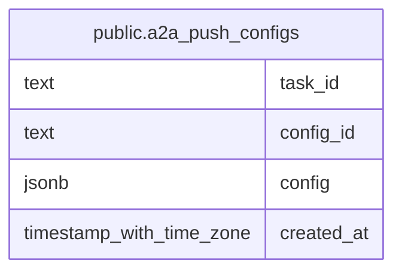

# public.a2a_push_configs

## Description

A2A push 通知設定をタスクと設定 ID ごとに永続化するテーブル。

## Columns

| Name       | Type                     | Default | Nullable | Children | Parents | Comment                                                        |
| ---------- | ------------------------ | ------- | -------- | -------- | ------- | -------------------------------------------------------------- |
| task_id    | text                     |         | false    |          |         | push 通知設定が紐づく A2A タスクの識別子。                     |
| config_id  | text                     |         | false    |          |         | push 通知設定の識別子。設定に ID がない場合は task_id を使う。 |
| config     | jsonb                    |         | false    |          |         | A2A PushNotificationConfig オブジェクト。                      |
| created_at | timestamp with time zone | now()   | false    |          |         |                                                                |

## Constraints

| Name                                  | Type        | Definition                       |
| ------------------------------------- | ----------- | -------------------------------- |
| a2a_push_configs_task_id_config_id_pk | PRIMARY KEY | PRIMARY KEY (task_id, config_id) |

## Indexes

| Name                                  | Definition                                                                                                            |
| ------------------------------------- | --------------------------------------------------------------------------------------------------------------------- |
| a2a_push_configs_task_id_config_id_pk | CREATE UNIQUE INDEX a2a_push_configs_task_id_config_id_pk ON public.a2a_push_configs USING btree (task_id, config_id) |

## Relations

---

> Generated by [tbls](https://github.com/k1LoW/tbls)
