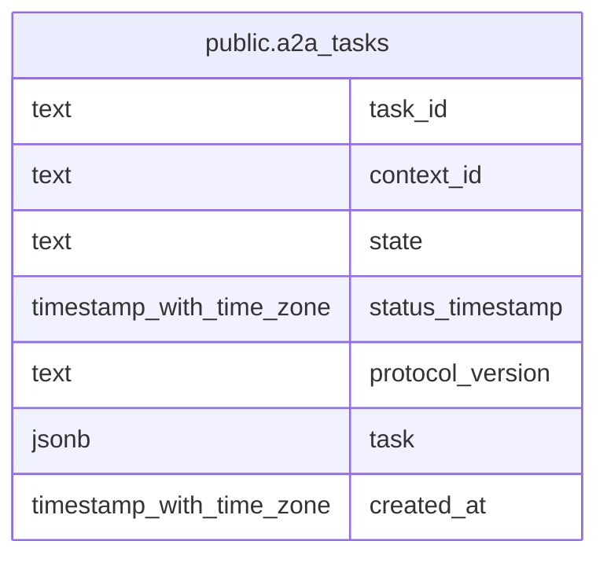

# public.a2a_tasks

## Description

A2A タスク本体と、状態検索や実行停滞の判定に使う項目を永続化するテーブル。

## Columns

| Name             | Type                     | Default     | Nullable | Children | Parents | Comment                                                                                          |
| ---------------- | ------------------------ | ----------- | -------- | -------- | ------- | ------------------------------------------------------------------------------------------------ |
| task_id          | text                     |             | false    |          |         | A2A タスクの識別子。Task.id を保存する。                                                         |
| context_id       | text                     |             | false    |          |         | タスクが属する A2A コンテキストの識別子。                                                        |
| state            | text                     |             | false    |          |         | タスクの現在の状態。Task.status.state を保存する。                                               |
| status_timestamp | timestamp with time zone |             | false    |          |         | タスク状態の更新時刻。Task.status.timestamp がない場合は現在時刻を使い、実行停滞の判定にも使う。 |
| protocol_version | text                     | '0.3'::text | false    |          |         | A2A プロトコルのバージョン。DB の既定値は 0.3。                                                  |
| task             | jsonb                    |             | false    |          |         | A2A Task オブジェクト全体。                                                                      |
| created_at       | timestamp with time zone | now()       | false    |          |         |                                                                                                  |

## Constraints

| Name           | Type        | Definition            |
| -------------- | ----------- | --------------------- |
| a2a_tasks_pkey | PRIMARY KEY | PRIMARY KEY (task_id) |

## Indexes

| Name                  | Definition                                                                                 |
| --------------------- | ------------------------------------------------------------------------------------------ |
| a2a_tasks_pkey        | CREATE UNIQUE INDEX a2a_tasks_pkey ON public.a2a_tasks USING btree (task_id)               |
| a2a_tasks_context_idx | CREATE INDEX a2a_tasks_context_idx ON public.a2a_tasks USING btree (context_id)            |
| a2a_tasks_sweep_idx   | CREATE INDEX a2a_tasks_sweep_idx ON public.a2a_tasks USING btree (state, status_timestamp) |

## Relations

---

> Generated by [tbls](https://github.com/k1LoW/tbls)
