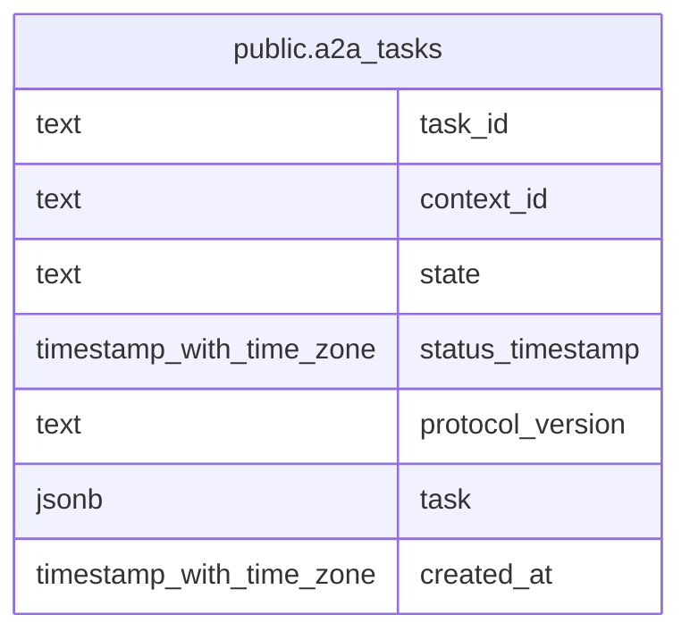

# public.a2a_tasks

## Columns

| Name             | Type                     | Default     | Nullable | Children | Parents | Comment |
| ---------------- | ------------------------ | ----------- | -------- | -------- | ------- | ------- |
| task_id          | text                     |             | false    |          |         |         |
| context_id       | text                     |             | false    |          |         |         |
| state            | text                     |             | false    |          |         |         |
| status_timestamp | timestamp with time zone |             | false    |          |         |         |
| protocol_version | text                     | '0.3'::text | false    |          |         |         |
| task             | jsonb                    |             | false    |          |         |         |
| created_at       | timestamp with time zone | now()       | false    |          |         |         |

## Constraints

| Name           | Type        | Definition            |
| -------------- | ----------- | --------------------- |
| a2a_tasks_pkey | PRIMARY KEY | PRIMARY KEY (task_id) |

## Indexes

| Name                  | Definition                                                                                 |
| --------------------- | ------------------------------------------------------------------------------------------ |
| a2a_tasks_pkey        | CREATE UNIQUE INDEX a2a_tasks_pkey ON public.a2a_tasks USING btree (task_id)               |
| a2a_tasks_context_idx | CREATE INDEX a2a_tasks_context_idx ON public.a2a_tasks USING btree (context_id)            |
| a2a_tasks_sweep_idx   | CREATE INDEX a2a_tasks_sweep_idx ON public.a2a_tasks USING btree (state, status_timestamp) |

## Relations

---

> Generated by [tbls](https://github.com/k1LoW/tbls)
