# t-rader backend

## Tables

| Name                                                                                        | Columns | Comment                                                                                                | Type       |
| ------------------------------------------------------------------------------------------- | ------- | ------------------------------------------------------------------------------------------------------ | ---------- |
| [public.instruments](public.instruments.md)                                                 | 4       | 価格データの取得対象となる金融商品を管理する。                                                         | BASE TABLE |
| [public.bars](public.bars.md)                                                               | 8       | 銘柄ごとの日足価格と出来高を保持する。                                                                 | BASE TABLE |
| [public.strategy](public.strategy.md)                                                       | 6       | 投資判断と関連データを分けて管理する永続的な戦略ワークスペース。                                       | BASE TABLE |
| [public.stock](public.stock.md)                                                             | 6       | ノートや戦略などから参照する銘柄マスタ。銘柄と分類グループの所属関係は stock_group_member で保持する。 | BASE TABLE |
| [public.indicator](public.indicator.md)                                                     | 3       | マクロ指標などの参照先を定義する。                                                                     | BASE TABLE |
| [public.note](public.note.md)                                                               | 7       | ノートの識別情報と作成時の契機を保持する。本文は note_version に保存する。                             | BASE TABLE |
| [public.note_ref](public.note_ref.md)                                                       | 3       | ノート本文やグラフから抽出した一級参照へのリンクを保持する。                                           | BASE TABLE |
| [public.annotation](public.annotation.md)                                                   | 13      | 銘柄などの対象へ付与したテキスト注釈を保持する。                                                       | BASE TABLE |
| [public.comment](public.comment.md)                                                         | 13      | ノートやアノテーションに付けるコメントと返信を保持する。                                               | BASE TABLE |
| [public.change_history](public.change_history.md)                                           | 9       | 主要レコードに対する作成・更新・削除・状態変更を記録する監査履歴。                                     | BASE TABLE |
| [public.trade](public.trade.md)                                                             | 12      | 戦略ごとの売買取引と約定内容を記録する。                                                               | BASE TABLE |
| [public.strategy_task](public.strategy_task.md)                                             | 14      | 戦略に対して投入したエージェントタスクの内容と実行状態を記録する。                                     | BASE TABLE |
| [public.trigger](public.trigger.md)                                                         | 12      | 時刻や外部 hook を契機にエージェントタスクを起動する設定。                                             | BASE TABLE |
| [public.custom_indicator](public.custom_indicator.md)                                       | 10      | 共有または戦略ごとに定義する実行可能なカスタム指標。                                                   | BASE TABLE |
| [public.news_item](public.news_item.md)                                                     | 7       | RSS フィードなどから取得したニュース記事情報を保持する。                                               | BASE TABLE |
| [public.rss_feed](public.rss_feed.md)                                                       | 8       | ニュース取り込み元となる RSS フィードを管理する。                                                      | BASE TABLE |
| [public.strategy_investable_amount](public.strategy_investable_amount.md)                   | 5       | 戦略ごとに設定した投資可能額の履歴。                                                                   | BASE TABLE |
| [public.account_risk_policy](public.account_risk_policy.md)                                 | 3       | 口座全体に適用するリスク制限設定を保持する。                                                           | BASE TABLE |
| [public.agent_config](public.agent_config.md)                                               | 7       | purpose ごとのエージェント実行設定を保持する。                                                         | BASE TABLE |
| [public.strategy_task_step](public.strategy_task_step.md)                                   | 15      | エージェントタスクを構成する実行ステップの状態と結果を記録する。                                       | BASE TABLE |
| [public.strategy_task_step_evidence](public.strategy_task_step_evidence.md)                 | 8       | 実行ステップが取得したデータのスナップショットと時刻を記録する。                                       | BASE TABLE |
| [public.checkpoint](public.checkpoint.md)                                                   | 8       | 戦略・処理グラフごとに外部 stream の読み進め位置を保持する。                                           | BASE TABLE |
| [public.trade_note](public.trade_note.md)                                                   | 4       | 取引と関連ノートおよび関連付け時のノートバージョンを結び付ける。                                       | BASE TABLE |
| [public.mcp_tool_call_count](public.mcp_tool_call_count.md)                                 | 6       | タスク実行ごとの MCP ツール呼び出し数を追跡する。                                                      | BASE TABLE |
| [public.margin_interest](public.margin_interest.md)                                         | 15      | 銘柄ごとの信用取引残高を日付と銘柄区分別に保持する。                                                   | BASE TABLE |
| [public.margin_alert](public.margin_alert.md)                                               | 16      | 日々公表銘柄の信用取引残高情報を保持する。                                                             | BASE TABLE |
| [public.short_sale_report](public.short_sale_report.md)                                     | 14      | 銘柄別の空売り残高報告と報告者情報を保持する。                                                         | BASE TABLE |
| [public.short_ratio](public.short_ratio.md)                                                 | 5       | 33 業種ごとの売買代金を日付別に保持する。                                                              | BASE TABLE |
| [public.ref_term](public.ref_term.md)                                                       | 5       | 銘柄・指標・グループに対する別名を保持する。                                                           | BASE TABLE |
| [public.indicator_observation](public.indicator_observation.md)                             | 3       | 日付ごとの指標観測値を保持する。                                                                       | BASE TABLE |
| [public.jquants_daily_bars_ingested_date](public.jquants_daily_bars_ingested_date.md)       | 1       | 全銘柄の日足データを取り込んだ営業日を記録する。                                                       | BASE TABLE |
| [public.prediction](public.prediction.md)                                                   | 10      | 戦略に記録した、対象銘柄と比較銘柄の将来リターンに関する予測。                                         | BASE TABLE |
| [public.prediction_grade](public.prediction_grade.md)                                       | 9       | 予測期間の株価データから算出した予測の採点結果。                                                       | BASE TABLE |
| [public.valuation](public.valuation.md)                                                     | 11      | 銘柄ごとの株価評価指標を日付別に保持する。                                                             | BASE TABLE |
| [public.valuation_ingested_date](public.valuation_ingested_date.md)                         | 1       | 株価評価指標データの取り込み済み日付を記録する。                                                       | BASE TABLE |
| [public.note_kind](public.note_kind.md)                                                     | 5       | ノートの分類と、その分類に適用するレビュー設定を定義する。                                             | BASE TABLE |
| [public.note_version](public.note_version.md)                                               | 14      | ノートの本文・メタデータとレビュー状態をバージョンごとに保持する。                                     | BASE TABLE |
| [public.note_link](public.note_link.md)                                                     | 3       | ノートバージョン本文から別のノートへのリンクを保持する。                                               | BASE TABLE |
| [public.financial_summary](public.financial_summary.md)                                     | 37      | 銘柄ごとの決算開示内容と業績予想を保持する。                                                           | BASE TABLE |
| [public.large_volume_shareholding_documents](public.large_volume_shareholding_documents.md) | 7       | EDINET の大量保有報告書と保有状況の明細を保持する。                                                    | BASE TABLE |
| [public.major_shareholder_documents](public.major_shareholder_documents.md)                 | 7       | EDINET の主要株主書類と順位付き株主情報を保持する。                                                    | BASE TABLE |
| [public.cross_shareholding_documents](public.cross_shareholding_documents.md)               | 7       | EDINET の政策保有株式に関する提出書類と明細を保持する。                                                | BASE TABLE |
| [public.group_axis](public.group_axis.md)                                                   | 5       | 銘柄グループを分類する軸を定義する。                                                                   | BASE TABLE |
| [public.stock_group](public.stock_group.md)                                                 | 6       | 分類軸の中で銘柄をまとめるグループを定義する。                                                         | BASE TABLE |
| [public.stock_group_member](public.stock_group_member.md)                                   | 3       | 銘柄と銘柄グループの所属関係を保持する。                                                               | BASE TABLE |
| [public.ingest_run](public.ingest_run.md)                                                   | 7       | データ取り込みジョブの実行履歴と結果を記録する。                                                       | BASE TABLE |
| [public.calendar_event](public.calendar_event.md)                                           | 13      | 指標、中銀イベント、決算などの予定を取得元ごとに保持する。                                             | BASE TABLE |
| [public.earnings_schedule_ingested_date](public.earnings_schedule_ingested_date.md)         | 1       | 決算予定を取得した公表日を記録する。                                                                   | BASE TABLE |
| [public.news_item_content](public.news_item_content.md)                                     | 6       | ニュース記事の本文と取得状態を保持する。                                                               | BASE TABLE |
| [public.minute_bars](public.minute_bars.md)                                                 | 7       | 銘柄ごとの 1 分足価格と出来高を保持する。                                                              | BASE TABLE |
| [public.strategy_earnings_target](public.strategy_earnings_target.md)                       | 4       | 戦略ごとに決算を追う銘柄とグループを保持する。                                                         | BASE TABLE |

## Stored procedures and functions

| Name                                        | ReturnType     | Arguments                                                                                                                                                                                                                                                                                                                                                                                                                                                                                                                                                                                                                                                                            | Type      |
| ------------------------------------------- | -------------- | ------------------------------------------------------------------------------------------------------------------------------------------------------------------------------------------------------------------------------------------------------------------------------------------------------------------------------------------------------------------------------------------------------------------------------------------------------------------------------------------------------------------------------------------------------------------------------------------------------------------------------------------------------------------------------------ | --------- |
| public.set_integer_now_func                 | void           | hypertable regclass, integer_now_func regproc, replace_if_exists boolean DEFAULT false                                                                                                                                                                                                                                                                                                                                                                                                                                                                                                                                                                                               | FUNCTION  |
| public.detach_chunk                         | void           | IN chunk regclass                                                                                                                                                                                                                                                                                                                                                                                                                                                                                                                                                                                                                                                                    | PROCEDURE |
| public.attach_chunk                         | void           | IN hypertable regclass, IN chunk regclass, IN slices jsonb                                                                                                                                                                                                                                                                                                                                                                                                                                                                                                                                                                                                                           | PROCEDURE |
| public.create_hypertable                    | record         | relation regclass, time_column_name name, partitioning_column name DEFAULT NULL::name, number_partitions integer DEFAULT NULL::integer, associated_schema_name name DEFAULT NULL::name, associated_table_prefix name DEFAULT NULL::name, chunk_time_interval anyelement DEFAULT NULL::bigint, create_default_indexes boolean DEFAULT true, if_not_exists boolean DEFAULT false, partitioning_func regproc DEFAULT NULL::regproc, migrate_data boolean DEFAULT false, time_partitioning_func regproc DEFAULT NULL::regproc                                                                                                                                                            | FUNCTION  |
| public.create_hypertable                    | record         | relation regclass, dimension _timescaledb_internal.dimension_info, create_default_indexes boolean DEFAULT true, if_not_exists boolean DEFAULT false, migrate_data boolean DEFAULT false                                                                                                                                                                                                                                                                                                                                                                                                                                                                                              | FUNCTION  |
| public.set_chunk_time_interval              | void           | hypertable regclass, chunk_time_interval anyelement, dimension_name name DEFAULT NULL::name                                                                                                                                                                                                                                                                                                                                                                                                                                                                                                                                                                                          | FUNCTION  |
| public.set_partitioning_interval            | void           | hypertable regclass, partition_interval anyelement, dimension_name name DEFAULT NULL::name                                                                                                                                                                                                                                                                                                                                                                                                                                                                                                                                                                                           | FUNCTION  |
| public.set_number_partitions                | void           | hypertable regclass, number_partitions integer, dimension_name name DEFAULT NULL::name                                                                                                                                                                                                                                                                                                                                                                                                                                                                                                                                                                                               | FUNCTION  |
| public.drop_chunks                          | text           | relation regclass, older_than "any" DEFAULT NULL::unknown, newer_than "any" DEFAULT NULL::unknown, "verbose" boolean DEFAULT false, created_before "any" DEFAULT NULL::unknown, created_after "any" DEFAULT NULL::unknown                                                                                                                                                                                                                                                                                                                                                                                                                                                            | FUNCTION  |
| public.show_chunks                          | regclass       | relation regclass, older_than "any" DEFAULT NULL::unknown, newer_than "any" DEFAULT NULL::unknown, created_before "any" DEFAULT NULL::unknown, created_after "any" DEFAULT NULL::unknown                                                                                                                                                                                                                                                                                                                                                                                                                                                                                             | FUNCTION  |
| public.add_dimension                        | record         | hypertable regclass, column_name name, number_partitions integer DEFAULT NULL::integer, chunk_time_interval anyelement DEFAULT NULL::bigint, partitioning_func regproc DEFAULT NULL::regproc, if_not_exists boolean DEFAULT false                                                                                                                                                                                                                                                                                                                                                                                                                                                    | FUNCTION  |
| public.add_dimension                        | record         | hypertable regclass, dimension _timescaledb_internal.dimension_info, if_not_exists boolean DEFAULT false                                                                                                                                                                                                                                                                                                                                                                                                                                                                                                                                                                             | FUNCTION  |
| public.enable_chunk_skipping                | record         | hypertable regclass, column_name name, if_not_exists boolean DEFAULT false                                                                                                                                                                                                                                                                                                                                                                                                                                                                                                                                                                                                           | FUNCTION  |
| public.disable_chunk_skipping               | record         | hypertable regclass, column_name name, if_not_exists boolean DEFAULT false                                                                                                                                                                                                                                                                                                                                                                                                                                                                                                                                                                                                           | FUNCTION  |
| public.by_hash                              | dimension_info | column_name name, number_partitions integer, partition_func regproc DEFAULT NULL::regproc                                                                                                                                                                                                                                                                                                                                                                                                                                                                                                                                                                                            | FUNCTION  |
| public.by_range                             | dimension_info | column_name name, partition_interval anyelement DEFAULT NULL::bigint, partition_func regproc DEFAULT NULL::regproc                                                                                                                                                                                                                                                                                                                                                                                                                                                                                                                                                                   | FUNCTION  |
| public.attach_tablespace                    | void           | tablespace name, hypertable regclass, if_not_attached boolean DEFAULT false                                                                                                                                                                                                                                                                                                                                                                                                                                                                                                                                                                                                          | FUNCTION  |
| public.detach_tablespace                    | int4           | tablespace name, hypertable regclass DEFAULT NULL::regclass, if_attached boolean DEFAULT false                                                                                                                                                                                                                                                                                                                                                                                                                                                                                                                                                                                       | FUNCTION  |
| public.detach_tablespaces                   | int4           | hypertable regclass                                                                                                                                                                                                                                                                                                                                                                                                                                                                                                                                                                                                                                                                  | FUNCTION  |
| public.show_tablespaces                     | name           | hypertable regclass                                                                                                                                                                                                                                                                                                                                                                                                                                                                                                                                                                                                                                                                  | FUNCTION  |
| public.refresh_continuous_aggregate         | void           | IN continuous_aggregate regclass, IN window_start "any", IN window_end "any", IN force boolean DEFAULT false, IN options jsonb DEFAULT NULL::jsonb                                                                                                                                                                                                                                                                                                                                                                                                                                                                                                                                   | PROCEDURE |
| public.first                                | anyelement     | anyelement, "any"                                                                                                                                                                                                                                                                                                                                                                                                                                                                                                                                                                                                                                                                    | a         |
| public.last                                 | anyelement     | anyelement, "any"                                                                                                                                                                                                                                                                                                                                                                                                                                                                                                                                                                                                                                                                    | a         |
| public.time_bucket                          | timestamp      | bucket_width interval, ts timestamp without time zone                                                                                                                                                                                                                                                                                                                                                                                                                                                                                                                                                                                                                                | FUNCTION  |
| public.time_bucket                          | timestamptz    | bucket_width interval, ts timestamp with time zone                                                                                                                                                                                                                                                                                                                                                                                                                                                                                                                                                                                                                                   | FUNCTION  |
| public.time_bucket                          | date           | bucket_width interval, ts date                                                                                                                                                                                                                                                                                                                                                                                                                                                                                                                                                                                                                                                       | FUNCTION  |
| public.time_bucket                          | timestamptz    | bucket_width interval, ts uuid                                                                                                                                                                                                                                                                                                                                                                                                                                                                                                                                                                                                                                                       | FUNCTION  |
| public.time_bucket                          | timestamp      | bucket_width interval, ts timestamp without time zone, origin timestamp without time zone                                                                                                                                                                                                                                                                                                                                                                                                                                                                                                                                                                                            | FUNCTION  |
| public.time_bucket                          | timestamptz    | bucket_width interval, ts timestamp with time zone, origin timestamp with time zone                                                                                                                                                                                                                                                                                                                                                                                                                                                                                                                                                                                                  | FUNCTION  |
| public.time_bucket                          | date           | bucket_width interval, ts date, origin date                                                                                                                                                                                                                                                                                                                                                                                                                                                                                                                                                                                                                                          | FUNCTION  |
| public.time_bucket                          | timestamptz    | bucket_width interval, ts uuid, origin timestamp with time zone                                                                                                                                                                                                                                                                                                                                                                                                                                                                                                                                                                                                                      | FUNCTION  |
| public.time_bucket                          | timestamp      | bucket_width interval, ts timestamp without time zone, "offset" interval                                                                                                                                                                                                                                                                                                                                                                                                                                                                                                                                                                                                             | FUNCTION  |
| public.time_bucket                          | timestamptz    | bucket_width interval, ts timestamp with time zone, "offset" interval                                                                                                                                                                                                                                                                                                                                                                                                                                                                                                                                                                                                                | FUNCTION  |
| public.time_bucket                          | date           | bucket_width interval, ts date, "offset" interval                                                                                                                                                                                                                                                                                                                                                                                                                                                                                                                                                                                                                                    | FUNCTION  |
| public.time_bucket                          | timestamptz    | bucket_width interval, ts uuid, "offset" interval                                                                                                                                                                                                                                                                                                                                                                                                                                                                                                                                                                                                                                    | FUNCTION  |
| public.time_bucket                          | timestamptz    | bucket_width interval, ts timestamp with time zone, timezone text, origin timestamp with time zone DEFAULT NULL::timestamp with time zone, "offset" interval DEFAULT NULL::interval                                                                                                                                                                                                                                                                                                                                                                                                                                                                                                  | FUNCTION  |
| public.time_bucket                          | timestamptz    | bucket_width interval, ts uuid, timezone text, origin timestamp with time zone DEFAULT NULL::timestamp with time zone, "offset" interval DEFAULT NULL::interval                                                                                                                                                                                                                                                                                                                                                                                                                                                                                                                      | FUNCTION  |
| public.time_bucket                          | int2           | bucket_width smallint, ts smallint                                                                                                                                                                                                                                                                                                                                                                                                                                                                                                                                                                                                                                                   | FUNCTION  |
| public.time_bucket                          | int4           | bucket_width integer, ts integer                                                                                                                                                                                                                                                                                                                                                                                                                                                                                                                                                                                                                                                     | FUNCTION  |
| public.time_bucket                          | int8           | bucket_width bigint, ts bigint                                                                                                                                                                                                                                                                                                                                                                                                                                                                                                                                                                                                                                                       | FUNCTION  |
| public.time_bucket                          | int2           | bucket_width smallint, ts smallint, "offset" smallint                                                                                                                                                                                                                                                                                                                                                                                                                                                                                                                                                                                                                                | FUNCTION  |
| public.time_bucket                          | int4           | bucket_width integer, ts integer, "offset" integer                                                                                                                                                                                                                                                                                                                                                                                                                                                                                                                                                                                                                                   | FUNCTION  |
| public.time_bucket                          | int8           | bucket_width bigint, ts bigint, "offset" bigint                                                                                                                                                                                                                                                                                                                                                                                                                                                                                                                                                                                                                                      | FUNCTION  |
| public.hypertable_detailed_size             | record         | hypertable regclass                                                                                                                                                                                                                                                                                                                                                                                                                                                                                                                                                                                                                                                                  | FUNCTION  |
| public.hypertable_size                      | int8           | hypertable regclass                                                                                                                                                                                                                                                                                                                                                                                                                                                                                                                                                                                                                                                                  | FUNCTION  |
| public.hypertable_approximate_detailed_size | record         | relation regclass                                                                                                                                                                                                                                                                                                                                                                                                                                                                                                                                                                                                                                                                    | FUNCTION  |
| public.hypertable_approximate_size          | int8           | hypertable regclass                                                                                                                                                                                                                                                                                                                                                                                                                                                                                                                                                                                                                                                                  | FUNCTION  |
| public.chunks_detailed_size                 | record         | hypertable regclass                                                                                                                                                                                                                                                                                                                                                                                                                                                                                                                                                                                                                                                                  | FUNCTION  |
| public.approximate_row_count                | int8           | relation regclass                                                                                                                                                                                                                                                                                                                                                                                                                                                                                                                                                                                                                                                                    | FUNCTION  |
| public.chunk_compression_stats              | record         | hypertable regclass                                                                                                                                                                                                                                                                                                                                                                                                                                                                                                                                                                                                                                                                  | FUNCTION  |
| public.chunk_columnstore_stats              | record         | hypertable regclass                                                                                                                                                                                                                                                                                                                                                                                                                                                                                                                                                                                                                                                                  | FUNCTION  |
| public.hypertable_compression_stats         | record         | hypertable regclass                                                                                                                                                                                                                                                                                                                                                                                                                                                                                                                                                                                                                                                                  | FUNCTION  |
| public.hypertable_columnstore_stats         | record         | hypertable regclass                                                                                                                                                                                                                                                                                                                                                                                                                                                                                                                                                                                                                                                                  | FUNCTION  |
| public.hypertable_index_size                | int8           | index_name regclass                                                                                                                                                                                                                                                                                                                                                                                                                                                                                                                                                                                                                                                                  | FUNCTION  |
| public.histogram                            | _int4          | double precision, double precision, double precision, integer                                                                                                                                                                                                                                                                                                                                                                                                                                                                                                                                                                                                                        | a         |
| public.generate_uuidv7                      | uuid           |                                                                                                                                                                                                                                                                                                                                                                                                                                                                                                                                                                                                                                                                                      | FUNCTION  |
| public.to_uuidv7                            | uuid           | ts timestamp with time zone                                                                                                                                                                                                                                                                                                                                                                                                                                                                                                                                                                                                                                                          | FUNCTION  |
| public.to_uuidv7_boundary                   | uuid           | ts timestamp with time zone                                                                                                                                                                                                                                                                                                                                                                                                                                                                                                                                                                                                                                                          | FUNCTION  |
| public.uuid_timestamp                       | timestamptz    | uuid uuid                                                                                                                                                                                                                                                                                                                                                                                                                                                                                                                                                                                                                                                                            | FUNCTION  |
| public.uuid_timestamp_micros                | timestamptz    | uuid uuid                                                                                                                                                                                                                                                                                                                                                                                                                                                                                                                                                                                                                                                                            | FUNCTION  |
| public.uuid_version                         | int4           | uuid uuid                                                                                                                                                                                                                                                                                                                                                                                                                                                                                                                                                                                                                                                                            | FUNCTION  |
| public.time_bucket_gapfill                  | int2           | bucket_width smallint, ts smallint, start smallint DEFAULT NULL::smallint, finish smallint DEFAULT NULL::smallint                                                                                                                                                                                                                                                                                                                                                                                                                                                                                                                                                                    | FUNCTION  |
| public.time_bucket_gapfill                  | int4           | bucket_width integer, ts integer, start integer DEFAULT NULL::integer, finish integer DEFAULT NULL::integer                                                                                                                                                                                                                                                                                                                                                                                                                                                                                                                                                                          | FUNCTION  |
| public.time_bucket_gapfill                  | int8           | bucket_width bigint, ts bigint, start bigint DEFAULT NULL::bigint, finish bigint DEFAULT NULL::bigint                                                                                                                                                                                                                                                                                                                                                                                                                                                                                                                                                                                | FUNCTION  |
| public.time_bucket_gapfill                  | date           | bucket_width interval, ts date, start date DEFAULT NULL::date, finish date DEFAULT NULL::date                                                                                                                                                                                                                                                                                                                                                                                                                                                                                                                                                                                        | FUNCTION  |
| public.time_bucket_gapfill                  | timestamp      | bucket_width interval, ts timestamp without time zone, start timestamp without time zone DEFAULT NULL::timestamp without time zone, finish timestamp without time zone DEFAULT NULL::timestamp without time zone                                                                                                                                                                                                                                                                                                                                                                                                                                                                     | FUNCTION  |
| public.time_bucket_gapfill                  | timestamptz    | bucket_width interval, ts timestamp with time zone, start timestamp with time zone DEFAULT NULL::timestamp with time zone, finish timestamp with time zone DEFAULT NULL::timestamp with time zone                                                                                                                                                                                                                                                                                                                                                                                                                                                                                    | FUNCTION  |
| public.time_bucket_gapfill                  | timestamptz    | bucket_width interval, ts timestamp with time zone, timezone text, start timestamp with time zone DEFAULT NULL::timestamp with time zone, finish timestamp with time zone DEFAULT NULL::timestamp with time zone                                                                                                                                                                                                                                                                                                                                                                                                                                                                     | FUNCTION  |
| public.locf                                 | anyelement     | value anyelement, prev anyelement DEFAULT NULL::unknown, treat_null_as_missing boolean DEFAULT false                                                                                                                                                                                                                                                                                                                                                                                                                                                                                                                                                                                 | FUNCTION  |
| public.interpolate                          | int2           | value smallint, prev record DEFAULT NULL::record, next record DEFAULT NULL::record                                                                                                                                                                                                                                                                                                                                                                                                                                                                                                                                                                                                   | FUNCTION  |
| public.interpolate                          | int4           | value integer, prev record DEFAULT NULL::record, next record DEFAULT NULL::record                                                                                                                                                                                                                                                                                                                                                                                                                                                                                                                                                                                                    | FUNCTION  |
| public.interpolate                          | int8           | value bigint, prev record DEFAULT NULL::record, next record DEFAULT NULL::record                                                                                                                                                                                                                                                                                                                                                                                                                                                                                                                                                                                                     | FUNCTION  |
| public.interpolate                          | float4         | value real, prev record DEFAULT NULL::record, next record DEFAULT NULL::record                                                                                                                                                                                                                                                                                                                                                                                                                                                                                                                                                                                                       | FUNCTION  |
| public.interpolate                          | float8         | value double precision, prev record DEFAULT NULL::record, next record DEFAULT NULL::record                                                                                                                                                                                                                                                                                                                                                                                                                                                                                                                                                                                           | FUNCTION  |
| public.reorder_chunk                        | void           | chunk regclass, index regclass DEFAULT NULL::regclass, "verbose" boolean DEFAULT false                                                                                                                                                                                                                                                                                                                                                                                                                                                                                                                                                                                               | FUNCTION  |
| public.move_chunk                           | void           | chunk regclass, destination_tablespace name, index_destination_tablespace name DEFAULT NULL::name, reorder_index regclass DEFAULT NULL::regclass, "verbose" boolean DEFAULT false                                                                                                                                                                                                                                                                                                                                                                                                                                                                                                    | FUNCTION  |
| public.compress_chunk                       | regclass       | uncompressed_chunk regclass, if_not_compressed boolean DEFAULT true, recompress boolean DEFAULT false                                                                                                                                                                                                                                                                                                                                                                                                                                                                                                                                                                                | FUNCTION  |
| public.convert_to_columnstore               | void           | IN chunk regclass, IN if_not_columnstore boolean DEFAULT true, IN recompress boolean DEFAULT false                                                                                                                                                                                                                                                                                                                                                                                                                                                                                                                                                                                   | PROCEDURE |
| public.decompress_chunk                     | regclass       | uncompressed_chunk regclass, if_compressed boolean DEFAULT true                                                                                                                                                                                                                                                                                                                                                                                                                                                                                                                                                                                                                      | FUNCTION  |
| public.convert_to_rowstore                  | void           | IN chunk regclass, IN if_columnstore boolean DEFAULT true                                                                                                                                                                                                                                                                                                                                                                                                                                                                                                                                                                                                                            | PROCEDURE |
| public.merge_chunks                         | void           | IN chunk1 regclass, IN chunk2 regclass, IN "concurrently" boolean DEFAULT false                                                                                                                                                                                                                                                                                                                                                                                                                                                                                                                                                                                                      | PROCEDURE |
| public.merge_chunks                         | void           | IN chunks regclass[]                                                                                                                                                                                                                                                                                                                                                                                                                                                                                                                                                                                                                                                                 | PROCEDURE |
| public.merge_chunks_concurrently            | void           | IN chunks regclass[]                                                                                                                                                                                                                                                                                                                                                                                                                                                                                                                                                                                                                                                                 | PROCEDURE |
| public.split_chunk                          | void           | IN chunk regclass, IN split_at "any" DEFAULT NULL::unknown                                                                                                                                                                                                                                                                                                                                                                                                                                                                                                                                                                                                                           | PROCEDURE |
| public.recompress_chunk                     | void           | IN chunk regclass, IN if_not_compressed boolean DEFAULT true                                                                                                                                                                                                                                                                                                                                                                                                                                                                                                                                                                                                                         | PROCEDURE |
| public.timescaledb_pre_restore              | bool           |                                                                                                                                                                                                                                                                                                                                                                                                                                                                                                                                                                                                                                                                                      | FUNCTION  |
| public.timescaledb_post_restore             | bool           |                                                                                                                                                                                                                                                                                                                                                                                                                                                                                                                                                                                                                                                                                      | FUNCTION  |
| public.add_job                              | int4           | proc regproc, schedule_interval interval, config jsonb DEFAULT NULL::jsonb, initial_start timestamp with time zone DEFAULT NULL::timestamp with time zone, scheduled boolean DEFAULT true, check_config regproc DEFAULT NULL::regproc, fixed_schedule boolean DEFAULT true, timezone text DEFAULT NULL::text, job_name text DEFAULT NULL::text                                                                                                                                                                                                                                                                                                                                       | FUNCTION  |
| public.delete_job                           | void           | job_id integer                                                                                                                                                                                                                                                                                                                                                                                                                                                                                                                                                                                                                                                                       | FUNCTION  |
| public.run_job                              | void           | IN job_id integer                                                                                                                                                                                                                                                                                                                                                                                                                                                                                                                                                                                                                                                                    | PROCEDURE |
| public.alter_job                            | record         | job_id integer, schedule_interval interval DEFAULT NULL::interval, max_runtime interval DEFAULT NULL::interval, max_retries integer DEFAULT NULL::integer, retry_period interval DEFAULT NULL::interval, scheduled boolean DEFAULT NULL::boolean, config jsonb DEFAULT NULL::jsonb, next_start timestamp with time zone DEFAULT NULL::timestamp with time zone, if_exists boolean DEFAULT false, check_config regproc DEFAULT NULL::regproc, fixed_schedule boolean DEFAULT NULL::boolean, initial_start timestamp with time zone DEFAULT NULL::timestamp with time zone, timezone text DEFAULT NULL::text, job_name text DEFAULT NULL::text, config_merge jsonb DEFAULT NULL::jsonb | FUNCTION  |
| public.add_retention_policy                 | int4           | relation regclass, drop_after "any" DEFAULT NULL::unknown, if_not_exists boolean DEFAULT false, schedule_interval interval DEFAULT NULL::interval, initial_start timestamp with time zone DEFAULT NULL::timestamp with time zone, timezone text DEFAULT NULL::text, drop_created_before interval DEFAULT NULL::interval                                                                                                                                                                                                                                                                                                                                                              | FUNCTION  |
| public.remove_retention_policy              | void           | relation regclass, if_exists boolean DEFAULT false                                                                                                                                                                                                                                                                                                                                                                                                                                                                                                                                                                                                                                   | FUNCTION  |
| public.add_reorder_policy                   | int4           | hypertable regclass, index_name name, if_not_exists boolean DEFAULT false, initial_start timestamp with time zone DEFAULT NULL::timestamp with time zone, timezone text DEFAULT NULL::text                                                                                                                                                                                                                                                                                                                                                                                                                                                                                           | FUNCTION  |
| public.remove_reorder_policy                | void           | hypertable regclass, if_exists boolean DEFAULT false                                                                                                                                                                                                                                                                                                                                                                                                                                                                                                                                                                                                                                 | FUNCTION  |
| public.add_compaction_policy                | int4           | hypertable regclass, if_not_exists boolean DEFAULT false, schedule_interval interval DEFAULT NULL::interval, initial_start timestamp with time zone DEFAULT NULL::timestamp with time zone, timezone text DEFAULT NULL::text, max_chunks integer DEFAULT NULL::integer, max_batches integer DEFAULT NULL::integer, inactive_for interval DEFAULT NULL::interval                                                                                                                                                                                                                                                                                                                      | FUNCTION  |
| public.remove_compaction_policy             | void           | hypertable regclass, if_exists boolean DEFAULT false                                                                                                                                                                                                                                                                                                                                                                                                                                                                                                                                                                                                                                 | FUNCTION  |
| public.add_compression_policy               | int4           | hypertable regclass, compress_after "any" DEFAULT NULL::unknown, if_not_exists boolean DEFAULT false, schedule_interval interval DEFAULT NULL::interval, initial_start timestamp with time zone DEFAULT NULL::timestamp with time zone, timezone text DEFAULT NULL::text, compress_created_before interval DEFAULT NULL::interval                                                                                                                                                                                                                                                                                                                                                    | FUNCTION  |
| public.add_columnstore_policy               | void           | IN hypertable regclass, IN after "any" DEFAULT NULL::unknown, IN if_not_exists boolean DEFAULT false, IN schedule_interval interval DEFAULT NULL::interval, IN initial_start timestamp with time zone DEFAULT NULL::timestamp with time zone, IN timezone text DEFAULT NULL::text, IN created_before interval DEFAULT NULL::interval                                                                                                                                                                                                                                                                                                                                                 | PROCEDURE |
| public.remove_compression_policy            | bool           | hypertable regclass, if_exists boolean DEFAULT false                                                                                                                                                                                                                                                                                                                                                                                                                                                                                                                                                                                                                                 | FUNCTION  |
| public.remove_columnstore_policy            | void           | IN hypertable regclass, IN if_exists boolean DEFAULT false                                                                                                                                                                                                                                                                                                                                                                                                                                                                                                                                                                                                                           | PROCEDURE |
| public.add_continuous_aggregate_policy      | int4           | continuous_aggregate regclass, start_offset "any", end_offset "any", schedule_interval interval, if_not_exists boolean DEFAULT false, initial_start timestamp with time zone DEFAULT NULL::timestamp with time zone, timezone text DEFAULT NULL::text, include_tiered_data boolean DEFAULT NULL::boolean, buckets_per_batch integer DEFAULT NULL::integer, max_batches_per_execution integer DEFAULT NULL::integer, refresh_newest_first boolean DEFAULT NULL::boolean                                                                                                                                                                                                               | FUNCTION  |
| public.remove_continuous_aggregate_policy   | void           | continuous_aggregate regclass, if_not_exists boolean DEFAULT false, if_exists boolean DEFAULT NULL::boolean                                                                                                                                                                                                                                                                                                                                                                                                                                                                                                                                                                          | FUNCTION  |
| public.get_telemetry_report                 | jsonb          |                                                                                                                                                                                                                                                                                                                                                                                                                                                                                                                                                                                                                                                                                      | FUNCTION  |

## Enums

| Name                             | Values                              |
| -------------------------------- | ----------------------------------- |
| public.strategy_task_phase       | completed, failed, pending, running |
| public.strategy_task_step_status | completed, failed, running          |

## Relations

```mermaid
erDiagram

"public.bars" }o--|| "public.instruments" : "FOREIGN KEY (instrument_id) REFERENCES instruments(id) ON DELETE CASCADE"
"public.note" }o--o| "public.note_kind" : "FOREIGN KEY (kind) REFERENCES note_kind(key) ON DELETE RESTRICT"
"public.note_ref" }o--|| "public.note" : "FOREIGN KEY (note_id) REFERENCES note(id) ON DELETE CASCADE"
"public.annotation" }o--o| "public.note" : "FOREIGN KEY (linked_note_id) REFERENCES note(id) ON DELETE SET NULL"
"public.comment" }o--o| "public.comment" : "FOREIGN KEY (parent_id) REFERENCES comment(id) ON DELETE CASCADE"
"public.trade" }o--|| "public.strategy" : "FOREIGN KEY (strategy_id) REFERENCES strategy(id) ON DELETE CASCADE"
"public.strategy_task" }o--|| "public.strategy" : "FOREIGN KEY (strategy_id) REFERENCES strategy(id) ON DELETE CASCADE"
"public.trigger" }o--o| "public.strategy" : "FOREIGN KEY (strategy_id) REFERENCES strategy(id) ON DELETE CASCADE"
"public.trigger" }o--o| "public.agent_config" : "FOREIGN KEY (purpose) REFERENCES agent_config(purpose) ON DELETE SET NULL"
"public.custom_indicator" }o--o| "public.strategy" : "FOREIGN KEY (strategy_id) REFERENCES strategy(id) ON DELETE CASCADE"
"public.strategy_investable_amount" }o--|| "public.strategy" : "FOREIGN KEY (strategy_id) REFERENCES strategy(id) ON DELETE CASCADE"
"public.strategy_task_step" }o--|| "public.strategy_task" : "FOREIGN KEY (task_id) REFERENCES strategy_task(task_id) ON DELETE CASCADE"
"public.checkpoint" }o--|| "public.strategy" : "FOREIGN KEY (strategy_id) REFERENCES strategy(id) ON DELETE CASCADE"
"public.trade_note" }o--|| "public.note" : "FOREIGN KEY (note_id) REFERENCES note(id) ON DELETE CASCADE"
"public.trade_note" }o--|| "public.trade" : "FOREIGN KEY (trade_id) REFERENCES trade(id) ON DELETE CASCADE"
"public.trade_note" }o--|| "public.note_version" : "FOREIGN KEY (note_version_id) REFERENCES note_version(id) ON DELETE CASCADE"
"public.indicator_observation" }o--|| "public.indicator" : "FOREIGN KEY (indicator_id) REFERENCES indicator(id) ON DELETE CASCADE"
"public.prediction" }o--|| "public.strategy" : "FOREIGN KEY (strategy_id) REFERENCES strategy(id) ON DELETE CASCADE"
"public.prediction" }o--|| "public.stock" : "FOREIGN KEY (benchmark_stock_id) REFERENCES stock(id)"
"public.prediction" }o--|| "public.stock" : "FOREIGN KEY (target_stock_id) REFERENCES stock(id)"
"public.prediction" }o--o| "public.note" : "FOREIGN KEY (note_id) REFERENCES note(id) ON DELETE SET NULL"
"public.prediction_grade" |o--|| "public.prediction" : "FOREIGN KEY (prediction_id) REFERENCES prediction(prediction_id) ON DELETE CASCADE"
"public.note_version" }o--|| "public.note" : "FOREIGN KEY (note_id) REFERENCES note(id) ON DELETE CASCADE"
"public.note_link" }o--|| "public.note" : "FOREIGN KEY (to_note_id) REFERENCES note(id) ON DELETE CASCADE"
"public.note_link" }o--|| "public.note_version" : "FOREIGN KEY (from_version_id) REFERENCES note_version(id) ON DELETE CASCADE"
"public.note_link" }o--o| "public.note_version" : "FOREIGN KEY (to_version_id) REFERENCES note_version(id) ON DELETE SET NULL"
"public.stock_group" }o--|| "public.group_axis" : "FOREIGN KEY (axis_id) REFERENCES group_axis(id) ON DELETE RESTRICT"
"public.stock_group_member" }o--|| "public.stock" : "FOREIGN KEY (stock_id) REFERENCES stock(id) ON DELETE CASCADE"
"public.stock_group_member" }o--|| "public.stock_group" : "FOREIGN KEY (group_id) REFERENCES stock_group(id) ON DELETE CASCADE"
"public.news_item_content" |o--|| "public.news_item" : "FOREIGN KEY (news_item_id) REFERENCES news_item(id) ON DELETE CASCADE"
"public.minute_bars" }o--|| "public.instruments" : "FOREIGN KEY (instrument_id) REFERENCES instruments(id) ON DELETE CASCADE"
"public.strategy_earnings_target" }o--|| "public.strategy" : "FOREIGN KEY (strategy_id) REFERENCES strategy(id) ON DELETE CASCADE"

"public.instruments" {
  varchar id
  varchar name
  varchar market
  varchar sector
}
"public.bars" {
  varchar instrument_id FK
  varchar timeframe
  timestamp_with_time_zone timestamp
  numeric open
  numeric high
  numeric low
  numeric close
  bigint volume
}
"public.strategy" {
  uuid id
  varchar name
  text description
  integer sort_order
  timestamp_with_time_zone created_at
  timestamp_with_time_zone updated_at
}
"public.stock" {
  varchar id
  varchar name
  varchar market
  timestamp_with_time_zone created_at
  timestamp_with_time_zone updated_at
  varchar product_category
}
"public.indicator" {
  varchar id
  varchar name
  varchar kind
}
"public.note" {
  uuid id
  varchar kind FK
  varchar trigger
  varchar trigger_label
  timestamp_with_time_zone created_at
  timestamp_with_time_zone updated_at
  text execution_id
}
"public.note_ref" {
  uuid note_id FK
  varchar ref_kind
  varchar ref_id
}
"public.annotation" {
  uuid id
  varchar target_symbol
  varchar target_kind
  timestamp_with_time_zone timestamp
  numeric price
  text text
  varchar status
  uuid linked_note_id FK
  varchar created_by_kind
  timestamp_with_time_zone created_at
  timestamp_with_time_zone updated_at
  uuid execution_step_id
  text execution_task_id
}
"public.comment" {
  uuid id
  varchar target_kind
  uuid target_id
  uuid parent_id FK
  text body
  varchar author_kind
  varchar author_label
  timestamp_with_time_zone created_at
  boolean resolved
  text anchor_text
  integer start_line
  integer end_line
  text anchor_side
}
"public.change_history" {
  uuid id
  varchar target_kind
  uuid target_id
  varchar actor_kind
  varchar actor_label
  varchar op
  jsonb diff_json
  text summary
  timestamp_with_time_zone created_at
}
"public.trade" {
  uuid id
  uuid strategy_id FK
  varchar symbol
  varchar side
  numeric qty
  numeric price
  numeric fee
  date date
  varchar source
  text note
  timestamp_with_time_zone created_at
  timestamp_with_time_zone updated_at
}
"public.strategy_task" {
  uuid task_id
  uuid strategy_id FK
  text a2a_task_id
  text source
  text prompt
  strategy_task_phase phase
  text error_summary
  timestamp_with_time_zone created_at
  timestamp_with_time_zone updated_at
  text result_text
  timestamp_with_time_zone deadline_at
  text purpose
  timestamp_with_time_zone as_of
  timestamp_with_time_zone auto_resumed_at
}
"public.trigger" {
  uuid trigger_id
  uuid strategy_id FK
  text kind
  text schedule
  text hook_slug
  jsonb event_match
  text prompt_template
  boolean enabled
  timestamp_with_time_zone last_fired_at
  timestamp_with_time_zone created_at
  timestamp_with_time_zone updated_at
  text purpose FK
}
"public.custom_indicator" {
  uuid indicator_id
  text name
  text scope
  uuid strategy_id FK
  text code
  jsonb input_schema
  jsonb output_schema
  text description
  timestamp_with_time_zone created_at
  timestamp_with_time_zone updated_at
}
"public.news_item" {
  uuid id
  text source
  text url
  text title
  text body_snippet
  timestamp_with_time_zone published_at
  timestamp_with_time_zone fetched_at
}
"public.rss_feed" {
  uuid id
  text source
  text display_name
  text url
  boolean enabled
  timestamp_with_time_zone created_at
  timestamp_with_time_zone updated_at
  text content_source
}
"public.strategy_investable_amount" {
  uuid id
  uuid strategy_id FK
  numeric amount_jpy
  timestamp_with_time_zone effective_at
  timestamp_with_time_zone created_at
}
"public.account_risk_policy" {
  smallint id
  jsonb risk_policy
  timestamp_with_time_zone updated_at
}
"public.agent_config" {
  uuid id
  text purpose
  text agents_md
  jsonb skills
  text agent_graph
  timestamp_with_time_zone created_at
  timestamp_with_time_zone updated_at
}
"public.strategy_task_step" {
  uuid execution_step_id
  uuid task_id FK
  text phase_key
  text label
  text model
  strategy_task_step_status status
  jsonb item
  text item_label
  jsonb output
  timestamp_with_time_zone started_at
  timestamp_with_time_zone finished_at
  text trace_id
  text span_id
  text error
  bigint seq
}
"public.strategy_task_step_evidence" {
  uuid id
  uuid execution_step_id
  text source
  text source_ref
  timestamp_with_time_zone observed_at
  timestamp_with_time_zone published_at
  timestamp_with_time_zone effective_at
  jsonb snapshot
}
"public.checkpoint" {
  uuid id
  uuid strategy_id FK
  text graph
  text stream
  text cursor
  text updated_by_run_id
  timestamp_with_time_zone created_at
  timestamp_with_time_zone updated_at
}
"public.trade_note" {
  uuid trade_id FK
  uuid note_id FK
  timestamp_with_time_zone created_at
  uuid note_version_id FK
}
"public.mcp_tool_call_count" {
  uuid id
  text task_execution_id
  text tool_name
  integer call_count
  timestamp_with_time_zone created_at
  timestamp_with_time_zone updated_at
}
"public.margin_interest" {
  date date
  varchar code
  smallint iss_type
  bigint shrt_vol
  bigint long_vol
  bigint shrt_neg_vol
  bigint long_neg_vol
  bigint shrt_std_vol
  bigint long_std_vol
  bigint shrt_val
  bigint long_val
  bigint shrt_neg_val
  bigint long_neg_val
  bigint shrt_std_val
  bigint long_std_val
}
"public.margin_alert" {
  date pub_date
  varchar code
  date app_date
  jsonb pub_reason
  bigint shrt_out
  bigint long_out
  bigint shrt_out_chg
  bigint long_out_chg
  numeric shrt_out_ratio
  numeric long_out_ratio
  numeric sl_ratio
  bigint shrt_neg_out
  bigint shrt_std_out
  bigint long_neg_out
  bigint long_std_out
  varchar tse_mrgn_reg_cls
}
"public.short_sale_report" {
  date disc_date
  date calc_date
  text code
  text ss_name
  text ss_addr
  text dic_name
  text dic_addr
  text fund_name
  numeric short_position_ratio
  bigint short_position_shares
  bigint short_position_units
  date prev_report_date
  numeric prev_report_ratio
  text notes
}
"public.short_ratio" {
  date date
  text sector33_code
  numeric sell_excluding_short_value
  numeric short_with_restriction_value
  numeric short_without_restriction_value
}
"public.ref_term" {
  varchar ref_kind
  varchar ref_id
  varchar term
  varchar origin
  timestamp_with_time_zone created_at
}
"public.indicator_observation" {
  varchar indicator_id FK
  date date
  numeric value
}
"public.jquants_daily_bars_ingested_date" {
  date date
}
"public.prediction" {
  uuid prediction_id
  uuid strategy_id FK
  uuid note_id FK
  varchar target_stock_id FK
  varchar benchmark_stock_id FK
  text direction
  numeric probability
  date base_date
  date due_date
  timestamp_with_time_zone created_at
}
"public.prediction_grade" {
  uuid prediction_id FK
  numeric target_base_close
  numeric target_due_close
  numeric benchmark_base_close
  numeric benchmark_due_close
  numeric target_return
  numeric benchmark_return
  boolean correct
  timestamp_with_time_zone graded_at
}
"public.valuation" {
  varchar code
  date date
  numeric eps
  numeric fwd_eps
  numeric bps
  numeric roe
  numeric fwd_roe
  numeric per
  numeric fwd_per
  numeric pbr
  numeric mkt_cap
}
"public.valuation_ingested_date" {
  date date
}
"public.note_kind" {
  text key
  text display_name
  boolean requires_approval
  text description
  integer sort_order
}
"public.note_version" {
  uuid id
  uuid note_id FK
  integer version_no
  text title
  text body_md
  jsonb frontmatter_json
  jsonb graphs_json
  text status
  boolean is_current
  text change_reason
  text created_by_kind
  text execution_id
  timestamp_with_time_zone created_at
  timestamp_with_time_zone reviewed_at
}
"public.note_link" {
  uuid from_version_id FK
  uuid to_note_id FK
  uuid to_version_id FK
}
"public.financial_summary" {
  varchar code
  varchar disclosure_no
  date disclosure_date
  varchar report_group_key
  varchar document_type
  varchar current_period_type
  date current_period_start
  date current_period_end
  date current_fiscal_year_start
  date current_fiscal_year_end
  double_precision sales
  double_precision operating_profit
  double_precision ordinary_profit
  double_precision net_profit
  double_precision eps
  double_precision bps
  double_precision total_assets
  double_precision equity
  double_precision equity_to_asset_ratio
  double_precision roe
  double_precision cash_flow_operating
  double_precision cash_flow_investing
  double_precision cash_flow_financing
  double_precision cash_and_equivalents
  double_precision dividend_annual
  double_precision dividend_annual_forecast
  double_precision dividend_annual_forecast_next
  double_precision forecast_sales
  double_precision forecast_operating_profit
  double_precision forecast_ordinary_profit
  double_precision forecast_net_profit
  double_precision forecast_eps
  double_precision next_forecast_sales
  double_precision next_forecast_operating_profit
  double_precision next_forecast_ordinary_profit
  double_precision next_forecast_net_profit
  double_precision next_forecast_eps
}
"public.large_volume_shareholding_documents" {
  text document_id
  text stock_code
  text filer_code
  date submitted_on
  jsonb details
  timestamp_with_time_zone created_at
  timestamp_with_time_zone updated_at
}
"public.major_shareholder_documents" {
  text document_id
  text stock_code
  text filer_code
  date submitted_on
  jsonb details
  timestamp_with_time_zone created_at
  timestamp_with_time_zone updated_at
}
"public.cross_shareholding_documents" {
  text document_id
  text stock_code
  text filer_code
  date submitted_on
  jsonb details
  timestamp_with_time_zone created_at
  timestamp_with_time_zone updated_at
}
"public.group_axis" {
  uuid id
  text key
  text name
  text description
  text sync_source
}
"public.stock_group" {
  uuid id
  uuid axis_id FK
  text key
  text name
  text description
  text sync_source_code
}
"public.stock_group_member" {
  varchar stock_id FK
  uuid group_id FK
  timestamp_with_time_zone created_at
}
"public.ingest_run" {
  uuid id
  text job
  timestamp_with_time_zone started_at
  timestamp_with_time_zone finished_at
  text status
  jsonb stats
  text error
}
"public.calendar_event" {
  uuid id
  text source
  text external_id
  text category
  text country
  text title
  text stock_id
  text fiscal_period
  date event_date
  timestamp_with_time_zone event_at
  text time_of_day
  timestamp_with_time_zone created_at
  timestamp_with_time_zone updated_at
}
"public.earnings_schedule_ingested_date" {
  date date
}
"public.news_item_content" {
  uuid news_item_id FK
  text status
  text body
  text error
  timestamp_with_time_zone created_at
  timestamp_with_time_zone updated_at
}
"public.minute_bars" {
  varchar instrument_id FK
  timestamp_with_time_zone timestamp
  numeric open
  numeric high
  numeric low
  numeric close
  bigint volume
}
"public.strategy_earnings_target" {
  uuid strategy_id FK
  text ref_kind
  text ref_id
  timestamp_with_time_zone created_at
}
```

---

> Generated by [tbls](https://github.com/k1LoW/tbls)
