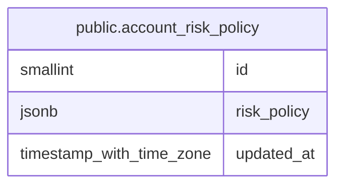

# public.account_risk_policy

## Description

口座全体に適用するリスク制限設定を保持する。

## Columns

| Name        | Type                     | Default           | Nullable | Children | Parents | Comment                                |
| ----------- | ------------------------ | ----------------- | -------- | -------- | ------- | -------------------------------------- |
| id          | smallint                 | 1                 | false    |          |         |                                        |
| risk_policy | jsonb                    | '{}'::jsonb       | false    |          |         | 口座全体のリスク制限を表す JSON 設定。 |
| updated_at  | timestamp with time zone | CURRENT_TIMESTAMP | false    |          |         |                                        |

## Constraints

| Name                         | Type        | Definition       |
| ---------------------------- | ----------- | ---------------- |
| account_risk_policy_id_check | CHECK       | CHECK ((id = 1)) |
| account_risk_policy_pkey     | PRIMARY KEY | PRIMARY KEY (id) |

## Indexes

| Name                     | Definition                                                                                  |
| ------------------------ | ------------------------------------------------------------------------------------------- |
| account_risk_policy_pkey | CREATE UNIQUE INDEX account_risk_policy_pkey ON public.account_risk_policy USING btree (id) |

## Relations

---

> Generated by [tbls](https://github.com/k1LoW/tbls)
