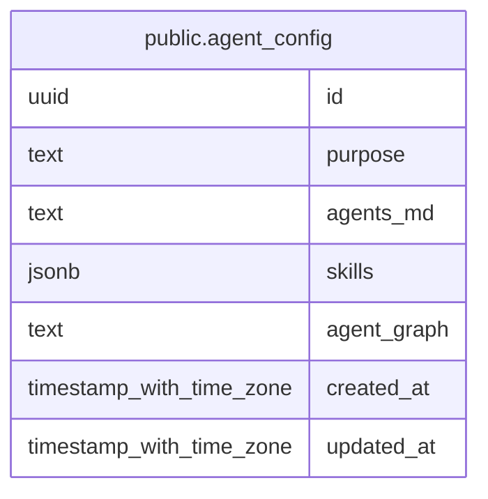

# public.agent_config

## Columns

| Name        | Type                     | Default           | Nullable | Children | Parents | Comment |
| ----------- | ------------------------ | ----------------- | -------- | -------- | ------- | ------- |
| id          | uuid                     | gen_random_uuid() | false    |          |         |         |
| purpose     | text                     |                   | false    |          |         |         |
| agents_md   | text                     | ''::text          | false    |          |         |         |
| skills      | jsonb                    | '{}'::jsonb       | false    |          |         |         |
| agent_graph | text                     | ''::text          | false    |          |         |         |
| created_at  | timestamp with time zone | CURRENT_TIMESTAMP | false    |          |         |         |
| updated_at  | timestamp with time zone | CURRENT_TIMESTAMP | false    |          |         |         |

## Constraints

| Name                     | Type        | Definition       |
| ------------------------ | ----------- | ---------------- |
| agent_config_pkey        | PRIMARY KEY | PRIMARY KEY (id) |
| agent_config_purpose_key | UNIQUE      | UNIQUE (purpose) |

## Indexes

| Name                     | Definition                                                                                |
| ------------------------ | ----------------------------------------------------------------------------------------- |
| agent_config_pkey        | CREATE UNIQUE INDEX agent_config_pkey ON public.agent_config USING btree (id)             |
| agent_config_purpose_key | CREATE UNIQUE INDEX agent_config_purpose_key ON public.agent_config USING btree (purpose) |

## Relations

---

> Generated by [tbls](https://github.com/k1LoW/tbls)
