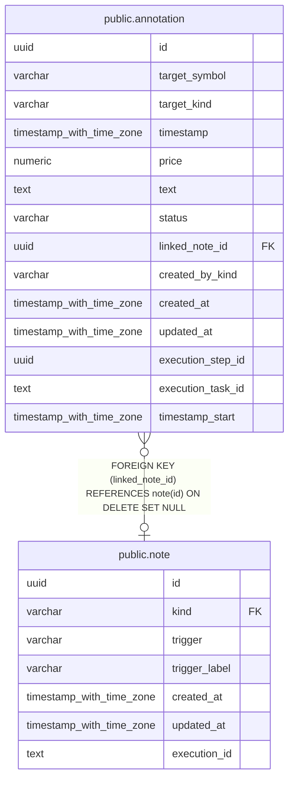

# public.annotation

## Description

銘柄などの対象へ付与したテキスト注釈を保持する。

## Columns

| Name              | Type                     | Default                     | Nullable | Children | Parents                       | Comment                                             |
| ----------------- | ------------------------ | --------------------------- | -------- | -------- | ----------------------------- | --------------------------------------------------- |
| id                | uuid                     |                             | false    |          |                               |                                                     |
| target_symbol     | varchar                  |                             | false    |          |                               | 注釈対象を識別する銘柄・参照の ID。                 |
| target_kind       | varchar                  |                             | false    |          |                               | 注釈対象の種類。                                    |
| timestamp         | timestamp with time zone |                             | false    |          |                               | 注釈を紐づける時刻。                                |
| price             | numeric                  |                             | true     |          |                               | 注釈を紐づける価格。                                |
| text              | text                     |                             | false    |          |                               | 注釈本文。                                          |
| status            | varchar                  | 'unread'::character varying | false    |          |                               | 注釈のレビュー状態。                                |
| linked_note_id    | uuid                     |                             | true     |          | [public.note](public.note.md) | 注釈に関連付けたノート。                            |
| created_by_kind   | varchar                  |                             | false    |          |                               | 注釈を作成した主体の種別。                          |
| created_at        | timestamp with time zone | CURRENT_TIMESTAMP           | false    |          |                               |                                                     |
| updated_at        | timestamp with time zone | CURRENT_TIMESTAMP           | false    |          |                               |                                                     |
| execution_step_id | uuid                     |                             | true     |          |                               | 注釈を作成したタスク実行ステップの UUID。           |
| execution_task_id | text                     |                             | true     |          |                               | 注釈を作成したタスク実行の識別子。                  |
| timestamp_start   | timestamp with time zone |                             | true     |          |                               | 注釈が語る期間の開始時刻。null は単日の注釈を表す。 |

## Constraints

| Name                             | Type        | Definition                                                                                                                                  |
| -------------------------------- | ----------- | ------------------------------------------------------------------------------------------------------------------------------------------- |
| annotation_created_by_kind_check | CHECK       | CHECK (((created_by_kind)::text = ANY ((ARRAY['human'::character varying, 'llm'::character varying])::text[])))                             |
| annotation_status_check          | CHECK       | CHECK (((status)::text = ANY ((ARRAY['approved'::character varying, 'unread'::character varying, 'rejected'::character varying])::text[]))) |
| annotation_linked_note_id_fkey   | FOREIGN KEY | FOREIGN KEY (linked_note_id) REFERENCES note(id) ON DELETE SET NULL                                                                         |
| annotation_pkey                  | PRIMARY KEY | PRIMARY KEY (id)                                                                                                                            |

## Indexes

| Name                                   | Definition                                                                                                        |
| -------------------------------------- | ----------------------------------------------------------------------------------------------------------------- |
| annotation_pkey                        | CREATE UNIQUE INDEX annotation_pkey ON public.annotation USING btree (id)                                         |
| idx_annotation_target_symbol_timestamp | CREATE INDEX idx_annotation_target_symbol_timestamp ON public.annotation USING btree (target_symbol, "timestamp") |
| idx_annotation_linked_note_id          | CREATE INDEX idx_annotation_linked_note_id ON public.annotation USING btree (linked_note_id)                      |
| idx_annotation_execution_step_id       | CREATE INDEX idx_annotation_execution_step_id ON public.annotation USING btree (execution_step_id)                |

## Relations

---

> Generated by [tbls](https://github.com/k1LoW/tbls)
