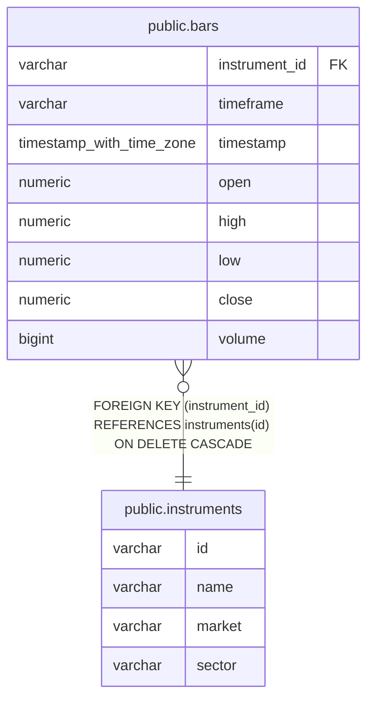

# public.bars

## Columns

| Name          | Type                     | Default | Nullable | Children | Parents                                     | Comment |
| ------------- | ------------------------ | ------- | -------- | -------- | ------------------------------------------- | ------- |
| instrument_id | varchar                  |         | false    |          | [public.instruments](public.instruments.md) |         |
| timeframe     | varchar                  |         | false    |          |                                             |         |
| timestamp     | timestamp with time zone |         | false    |          |                                             |         |
| open          | numeric                  |         | false    |          |                                             |         |
| high          | numeric                  |         | false    |          |                                             |         |
| low           | numeric                  |         | false    |          |                                             |         |
| close         | numeric                  |         | false    |          |                                             |         |
| volume        | bigint                   |         | false    |          |                                             |         |

## Constraints

| Name                    | Type        | Definition                                                               |
| ----------------------- | ----------- | ------------------------------------------------------------------------ |
| bars_timeframe_check    | CHECK       | CHECK (((timeframe)::text = '1d'::text))                                 |
| bars_instrument_id_fkey | FOREIGN KEY | FOREIGN KEY (instrument_id) REFERENCES instruments(id) ON DELETE CASCADE |
| bars_pkey               | PRIMARY KEY | PRIMARY KEY (instrument_id, timeframe, "timestamp")                      |

## Indexes

| Name               | Definition                                                                                       |
| ------------------ | ------------------------------------------------------------------------------------------------ |
| bars_pkey          | CREATE UNIQUE INDEX bars_pkey ON public.bars USING btree (instrument_id, timeframe, "timestamp") |
| bars_timestamp_idx | CREATE INDEX bars_timestamp_idx ON public.bars USING btree ("timestamp" DESC)                    |

## Relations

---

> Generated by [tbls](https://github.com/k1LoW/tbls)
