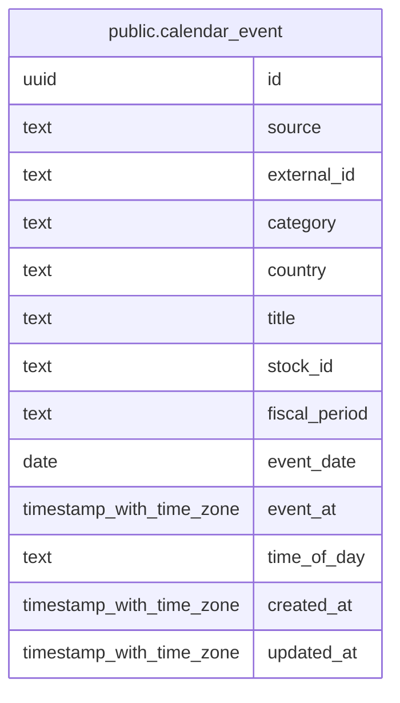

# public.calendar_event

## Description

指標、中銀イベント、決算などの予定を取得元ごとに保持する。

## Columns

| Name          | Type                     | Default           | Nullable | Children | Parents | Comment                                                        |
| ------------- | ------------------------ | ----------------- | -------- | -------- | ------- | -------------------------------------------------------------- |
| id            | uuid                     | gen_random_uuid() | false    |          |         |                                                                |
| source        | text                     |                   | false    |          |         | 予定を取得した取得元の識別子。                                 |
| external_id   | text                     |                   | false    |          |         | 取得元内でイベントを識別するキー。                             |
| category      | text                     |                   | false    |          |         | イベントの分類。indicator、central_bank、earnings のいずれか。 |
| country       | text                     |                   | false    |          |         | 指標・中銀イベントの対象地域、または決算の上場市場。           |
| title         | text                     |                   | false    |          |         | イベント名、または決算会社名。                                 |
| stock_id      | text                     |                   | true     |          |         | 決算対象の銘柄 ID。決算以外では null。                         |
| fiscal_period | text                     |                   | true     |          |         | 決算期。決算以外では null。                                    |
| event_date    | date                     |                   | false    |          |         | イベントが予定されている JST の日付。                          |
| event_at      | timestamp with time zone |                   | true     |          |         | 時刻が分かる場合のイベント日時。                               |
| time_of_day   | text                     |                   | true     |          |         | 時刻の代わりに寄り前または引け後が分かる場合の区分。           |
| created_at    | timestamp with time zone | CURRENT_TIMESTAMP | false    |          |         |                                                                |
| updated_at    | timestamp with time zone | CURRENT_TIMESTAMP | false    |          |         |                                                                |

## Constraints

| Name                             | Type        | Definition                                                                                  |
| -------------------------------- | ----------- | ------------------------------------------------------------------------------------------- |
| calendar_event_category_check    | CHECK       | CHECK ((category = ANY (ARRAY['indicator'::text, 'central_bank'::text, 'earnings'::text]))) |
| calendar_event_time_of_day_check | CHECK       | CHECK ((time_of_day = ANY (ARRAY['pre_market'::text, 'post_market'::text])))                |
| calendar_event_pkey              | PRIMARY KEY | PRIMARY KEY (id)                                                                            |

## Indexes

| Name                                 | Definition                                                                                                          |
| ------------------------------------ | ------------------------------------------------------------------------------------------------------------------- |
| calendar_event_pkey                  | CREATE UNIQUE INDEX calendar_event_pkey ON public.calendar_event USING btree (id)                                   |
| uq_calendar_event_source_external_id | CREATE UNIQUE INDEX uq_calendar_event_source_external_id ON public.calendar_event USING btree (source, external_id) |
| idx_calendar_event_event_date        | CREATE INDEX idx_calendar_event_event_date ON public.calendar_event USING btree (event_date)                        |
| idx_calendar_event_source_event_date | CREATE INDEX idx_calendar_event_source_event_date ON public.calendar_event USING btree (source, event_date)         |
| idx_calendar_event_stock_id          | CREATE INDEX idx_calendar_event_stock_id ON public.calendar_event USING btree (stock_id)                            |

## Relations

---

> Generated by [tbls](https://github.com/k1LoW/tbls)
