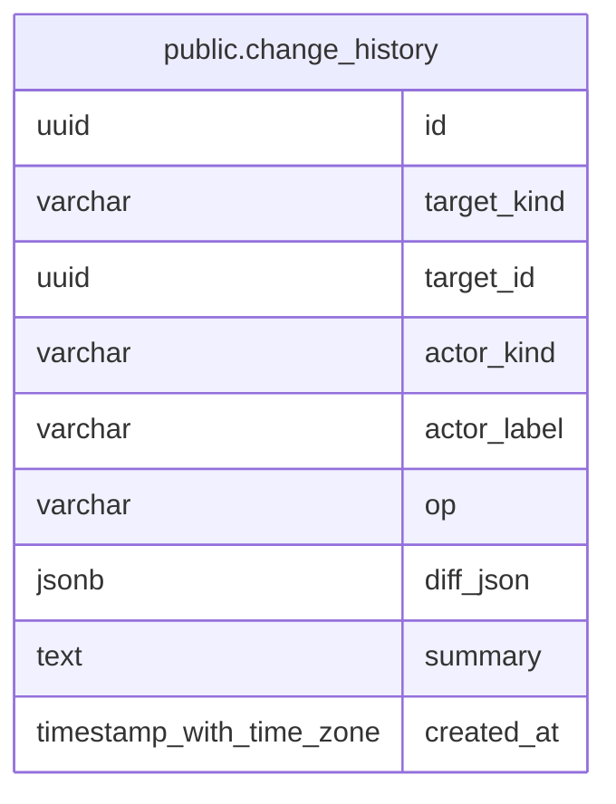

# public.change_history

## Description

主要レコードに対する作成・更新・削除・状態変更を記録する監査履歴。

## Columns

| Name        | Type                     | Default           | Nullable | Children | Parents | Comment                                                                  |
| ----------- | ------------------------ | ----------------- | -------- | -------- | ------- | ------------------------------------------------------------------------ |
| id          | uuid                     |                   | false    |          |         |                                                                          |
| target_kind | varchar                  |                   | false    |          |         | 変更対象のレコード種別。stock は銘柄、stock_group は銘柄グループを表す。 |
| target_id   | uuid                     |                   | false    |          |         | 変更対象レコードの ID。                                                  |
| actor_kind  | varchar                  |                   | false    |          |         | 変更を行った主体の種別。                                                 |
| actor_label | varchar                  |                   | false    |          |         | 変更を行った主体の表示名。                                               |
| op          | varchar                  |                   | false    |          |         | 記録した操作の種別。                                                     |
| diff_json   | jsonb                    |                   | false    |          |         | 変更内容を表す JSON 差分。                                               |
| summary     | text                     |                   | true     |          |         | 変更理由などの補足説明。                                                 |
| created_at  | timestamp with time zone | CURRENT_TIMESTAMP | false    |          |         |                                                                          |

## Constraints

| Name                             | Type        | Definition                                                                                                                                                                                                                                                                                                                                      |
| -------------------------------- | ----------- | ----------------------------------------------------------------------------------------------------------------------------------------------------------------------------------------------------------------------------------------------------------------------------------------------------------------------------------------------- |
| change_history_actor_kind_check  | CHECK       | CHECK (((actor_kind)::text = ANY ((ARRAY['human'::character varying, 'llm'::character varying])::text[])))                                                                                                                                                                                                                                      |
| change_history_op_check          | CHECK       | CHECK (((op)::text = ANY ((ARRAY['create'::character varying, 'update'::character varying, 'delete'::character varying, 'status_change'::character varying])::text[])))                                                                                                                                                                         |
| change_history_target_kind_check | CHECK       | CHECK (((target_kind)::text = ANY ((ARRAY['note'::character varying, 'annotation'::character varying, 'strategy'::character varying, 'trade'::character varying, 'comment'::character varying, 'custom_indicator'::character varying, 'note_kind'::character varying, 'stock_group'::character varying, 'stock'::character varying])::text[]))) |
| change_history_pkey              | PRIMARY KEY | PRIMARY KEY (id)                                                                                                                                                                                                                                                                                                                                |

## Indexes

| Name                      | Definition                                                                                           |
| ------------------------- | ---------------------------------------------------------------------------------------------------- |
| change_history_pkey       | CREATE UNIQUE INDEX change_history_pkey ON public.change_history USING btree (id)                    |
| idx_change_history_target | CREATE INDEX idx_change_history_target ON public.change_history USING btree (target_kind, target_id) |

## Relations

---

> Generated by [tbls](https://github.com/k1LoW/tbls)
