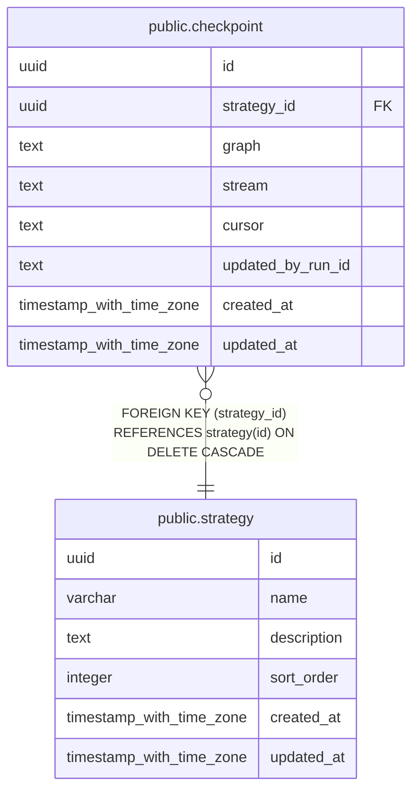

# public.checkpoint

## Description

戦略・処理グラフごとに外部 stream の読み進め位置を保持する。

## Columns

| Name              | Type                     | Default           | Nullable | Children | Parents                               | Comment                                         |
| ----------------- | ------------------------ | ----------------- | -------- | -------- | ------------------------------------- | ----------------------------------------------- |
| id                | uuid                     | gen_random_uuid() | false    |          |                                       |                                                 |
| strategy_id       | uuid                     |                   | false    |          | [public.strategy](public.strategy.md) | checkpoint が属する戦略。                       |
| graph             | text                     |                   | false    |          |                                       | checkpoint を分離する処理グラフの識別子。       |
| stream            | text                     |                   | false    |          |                                       | checkpoint を分離する外部 stream の識別子。     |
| cursor            | text                     |                   | false    |          |                                       | 外部 stream で最後に読み進めた位置。            |
| updated_by_run_id | text                     |                   | true     |          |                                       | checkpoint を最後に更新したタスク実行の識別子。 |
| created_at        | timestamp with time zone | CURRENT_TIMESTAMP | false    |          |                                       |                                                 |
| updated_at        | timestamp with time zone | CURRENT_TIMESTAMP | false    |          |                                       |                                                 |

## Constraints

| Name                        | Type        | Definition                                                          |
| --------------------------- | ----------- | ------------------------------------------------------------------- |
| checkpoint_strategy_id_fkey | FOREIGN KEY | FOREIGN KEY (strategy_id) REFERENCES strategy(id) ON DELETE CASCADE |
| checkpoint_pkey             | PRIMARY KEY | PRIMARY KEY (id)                                                    |

## Indexes

| Name                                 | Definition                                                                                                             |
| ------------------------------------ | ---------------------------------------------------------------------------------------------------------------------- |
| checkpoint_pkey                      | CREATE UNIQUE INDEX checkpoint_pkey ON public.checkpoint USING btree (id)                                              |
| checkpoint_strategy_graph_stream_idx | CREATE UNIQUE INDEX checkpoint_strategy_graph_stream_idx ON public.checkpoint USING btree (strategy_id, graph, stream) |

## Relations

---

> Generated by [tbls](https://github.com/k1LoW/tbls)
