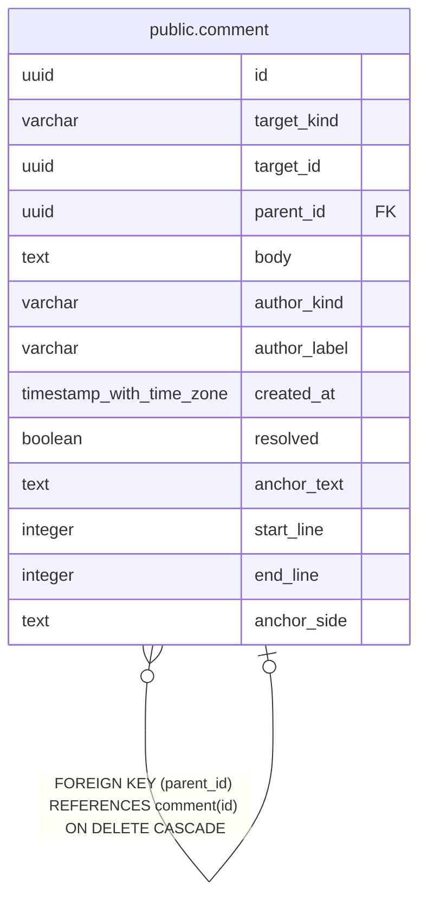

# public.comment

## Description

ノートやアノテーションに付けるコメントと返信を保持する。

## Columns

| Name         | Type                     | Default           | Nullable | Children                            | Parents                             | Comment                                        |
| ------------ | ------------------------ | ----------------- | -------- | ----------------------------------- | ----------------------------------- | ---------------------------------------------- |
| id           | uuid                     |                   | false    | [public.comment](public.comment.md) |                                     |                                                |
| target_kind  | varchar                  |                   | false    |                                     |                                     | コメント対象の種類。                           |
| target_id    | uuid                     |                   | false    |                                     |                                     | コメント対象の ID。                            |
| parent_id    | uuid                     |                   | true     |                                     | [public.comment](public.comment.md) | 返信元となる親コメント。                       |
| body         | text                     |                   | false    |                                     |                                     | コメント本文。                                 |
| author_kind  | varchar                  |                   | false    |                                     |                                     | コメントを投稿した主体の種別。                 |
| author_label | varchar                  |                   | false    |                                     |                                     | コメントを投稿した主体の表示名。               |
| created_at   | timestamp with time zone | CURRENT_TIMESTAMP | false    |                                     |                                     |                                                |
| resolved     | boolean                  | false             | false    |                                     |                                     | コメントが解決済みかどうか。                   |
| anchor_text  | text                     |                   | true     |                                     |                                     | 行コメントで選択した本文の引用。               |
| start_line   | integer                  |                   | true     |                                     |                                     | 行コメントの開始行。1 始まり。                 |
| end_line     | integer                  |                   | true     |                                     |                                     | 行コメントの終了行。1 始まり。                 |
| anchor_side  | text                     |                   | true     |                                     |                                     | 行コメントが参照するノートバージョン本文の側。 |

## Constraints

| Name                      | Type        | Definition                                                                                                                                           |
| ------------------------- | ----------- | ---------------------------------------------------------------------------------------------------------------------------------------------------- |
| comment_author_kind_check | CHECK       | CHECK (((author_kind)::text = ANY ((ARRAY['human'::character varying, 'llm'::character varying])::text[])))                                          |
| comment_target_kind_check | CHECK       | CHECK (((target_kind)::text = ANY ((ARRAY['note'::character varying, 'note_version'::character varying, 'annotation'::character varying])::text[]))) |
| comment_parent_id_fkey    | FOREIGN KEY | FOREIGN KEY (parent_id) REFERENCES comment(id) ON DELETE CASCADE                                                                                     |
| comment_pkey              | PRIMARY KEY | PRIMARY KEY (id)                                                                                                                                     |

## Indexes

| Name                  | Definition                                                                             |
| --------------------- | -------------------------------------------------------------------------------------- |
| comment_pkey          | CREATE UNIQUE INDEX comment_pkey ON public.comment USING btree (id)                    |
| idx_comment_target    | CREATE INDEX idx_comment_target ON public.comment USING btree (target_kind, target_id) |
| idx_comment_parent_id | CREATE INDEX idx_comment_parent_id ON public.comment USING btree (parent_id)           |

## Relations

---

> Generated by [tbls](https://github.com/k1LoW/tbls)
