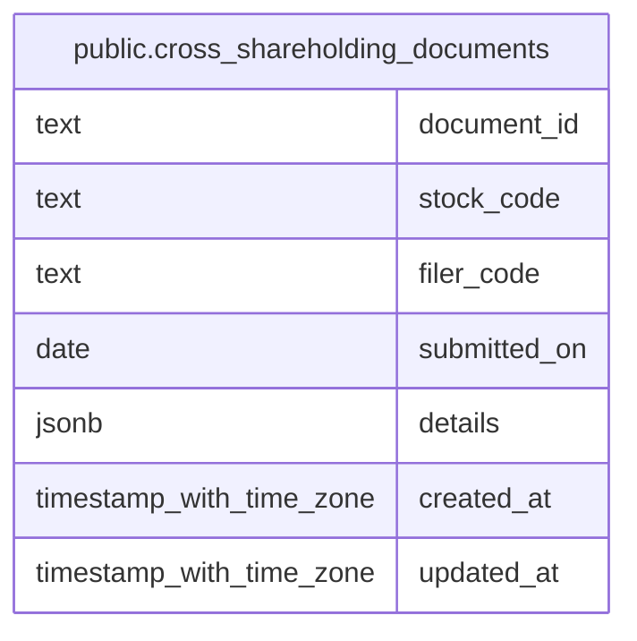

# public.cross_shareholding_documents

## Description

EDINET の政策保有株式に関する提出書類と明細を保持する。

## Columns

| Name         | Type                     | Default           | Nullable | Children | Parents | Comment                                                          |
| ------------ | ------------------------ | ----------------- | -------- | -------- | ------- | ---------------------------------------------------------------- |
| document_id  | text                     |                   | false    |          |         | EDINET 書類の識別子。                                            |
| stock_code   | text                     |                   | true     |          |         | 書類の対象銘柄コード。                                           |
| filer_code   | text                     |                   | false    |          |         | 書類提出者の EDINET コード。                                     |
| submitted_on | date                     |                   | false    |          |         | 書類の提出日。                                                   |
| details      | jsonb                    |                   | false    |          |         | 対象期間、相手先、保有株数・簿価の現行値と前期値を含む書類明細。 |
| created_at   | timestamp with time zone | CURRENT_TIMESTAMP | false    |          |         |                                                                  |
| updated_at   | timestamp with time zone | CURRENT_TIMESTAMP | false    |          |         |                                                                  |

## Constraints

| Name                              | Type        | Definition                |
| --------------------------------- | ----------- | ------------------------- |
| cross_shareholding_documents_pkey | PRIMARY KEY | PRIMARY KEY (document_id) |

## Indexes

| Name                                          | Definition                                                                                                                   |
| --------------------------------------------- | ---------------------------------------------------------------------------------------------------------------------------- |
| cross_shareholding_documents_pkey             | CREATE UNIQUE INDEX cross_shareholding_documents_pkey ON public.cross_shareholding_documents USING btree (document_id)       |
| idx_cross_shareholding_documents_stock_code   | CREATE INDEX idx_cross_shareholding_documents_stock_code ON public.cross_shareholding_documents USING btree (stock_code)     |
| idx_cross_shareholding_documents_submitted_on | CREATE INDEX idx_cross_shareholding_documents_submitted_on ON public.cross_shareholding_documents USING btree (submitted_on) |

## Relations

---

> Generated by [tbls](https://github.com/k1LoW/tbls)
