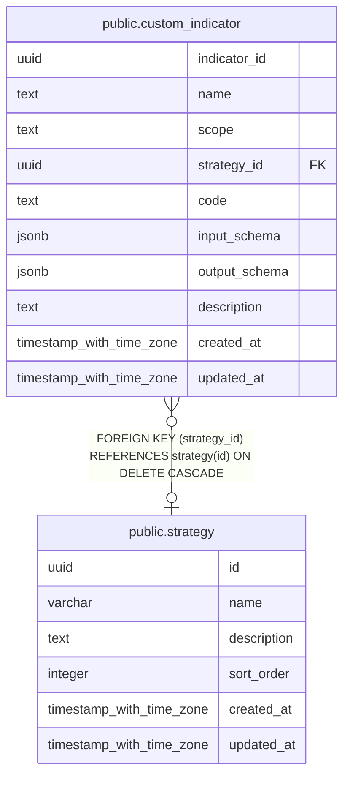

# public.custom_indicator

## Description

共有または戦略ごとに定義する実行可能なカスタム指標。

## Columns

| Name          | Type                     | Default           | Nullable | Children | Parents                               | Comment                                  |
| ------------- | ------------------------ | ----------------- | -------- | -------- | ------------------------------------- | ---------------------------------------- |
| indicator_id  | uuid                     | gen_random_uuid() | false    |          |                                       | カスタム指標の識別子。                   |
| name          | text                     |                   | false    |          |                                       | カスタム指標の名称。                     |
| scope         | text                     |                   | false    |          |                                       | 指標の共有範囲。                         |
| strategy_id   | uuid                     |                   | true     |          | [public.strategy](public.strategy.md) | 戦略スコープの場合に指標を所有する戦略。 |
| code          | text                     |                   | false    |          |                                       | 指標の計算に実行するコード。             |
| input_schema  | jsonb                    |                   | false    |          |                                       | 指標へ渡す入力値を検証する JSON Schema。 |
| output_schema | jsonb                    |                   | false    |          |                                       | 指標の出力値を検証する JSON Schema。     |
| description   | text                     |                   | true     |          |                                       | カスタム指標の説明。                     |
| created_at    | timestamp with time zone | CURRENT_TIMESTAMP | false    |          |                                       |                                          |
| updated_at    | timestamp with time zone | CURRENT_TIMESTAMP | false    |          |                                       |                                          |

## Constraints

| Name                                     | Type        | Definition                                                                                                                   |
| ---------------------------------------- | ----------- | ---------------------------------------------------------------------------------------------------------------------------- |
| custom_indicator_scope_check             | CHECK       | CHECK ((scope = ANY (ARRAY['global'::text, 'strategy'::text])))                                                              |
| custom_indicator_scope_strategy_id_check | CHECK       | CHECK ((((scope = 'global'::text) AND (strategy_id IS NULL)) OR ((scope = 'strategy'::text) AND (strategy_id IS NOT NULL)))) |
| custom_indicator_strategy_id_fkey        | FOREIGN KEY | FOREIGN KEY (strategy_id) REFERENCES strategy(id) ON DELETE CASCADE                                                          |
| custom_indicator_pkey                    | PRIMARY KEY | PRIMARY KEY (indicator_id)                                                                                                   |

## Indexes

| Name                               | Definition                                                                                                                                         |
| ---------------------------------- | -------------------------------------------------------------------------------------------------------------------------------------------------- |
| custom_indicator_pkey              | CREATE UNIQUE INDEX custom_indicator_pkey ON public.custom_indicator USING btree (indicator_id)                                                    |
| custom_indicator_global_name_idx   | CREATE UNIQUE INDEX custom_indicator_global_name_idx ON public.custom_indicator USING btree (name) WHERE (scope = 'global'::text)                  |
| custom_indicator_strategy_name_idx | CREATE UNIQUE INDEX custom_indicator_strategy_name_idx ON public.custom_indicator USING btree (strategy_id, name) WHERE (scope = 'strategy'::text) |

## Relations

---

> Generated by [tbls](https://github.com/k1LoW/tbls)
