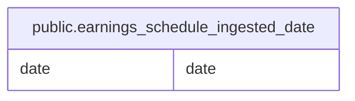

# public.earnings_schedule_ingested_date

## Description

決算予定を取得した公表日を記録する。

## Columns

| Name | Type | Default | Nullable | Children | Parents | Comment                      |
| ---- | ---- | ------- | -------- | -------- | ------- | ---------------------------- |
| date | date |         | false    |          |         | 決算予定を保存できた公表日。 |

## Constraints

| Name                                 | Type        | Definition         |
| ------------------------------------ | ----------- | ------------------ |
| earnings_schedule_ingested_date_pkey | PRIMARY KEY | PRIMARY KEY (date) |

## Indexes

| Name                                 | Definition                                                                                                            |
| ------------------------------------ | --------------------------------------------------------------------------------------------------------------------- |
| earnings_schedule_ingested_date_pkey | CREATE UNIQUE INDEX earnings_schedule_ingested_date_pkey ON public.earnings_schedule_ingested_date USING btree (date) |

## Relations

---

> Generated by [tbls](https://github.com/k1LoW/tbls)
