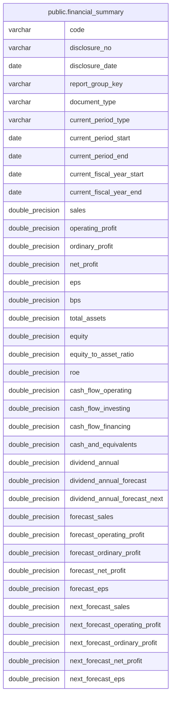

# public.financial_summary

## Description

銘柄ごとの決算開示内容と業績予想を保持する。

## Columns

| Name                           | Type             | Default | Nullable | Children | Parents | Comment                                        |
| ------------------------------ | ---------------- | ------- | -------- | -------- | ------- | ---------------------------------------------- |
| code                           | varchar          |         | false    |          |         | 銘柄コード。                                   |
| disclosure_no                  | varchar          |         | false    |          |         | 開示番号。                                     |
| disclosure_date                | date             |         | false    |          |         | 開示日。                                       |
| report_group_key               | varchar          |         | false    |          |         | 開示書類種別と対象期間をまとめる内部識別キー。 |
| document_type                  | varchar          |         | true     |          |         | 開示書類の種別。                               |
| current_period_type            | varchar          |         | true     |          |         | 当期対象期間の種別。                           |
| current_period_start           | date             |         | true     |          |         | 当期対象期間の開始日。                         |
| current_period_end             | date             |         | true     |          |         | 当期対象期間の終了日。                         |
| current_fiscal_year_start      | date             |         | true     |          |         | 当期会計年度の開始日。                         |
| current_fiscal_year_end        | date             |         | true     |          |         | 当期会計年度の終了日。                         |
| sales                          | double precision |         | true     |          |         | 売上高。                                       |
| operating_profit               | double precision |         | true     |          |         | 営業利益。                                     |
| ordinary_profit                | double precision |         | true     |          |         | 経常利益。                                     |
| net_profit                     | double precision |         | true     |          |         | 純利益。                                       |
| eps                            | double precision |         | true     |          |         | 1 株当たり利益。                               |
| bps                            | double precision |         | true     |          |         | 1 株当たり純資産。                             |
| total_assets                   | double precision |         | true     |          |         | 総資産。                                       |
| equity                         | double precision |         | true     |          |         | 純資産。                                       |
| equity_to_asset_ratio          | double precision |         | true     |          |         | 純資産の総資産に対する比率。                   |
| roe                            | double precision |         | true     |          |         | 自己資本利益率。                               |
| cash_flow_operating            | double precision |         | true     |          |         | 営業活動によるキャッシュフロー。               |
| cash_flow_investing            | double precision |         | true     |          |         | 投資活動によるキャッシュフロー。               |
| cash_flow_financing            | double precision |         | true     |          |         | 財務活動によるキャッシュフロー。               |
| cash_and_equivalents           | double precision |         | true     |          |         | 現金及び現金同等物。                           |
| dividend_annual                | double precision |         | true     |          |         | 年間配当実績。                                 |
| dividend_annual_forecast       | double precision |         | true     |          |         | 年間配当予想。                                 |
| dividend_annual_forecast_next  | double precision |         | true     |          |         | 翌期の年間配当予想。                           |
| forecast_sales                 | double precision |         | true     |          |         | 当期の売上高予想。                             |
| forecast_operating_profit      | double precision |         | true     |          |         | 当期の営業利益予想。                           |
| forecast_ordinary_profit       | double precision |         | true     |          |         | 当期の経常利益予想。                           |
| forecast_net_profit            | double precision |         | true     |          |         | 当期の純利益予想。                             |
| forecast_eps                   | double precision |         | true     |          |         | 当期の 1 株当たり利益予想。                    |
| next_forecast_sales            | double precision |         | true     |          |         | 翌期の売上高予想。                             |
| next_forecast_operating_profit | double precision |         | true     |          |         | 翌期の営業利益予想。                           |
| next_forecast_ordinary_profit  | double precision |         | true     |          |         | 翌期の経常利益予想。                           |
| next_forecast_net_profit       | double precision |         | true     |          |         | 翌期の純利益予想。                             |
| next_forecast_eps              | double precision |         | true     |          |         | 翌期の 1 株当たり利益予想。                    |

## Constraints

| Name                   | Type        | Definition                        |
| ---------------------- | ----------- | --------------------------------- |
| financial_summary_pkey | PRIMARY KEY | PRIMARY KEY (code, disclosure_no) |

## Indexes

| Name                                  | Definition                                                                                                       |
| ------------------------------------- | ---------------------------------------------------------------------------------------------------------------- |
| financial_summary_pkey                | CREATE UNIQUE INDEX financial_summary_pkey ON public.financial_summary USING btree (code, disclosure_no)         |
| idx_financial_summary_disclosure_date | CREATE INDEX idx_financial_summary_disclosure_date ON public.financial_summary USING btree (disclosure_date)     |
| idx_financial_summary_code_prefix     | CREATE INDEX idx_financial_summary_code_prefix ON public.financial_summary USING btree ("left"((code)::text, 4)) |

## Relations

---

> Generated by [tbls](https://github.com/k1LoW/tbls)
