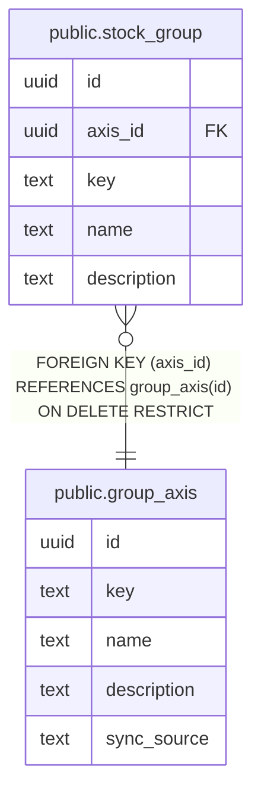

# public.group_axis

## Columns

| Name        | Type | Default           | Nullable | Children                                    | Parents | Comment |
| ----------- | ---- | ----------------- | -------- | ------------------------------------------- | ------- | ------- |
| id          | uuid | gen_random_uuid() | false    | [public.stock_group](public.stock_group.md) |         |         |
| key         | text |                   | false    |                                             |         |         |
| name        | text |                   | false    |                                             |         |         |
| description | text |                   | false    |                                             |         |         |
| sync_source | text |                   | true     |                                             |         |         |

## Constraints

| Name               | Type        | Definition       |
| ------------------ | ----------- | ---------------- |
| group_axis_pkey    | PRIMARY KEY | PRIMARY KEY (id) |
| group_axis_key_key | UNIQUE      | UNIQUE (key)     |

## Indexes

| Name               | Definition                                                                    |
| ------------------ | ----------------------------------------------------------------------------- |
| group_axis_pkey    | CREATE UNIQUE INDEX group_axis_pkey ON public.group_axis USING btree (id)     |
| group_axis_key_key | CREATE UNIQUE INDEX group_axis_key_key ON public.group_axis USING btree (key) |

## Relations

---

> Generated by [tbls](https://github.com/k1LoW/tbls)
