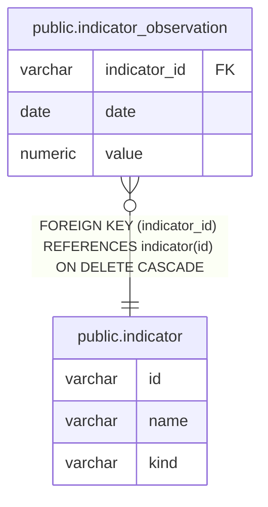

# public.indicator

## Description

マクロ指標などの参照先を定義する。

## Columns

| Name | Type    | Default | Nullable | Children                                                        | Parents | Comment            |
| ---- | ------- | ------- | -------- | --------------------------------------------------------------- | ------- | ------------------ |
| id   | varchar |         | false    | [public.indicator_observation](public.indicator_observation.md) |         |                    |
| name | varchar |         | false    |                                                                 |         | 指標の表示名。     |
| kind | varchar |         | false    |                                                                 |         | 指標の分類ラベル。 |

## Constraints

| Name           | Type        | Definition       |
| -------------- | ----------- | ---------------- |
| indicator_pkey | PRIMARY KEY | PRIMARY KEY (id) |

## Indexes

| Name           | Definition                                                              |
| -------------- | ----------------------------------------------------------------------- |
| indicator_pkey | CREATE UNIQUE INDEX indicator_pkey ON public.indicator USING btree (id) |

## Relations

---

> Generated by [tbls](https://github.com/k1LoW/tbls)
