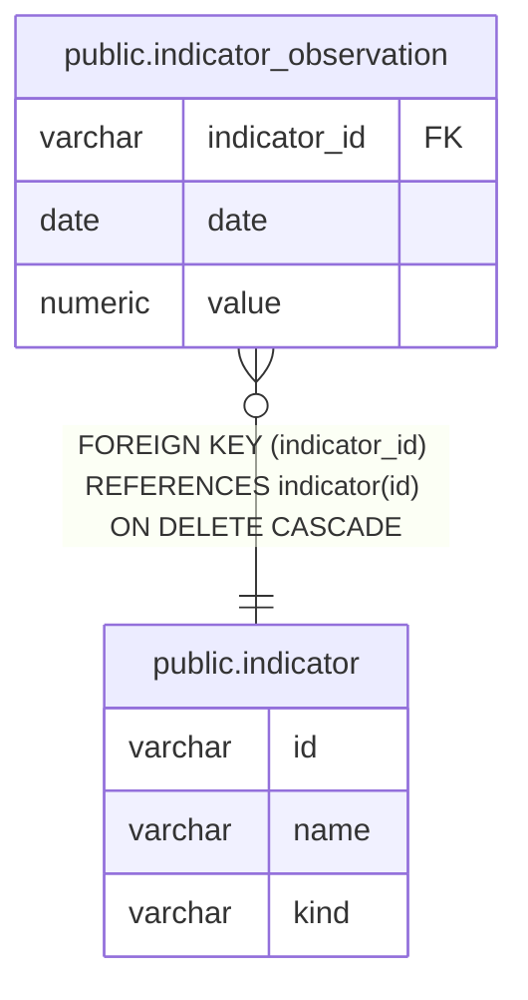

# public.indicator_observation

## Columns

| Name         | Type    | Default | Nullable | Children | Parents                                 | Comment |
| ------------ | ------- | ------- | -------- | -------- | --------------------------------------- | ------- |
| indicator_id | varchar |         | false    |          | [public.indicator](public.indicator.md) |         |
| date         | date    |         | false    |          |                                         |         |
| value        | numeric |         | false    |          |                                         |         |

## Constraints

| Name                                    | Type        | Definition                                                            |
| --------------------------------------- | ----------- | --------------------------------------------------------------------- |
| indicator_observation_indicator_id_fkey | FOREIGN KEY | FOREIGN KEY (indicator_id) REFERENCES indicator(id) ON DELETE CASCADE |
| indicator_observation_pkey              | PRIMARY KEY | PRIMARY KEY (indicator_id, date)                                      |

## Indexes

| Name                       | Definition                                                                                                      |
| -------------------------- | --------------------------------------------------------------------------------------------------------------- |
| indicator_observation_pkey | CREATE UNIQUE INDEX indicator_observation_pkey ON public.indicator_observation USING btree (indicator_id, date) |

## Relations

---

> Generated by [tbls](https://github.com/k1LoW/tbls)
