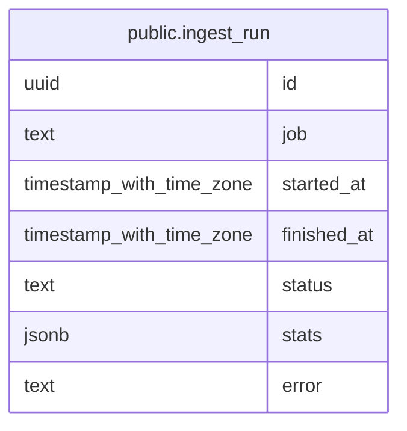

# public.ingest_run

## Columns

| Name        | Type                     | Default           | Nullable | Children | Parents | Comment |
| ----------- | ------------------------ | ----------------- | -------- | -------- | ------- | ------- |
| id          | uuid                     | gen_random_uuid() | false    |          |         |         |
| job         | text                     |                   | false    |          |         |         |
| started_at  | timestamp with time zone | CURRENT_TIMESTAMP | false    |          |         |         |
| finished_at | timestamp with time zone |                   | true     |          |         |         |
| status      | text                     | 'running'::text   | false    |          |         |         |
| stats       | jsonb                    |                   | true     |          |         |         |
| error       | text                     |                   | true     |          |         |         |

## Constraints

| Name                    | Type        | Definition                                                                         |
| ----------------------- | ----------- | ---------------------------------------------------------------------------------- |
| ingest_run_status_check | CHECK       | CHECK ((status = ANY (ARRAY['running'::text, 'succeeded'::text, 'failed'::text]))) |
| ingest_run_pkey         | PRIMARY KEY | PRIMARY KEY (id)                                                                   |

## Indexes

| Name                          | Definition                                                                                         |
| ----------------------------- | -------------------------------------------------------------------------------------------------- |
| ingest_run_pkey               | CREATE UNIQUE INDEX ingest_run_pkey ON public.ingest_run USING btree (id)                          |
| idx_ingest_run_job_started_at | CREATE INDEX idx_ingest_run_job_started_at ON public.ingest_run USING btree (job, started_at DESC) |

## Relations

---

> Generated by [tbls](https://github.com/k1LoW/tbls)
