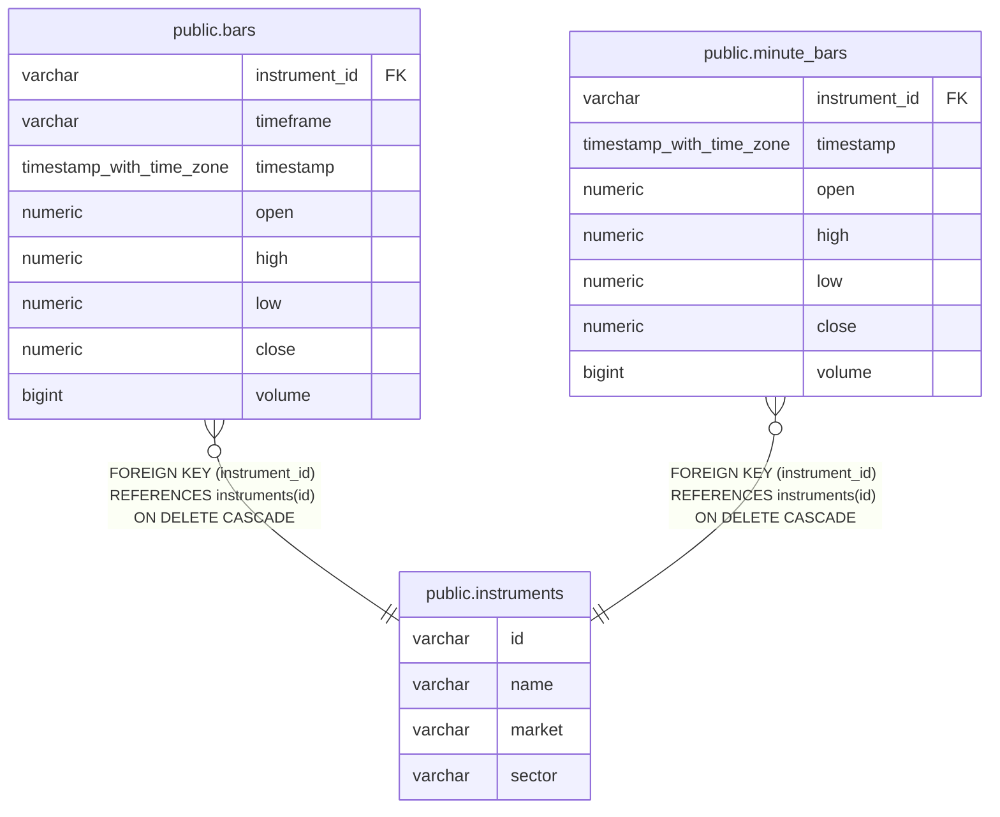

# public.instruments

## Description

価格データの取得対象となる金融商品を管理する。

## Columns

| Name   | Type    | Default | Nullable | Children                                                                  | Parents | Comment                                             |
| ------ | ------- | ------- | -------- | ------------------------------------------------------------------------- | ------- | --------------------------------------------------- |
| id     | varchar |         | false    | [public.bars](public.bars.md) [public.minute_bars](public.minute_bars.md) |         |                                                     |
| name   | varchar |         | false    |                                                                           |         | 金融商品の名称。                                    |
| market | varchar |         | false    |                                                                           |         | 金融商品が上場する市場。TSE、US、OTHER のいずれか。 |
| sector | varchar |         | true     |                                                                           |         | 金融商品に設定された業種名。                        |

## Constraints

| Name                     | Type        | Definition                                                                                                                      |
| ------------------------ | ----------- | ------------------------------------------------------------------------------------------------------------------------------- |
| instruments_market_check | CHECK       | CHECK (((market)::text = ANY ((ARRAY['TSE'::character varying, 'US'::character varying, 'OTHER'::character varying])::text[]))) |
| instruments_pkey         | PRIMARY KEY | PRIMARY KEY (id)                                                                                                                |

## Indexes

| Name             | Definition                                                                  |
| ---------------- | --------------------------------------------------------------------------- |
| instruments_pkey | CREATE UNIQUE INDEX instruments_pkey ON public.instruments USING btree (id) |

## Relations

---

> Generated by [tbls](https://github.com/k1LoW/tbls)
