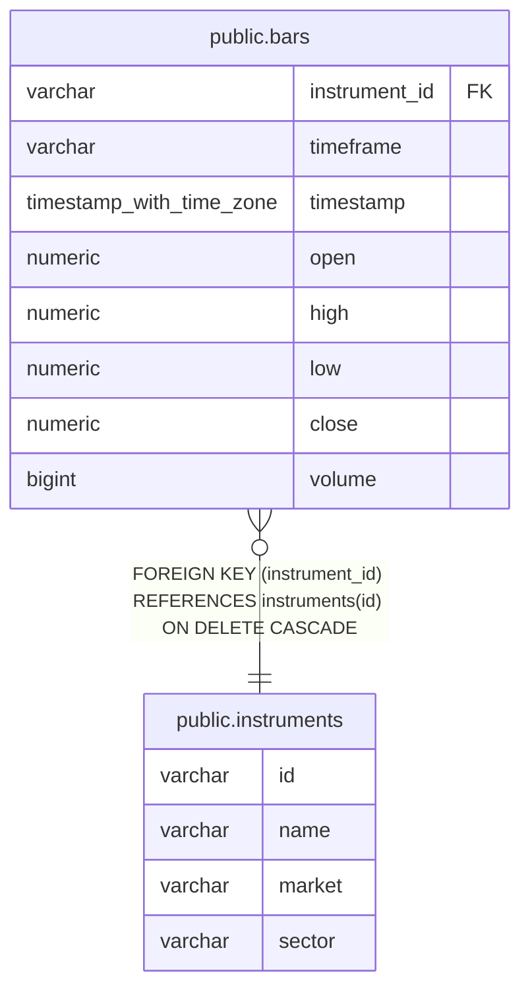

# public.instruments

## Columns

| Name   | Type    | Default | Nullable | Children                      | Parents | Comment |
| ------ | ------- | ------- | -------- | ----------------------------- | ------- | ------- |
| id     | varchar |         | false    | [public.bars](public.bars.md) |         |         |
| name   | varchar |         | false    |                               |         |         |
| market | varchar |         | false    |                               |         |         |
| sector | varchar |         | true     |                               |         |         |

## Constraints

| Name                     | Type        | Definition                             |
| ------------------------ | ----------- | -------------------------------------- |
| instruments_market_check | CHECK       | CHECK (((market)::text = 'TSE'::text)) |
| instruments_pkey         | PRIMARY KEY | PRIMARY KEY (id)                       |

## Indexes

| Name             | Definition                                                                  |
| ---------------- | --------------------------------------------------------------------------- |
| instruments_pkey | CREATE UNIQUE INDEX instruments_pkey ON public.instruments USING btree (id) |

## Relations

---

> Generated by [tbls](https://github.com/k1LoW/tbls)
