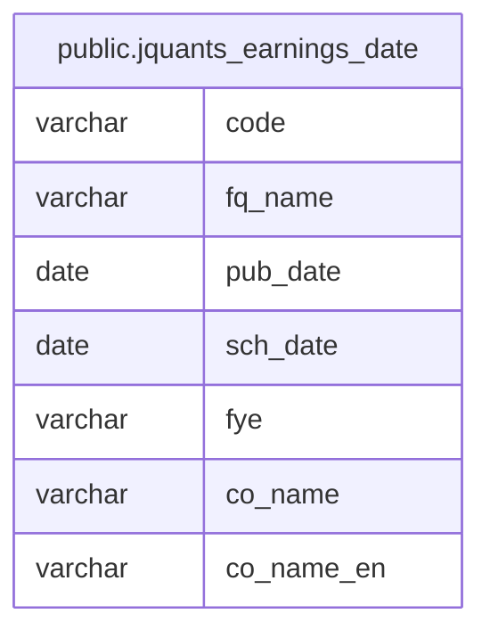

# public.jquants_earnings_date

## Columns

| Name       | Type    | Default | Nullable | Children | Parents | Comment |
| ---------- | ------- | ------- | -------- | -------- | ------- | ------- |
| code       | varchar |         | false    |          |         |         |
| fq_name    | varchar |         | false    |          |         |         |
| pub_date   | date    |         | false    |          |         |         |
| sch_date   | date    |         | true     |          |         |         |
| fye        | varchar |         | false    |          |         |         |
| co_name    | varchar |         | false    |          |         |         |
| co_name_en | varchar |         | false    |          |         |         |

## Constraints

| Name                       | Type        | Definition                            |
| -------------------------- | ----------- | ------------------------------------- |
| jquants_earnings_date_pkey | PRIMARY KEY | PRIMARY KEY (code, fq_name, pub_date) |

## Indexes

| Name                               | Definition                                                                                                           |
| ---------------------------------- | -------------------------------------------------------------------------------------------------------------------- |
| jquants_earnings_date_pkey         | CREATE UNIQUE INDEX jquants_earnings_date_pkey ON public.jquants_earnings_date USING btree (code, fq_name, pub_date) |
| idx_jquants_earnings_date_pub_date | CREATE INDEX idx_jquants_earnings_date_pub_date ON public.jquants_earnings_date USING btree (pub_date)               |

## Relations

---

> Generated by [tbls](https://github.com/k1LoW/tbls)
