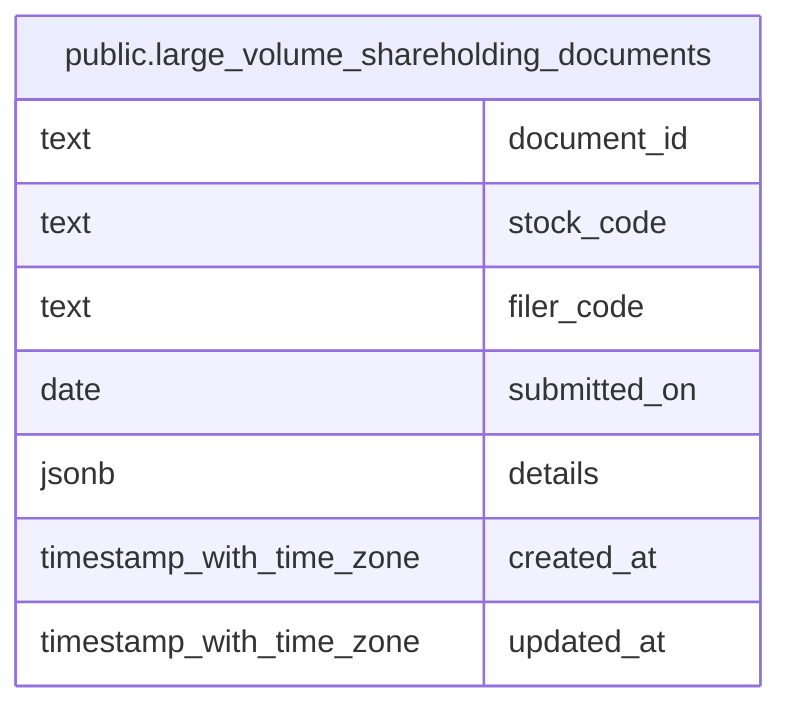

# public.large_volume_shareholding_documents

## Columns

| Name         | Type                     | Default           | Nullable | Children | Parents | Comment |
| ------------ | ------------------------ | ----------------- | -------- | -------- | ------- | ------- |
| document_id  | text                     |                   | false    |          |         |         |
| stock_code   | text                     |                   | true     |          |         |         |
| filer_code   | text                     |                   | false    |          |         |         |
| submitted_on | date                     |                   | false    |          |         |         |
| details      | jsonb                    |                   | false    |          |         |         |
| created_at   | timestamp with time zone | CURRENT_TIMESTAMP | false    |          |         |         |
| updated_at   | timestamp with time zone | CURRENT_TIMESTAMP | false    |          |         |         |

## Constraints

| Name                                     | Type        | Definition                |
| ---------------------------------------- | ----------- | ------------------------- |
| large_volume_shareholding_documents_pkey | PRIMARY KEY | PRIMARY KEY (document_id) |

## Indexes

| Name                                                 | Definition                                                                                                                                 |
| ---------------------------------------------------- | ------------------------------------------------------------------------------------------------------------------------------------------ |
| large_volume_shareholding_documents_pkey             | CREATE UNIQUE INDEX large_volume_shareholding_documents_pkey ON public.large_volume_shareholding_documents USING btree (document_id)       |
| idx_large_volume_shareholding_documents_stock_code   | CREATE INDEX idx_large_volume_shareholding_documents_stock_code ON public.large_volume_shareholding_documents USING btree (stock_code)     |
| idx_large_volume_shareholding_documents_submitted_on | CREATE INDEX idx_large_volume_shareholding_documents_submitted_on ON public.large_volume_shareholding_documents USING btree (submitted_on) |

## Relations

---

> Generated by [tbls](https://github.com/k1LoW/tbls)
