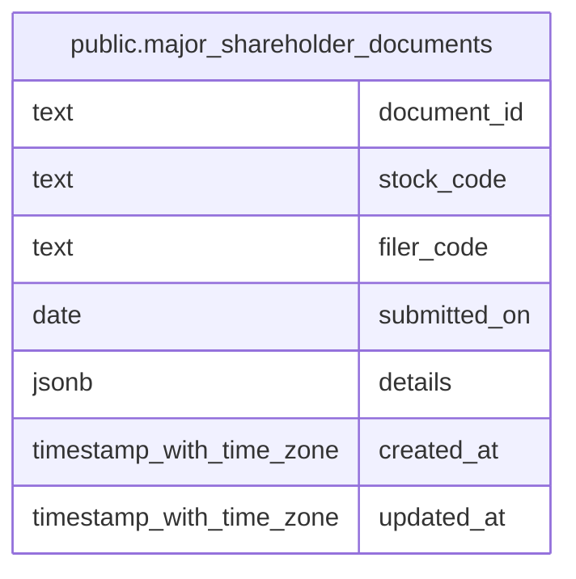

# public.major_shareholder_documents

## Description

EDINET の主要株主書類と順位付き株主情報を保持する。

## Columns

| Name         | Type                     | Default           | Nullable | Children | Parents | Comment                                                                        |
| ------------ | ------------------------ | ----------------- | -------- | -------- | ------- | ------------------------------------------------------------------------------ |
| document_id  | text                     |                   | false    |          |         | EDINET 書類の識別子。                                                          |
| stock_code   | text                     |                   | true     |          |         | 書類の対象銘柄コード。                                                         |
| filer_code   | text                     |                   | false    |          |         | 書類提出者の EDINET コード。                                                   |
| submitted_on | date                     |                   | false    |          |         | 書類の提出日。                                                                 |
| details      | jsonb                    |                   | false    |          |         | 対象期間末、報告種別、順位付きの主要株主名・保有株数・保有割合を含む書類明細。 |
| created_at   | timestamp with time zone | CURRENT_TIMESTAMP | false    |          |         |                                                                                |
| updated_at   | timestamp with time zone | CURRENT_TIMESTAMP | false    |          |         |                                                                                |

## Constraints

| Name                             | Type        | Definition                |
| -------------------------------- | ----------- | ------------------------- |
| major_shareholder_documents_pkey | PRIMARY KEY | PRIMARY KEY (document_id) |

## Indexes

| Name                                         | Definition                                                                                                                 |
| -------------------------------------------- | -------------------------------------------------------------------------------------------------------------------------- |
| major_shareholder_documents_pkey             | CREATE UNIQUE INDEX major_shareholder_documents_pkey ON public.major_shareholder_documents USING btree (document_id)       |
| idx_major_shareholder_documents_stock_code   | CREATE INDEX idx_major_shareholder_documents_stock_code ON public.major_shareholder_documents USING btree (stock_code)     |
| idx_major_shareholder_documents_submitted_on | CREATE INDEX idx_major_shareholder_documents_submitted_on ON public.major_shareholder_documents USING btree (submitted_on) |

## Relations

---

> Generated by [tbls](https://github.com/k1LoW/tbls)
