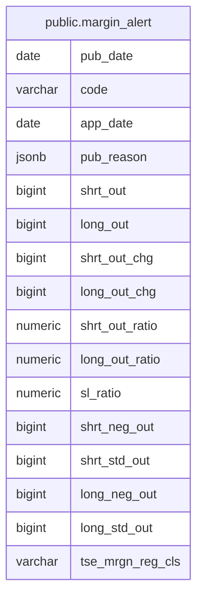

# public.margin_alert

## Description

日々公表銘柄の信用取引残高情報を保持する。

## Columns

| Name             | Type    | Default | Nullable | Children | Parents | Comment                        |
| ---------------- | ------- | ------- | -------- | -------- | ------- | ------------------------------ |
| pub_date         | date    |         | false    |          |         | データの公表日。               |
| code             | varchar |         | false    |          |         | 銘柄コード。                   |
| app_date         | date    |         | false    |          |         | 信用取引残高の申込日。         |
| pub_reason       | jsonb   |         | false    |          |         | 日々公表を行う理由のコード。   |
| shrt_out         | bigint  |         | false    |          |         | 信用売り残高。                 |
| long_out         | bigint  |         | false    |          |         | 信用買い残高。                 |
| shrt_out_chg     | bigint  |         | true     |          |         | 信用売り残高の増減。           |
| long_out_chg     | bigint  |         | true     |          |         | 信用買い残高の増減。           |
| shrt_out_ratio   | numeric |         | true     |          |         | 信用売り残高の比率。           |
| long_out_ratio   | numeric |         | true     |          |         | 信用買い残高の比率。           |
| sl_ratio         | numeric |         | true     |          |         | データソースの SL 比率欄の値。 |
| shrt_neg_out     | bigint  |         | false    |          |         | 信用売り残高の neg 区分値。    |
| shrt_std_out     | bigint  |         | false    |          |         | 信用売り残高の std 区分値。    |
| long_neg_out     | bigint  |         | false    |          |         | 信用買い残高の neg 区分値。    |
| long_std_out     | bigint  |         | false    |          |         | 信用買い残高の std 区分値。    |
| tse_mrgn_reg_cls | varchar |         | false    |          |         | 東証の信用規制区分コード。     |

## Constraints

| Name              | Type        | Definition                   |
| ----------------- | ----------- | ---------------------------- |
| margin_alert_pkey | PRIMARY KEY | PRIMARY KEY (pub_date, code) |

## Indexes

| Name                           | Definition                                                                                             |
| ------------------------------ | ------------------------------------------------------------------------------------------------------ |
| margin_alert_pkey              | CREATE UNIQUE INDEX margin_alert_pkey ON public.margin_alert USING btree (pub_date, code)              |
| idx_margin_alert_code_pub_date | CREATE INDEX idx_margin_alert_code_pub_date ON public.margin_alert USING btree (code, pub_date)        |
| idx_margin_alert_code_prefix   | CREATE INDEX idx_margin_alert_code_prefix ON public.margin_alert USING btree ("left"((code)::text, 4)) |

## Relations

---

> Generated by [tbls](https://github.com/k1LoW/tbls)
