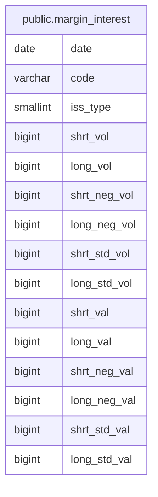

# public.margin_interest

## Columns

| Name         | Type     | Default | Nullable | Children | Parents | Comment |
| ------------ | -------- | ------- | -------- | -------- | ------- | ------- |
| date         | date     |         | false    |          |         |         |
| code         | varchar  |         | false    |          |         |         |
| iss_type     | smallint |         | false    |          |         |         |
| shrt_vol     | bigint   |         | false    |          |         |         |
| long_vol     | bigint   |         | false    |          |         |         |
| shrt_neg_vol | bigint   |         | false    |          |         |         |
| long_neg_vol | bigint   |         | false    |          |         |         |
| shrt_std_vol | bigint   |         | false    |          |         |         |
| long_std_vol | bigint   |         | false    |          |         |         |
| shrt_val     | bigint   |         | true     |          |         |         |
| long_val     | bigint   |         | true     |          |         |         |
| shrt_neg_val | bigint   |         | true     |          |         |         |
| long_neg_val | bigint   |         | true     |          |         |         |
| shrt_std_val | bigint   |         | true     |          |         |         |
| long_std_val | bigint   |         | true     |          |         |         |

## Constraints

| Name                           | Type        | Definition                                |
| ------------------------------ | ----------- | ----------------------------------------- |
| margin_interest_iss_type_check | CHECK       | CHECK ((iss_type = ANY (ARRAY[1, 2, 3]))) |
| margin_interest_pkey           | PRIMARY KEY | PRIMARY KEY (date, code, iss_type)        |

## Indexes

| Name                            | Definition                                                                                                   |
| ------------------------------- | ------------------------------------------------------------------------------------------------------------ |
| margin_interest_pkey            | CREATE UNIQUE INDEX margin_interest_pkey ON public.margin_interest USING btree (date, code, iss_type)        |
| idx_margin_interest_code_date   | CREATE INDEX idx_margin_interest_code_date ON public.margin_interest USING btree (code, date)                |
| idx_margin_interest_code_prefix | CREATE INDEX idx_margin_interest_code_prefix ON public.margin_interest USING btree ("left"((code)::text, 4)) |

## Relations

---

> Generated by [tbls](https://github.com/k1LoW/tbls)
