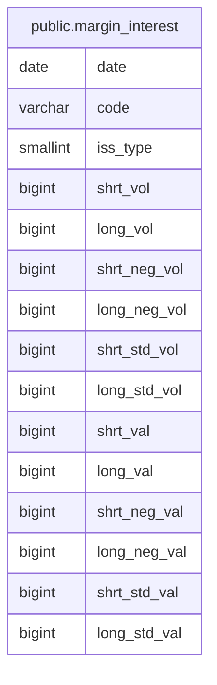

# public.margin_interest

## Description

銘柄ごとの信用取引残高を日付と銘柄区分別に保持する。

## Columns

| Name         | Type     | Default | Nullable | Children | Parents | Comment                                 |
| ------------ | -------- | ------- | -------- | -------- | ------- | --------------------------------------- |
| date         | date     |         | false    |          |         | 信用取引残高の対象日。                  |
| code         | varchar  |         | false    |          |         | 銘柄コード。                            |
| iss_type     | smallint |         | false    |          |         | 信用取引の銘柄区分コード。              |
| shrt_vol     | bigint   |         | false    |          |         | 信用売り残高の数量。                    |
| long_vol     | bigint   |         | false    |          |         | 信用買い残高の数量。                    |
| shrt_neg_vol | bigint   |         | false    |          |         | 信用売り残高の neg 区分数量。           |
| long_neg_vol | bigint   |         | false    |          |         | 信用買い残高の neg 区分数量。           |
| shrt_std_vol | bigint   |         | false    |          |         | 信用売り残高の std 区分数量。           |
| long_std_vol | bigint   |         | false    |          |         | 信用買い残高の std 区分数量。           |
| shrt_val     | bigint   |         | true     |          |         | 信用売り残高に対応する金額。            |
| long_val     | bigint   |         | true     |          |         | 信用買い残高に対応する金額。            |
| shrt_neg_val | bigint   |         | true     |          |         | 信用売り残高の neg 区分に対応する金額。 |
| long_neg_val | bigint   |         | true     |          |         | 信用買い残高の neg 区分に対応する金額。 |
| shrt_std_val | bigint   |         | true     |          |         | 信用売り残高の std 区分に対応する金額。 |
| long_std_val | bigint   |         | true     |          |         | 信用買い残高の std 区分に対応する金額。 |

## Constraints

| Name                           | Type        | Definition                                |
| ------------------------------ | ----------- | ----------------------------------------- |
| margin_interest_iss_type_check | CHECK       | CHECK ((iss_type = ANY (ARRAY[1, 2, 3]))) |
| margin_interest_pkey           | PRIMARY KEY | PRIMARY KEY (date, code, iss_type)        |

## Indexes

| Name                            | Definition                                                                                                   |
| ------------------------------- | ------------------------------------------------------------------------------------------------------------ |
| margin_interest_pkey            | CREATE UNIQUE INDEX margin_interest_pkey ON public.margin_interest USING btree (date, code, iss_type)        |
| idx_margin_interest_code_date   | CREATE INDEX idx_margin_interest_code_date ON public.margin_interest USING btree (code, date)                |
| idx_margin_interest_code_prefix | CREATE INDEX idx_margin_interest_code_prefix ON public.margin_interest USING btree ("left"((code)::text, 4)) |

## Relations

---

> Generated by [tbls](https://github.com/k1LoW/tbls)
