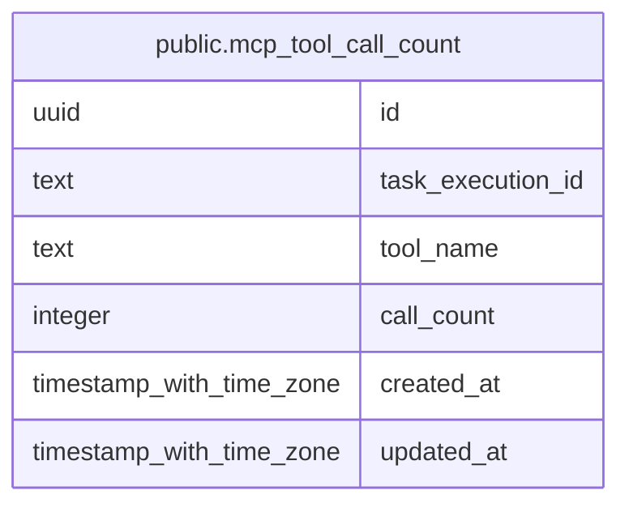

# public.mcp_tool_call_count

## Columns

| Name              | Type                     | Default           | Nullable | Children | Parents | Comment |
| ----------------- | ------------------------ | ----------------- | -------- | -------- | ------- | ------- |
| id                | uuid                     | gen_random_uuid() | false    |          |         |         |
| task_execution_id | text                     |                   | false    |          |         |         |
| tool_name         | text                     |                   | false    |          |         |         |
| call_count        | integer                  |                   | false    |          |         |         |
| created_at        | timestamp with time zone | CURRENT_TIMESTAMP | false    |          |         |         |
| updated_at        | timestamp with time zone | CURRENT_TIMESTAMP | false    |          |         |         |

## Constraints

| Name                     | Type        | Definition       |
| ------------------------ | ----------- | ---------------- |
| mcp_tool_call_count_pkey | PRIMARY KEY | PRIMARY KEY (id) |

## Indexes

| Name                              | Definition                                                                                                                     |
| --------------------------------- | ------------------------------------------------------------------------------------------------------------------------------ |
| mcp_tool_call_count_pkey          | CREATE UNIQUE INDEX mcp_tool_call_count_pkey ON public.mcp_tool_call_count USING btree (id)                                    |
| mcp_tool_call_count_task_tool_idx | CREATE UNIQUE INDEX mcp_tool_call_count_task_tool_idx ON public.mcp_tool_call_count USING btree (task_execution_id, tool_name) |

## Relations

---

> Generated by [tbls](https://github.com/k1LoW/tbls)
