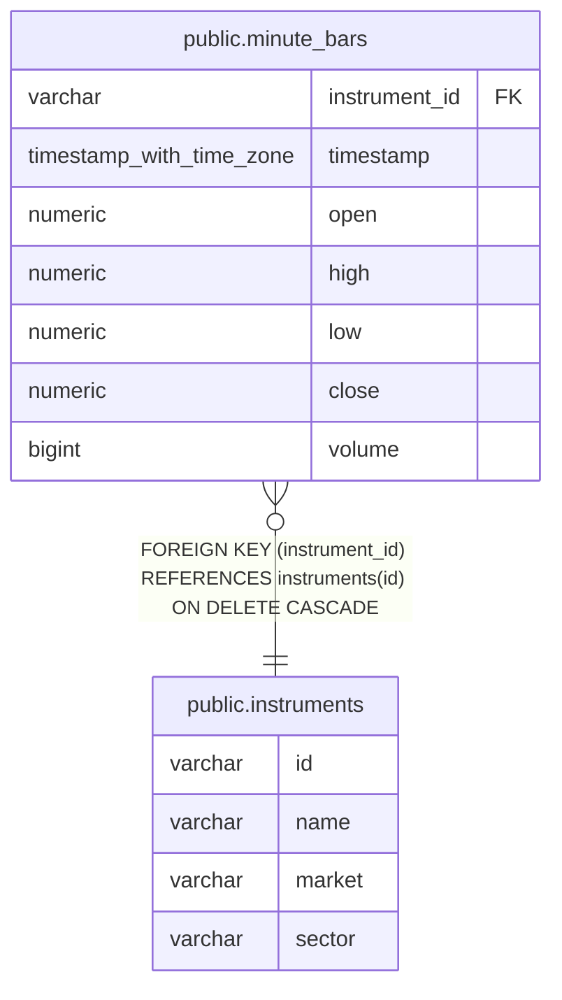

# public.minute_bars

## Description

銘柄ごとの 1 分足価格と出来高を保持する。

## Columns

| Name          | Type                     | Default | Nullable | Children | Parents                                     | Comment         |
| ------------- | ------------------------ | ------- | -------- | -------- | ------------------------------------------- | --------------- |
| instrument_id | varchar                  |         | false    |          | [public.instruments](public.instruments.md) | バーの銘柄 ID。 |
| timestamp     | timestamp with time zone |         | false    |          |                                             | バーの時刻。    |
| open          | numeric                  |         | false    |          |                                             | バーの始値。    |
| high          | numeric                  |         | false    |          |                                             | バーの高値。    |
| low           | numeric                  |         | false    |          |                                             | バーの安値。    |
| close         | numeric                  |         | false    |          |                                             | バーの終値。    |
| volume        | bigint                   |         | false    |          |                                             | バーの出来高。  |

## Constraints

| Name                           | Type        | Definition                                                               |
| ------------------------------ | ----------- | ------------------------------------------------------------------------ |
| minute_bars_instrument_id_fkey | FOREIGN KEY | FOREIGN KEY (instrument_id) REFERENCES instruments(id) ON DELETE CASCADE |
| minute_bars_pkey               | PRIMARY KEY | PRIMARY KEY (instrument_id, "timestamp")                                 |

## Indexes

| Name                      | Definition                                                                                          |
| ------------------------- | --------------------------------------------------------------------------------------------------- |
| minute_bars_pkey          | CREATE UNIQUE INDEX minute_bars_pkey ON public.minute_bars USING btree (instrument_id, "timestamp") |
| minute_bars_timestamp_idx | CREATE INDEX minute_bars_timestamp_idx ON public.minute_bars USING btree ("timestamp" DESC)         |

## Relations

---

> Generated by [tbls](https://github.com/k1LoW/tbls)
