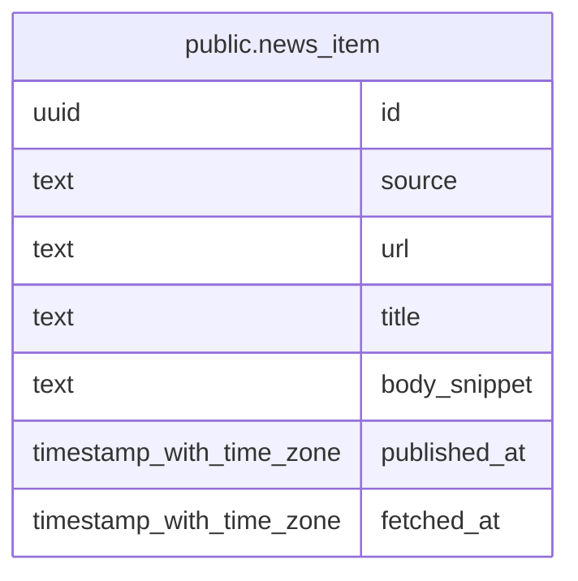

# public.news_item

## Description

RSS フィードなどから取得したニュース記事情報を保持する。

## Columns

| Name         | Type                     | Default           | Nullable | Children | Parents | Comment                                        |
| ------------ | ------------------------ | ----------------- | -------- | -------- | ------- | ---------------------------------------------- |
| id           | uuid                     | gen_random_uuid() | false    |          |         |                                                |
| source       | text                     |                   | false    |          |         | ニュースソースの表示名。                       |
| url          | text                     |                   | false    |          |         | 記事の URL。                                   |
| title        | text                     |                   | false    |          |         | 記事タイトル。                                 |
| body_snippet | text                     |                   | true     |          |         | フィードの説明文から切り出した記事本文の抜粋。 |
| published_at | timestamp with time zone |                   | false    |          |         | 記事の公開日時。                               |
| fetched_at   | timestamp with time zone | CURRENT_TIMESTAMP | false    |          |         | 記事を取得した日時。                           |

## Constraints

| Name              | Type        | Definition       |
| ----------------- | ----------- | ---------------- |
| news_item_pkey    | PRIMARY KEY | PRIMARY KEY (id) |
| news_item_url_key | UNIQUE      | UNIQUE (url)     |

## Indexes

| Name                       | Definition                                                                                  |
| -------------------------- | ------------------------------------------------------------------------------------------- |
| news_item_pkey             | CREATE UNIQUE INDEX news_item_pkey ON public.news_item USING btree (id)                     |
| news_item_url_key          | CREATE UNIQUE INDEX news_item_url_key ON public.news_item USING btree (url)                 |
| news_item_published_at_idx | CREATE INDEX news_item_published_at_idx ON public.news_item USING btree (published_at DESC) |

## Relations

---

> Generated by [tbls](https://github.com/k1LoW/tbls)
