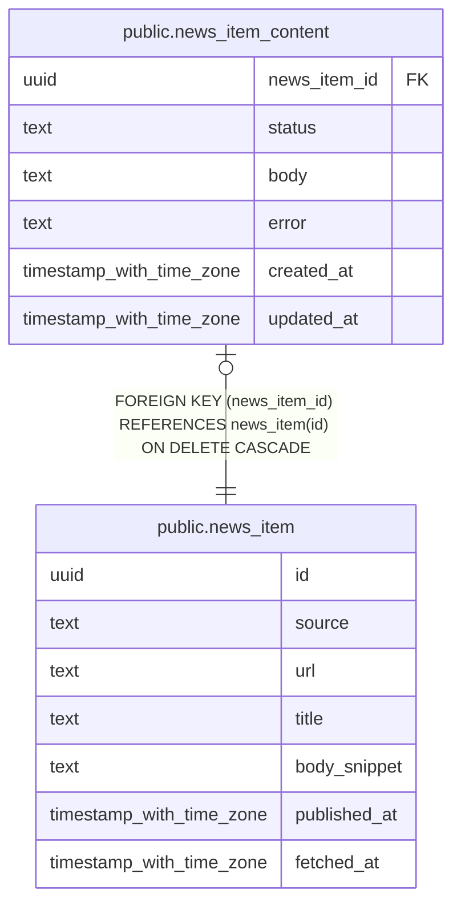

# public.news_item_content

## Description

ニュース記事の本文と取得状態を保持する。

## Columns

| Name         | Type                     | Default           | Nullable | Children | Parents                                 | Comment                                                 |
| ------------ | ------------------------ | ----------------- | -------- | -------- | --------------------------------------- | ------------------------------------------------------- |
| news_item_id | uuid                     |                   | false    |          | [public.news_item](public.news_item.md) | 本文を保持するニュース記事の ID。                       |
| status       | text                     |                   | false    |          |                                         | 本文の取得状態。pending / fetched / failed のいずれか。 |
| body         | text                     |                   | true     |          |                                         | Markdown 形式の記事本文。                               |
| error        | text                     |                   | true     |          |                                         | 本文取得に失敗した理由。                                |
| created_at   | timestamp with time zone | CURRENT_TIMESTAMP | false    |          |                                         |                                                         |
| updated_at   | timestamp with time zone | CURRENT_TIMESTAMP | false    |          |                                         |                                                         |

## Constraints

| Name                                 | Type        | Definition                                                                       |
| ------------------------------------ | ----------- | -------------------------------------------------------------------------------- |
| news_item_content_failed_error_check | CHECK       | CHECK (((status = 'failed'::text) = (error IS NOT NULL)))                        |
| news_item_content_fetched_body_check | CHECK       | CHECK (((status = 'fetched'::text) = (body IS NOT NULL)))                        |
| news_item_content_status_check       | CHECK       | CHECK ((status = ANY (ARRAY['pending'::text, 'fetched'::text, 'failed'::text]))) |
| news_item_content_news_item_id_fkey  | FOREIGN KEY | FOREIGN KEY (news_item_id) REFERENCES news_item(id) ON DELETE CASCADE            |
| news_item_content_pkey               | PRIMARY KEY | PRIMARY KEY (news_item_id)                                                       |

## Indexes

| Name                                     | Definition                                                                                                                                  |
| ---------------------------------------- | ------------------------------------------------------------------------------------------------------------------------------------------- |
| news_item_content_pkey                   | CREATE UNIQUE INDEX news_item_content_pkey ON public.news_item_content USING btree (news_item_id)                                           |
| news_item_content_pending_created_at_idx | CREATE INDEX news_item_content_pending_created_at_idx ON public.news_item_content USING btree (created_at) WHERE (status = 'pending'::text) |

## Relations

---

> Generated by [tbls](https://github.com/k1LoW/tbls)
