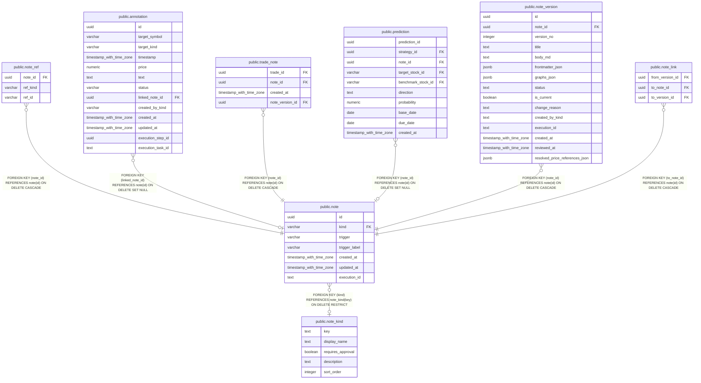

# public.note

## Description

ノートの識別情報と作成時の契機を保持する。本文は note_version に保存する。

## Columns

| Name          | Type                     | Default           | Nullable | Children                                                                                                                                                                                                                                                  | Parents                                 | Comment                                |
| ------------- | ------------------------ | ----------------- | -------- | --------------------------------------------------------------------------------------------------------------------------------------------------------------------------------------------------------------------------------------------------------- | --------------------------------------- | -------------------------------------- |
| id            | uuid                     |                   | false    | [public.note_ref](public.note_ref.md) [public.annotation](public.annotation.md) [public.trade_note](public.trade_note.md) [public.prediction](public.prediction.md) [public.note_version](public.note_version.md) [public.note_link](public.note_link.md) |                                         |                                        |
| kind          | varchar                  |                   | true     |                                                                                                                                                                                                                                                           | [public.note_kind](public.note_kind.md) | note_kind で定義されたノート分類キー。 |
| trigger       | varchar                  |                   | true     |                                                                                                                                                                                                                                                           |                                         | ノートが作成された契機の種別。         |
| trigger_label | varchar                  |                   | true     |                                                                                                                                                                                                                                                           |                                         | ノート作成の契機に付けた表示ラベル。   |
| created_at    | timestamp with time zone | CURRENT_TIMESTAMP | false    |                                                                                                                                                                                                                                                           |                                         |                                        |
| updated_at    | timestamp with time zone | CURRENT_TIMESTAMP | false    |                                                                                                                                                                                                                                                           |                                         |                                        |
| execution_id  | text                     |                   | true     |                                                                                                                                                                                                                                                           |                                         | ノートを作成したタスク実行の識別子。   |

## Constraints

| Name                     | Type        | Definition                                                                                                                                                                                  |
| ------------------------ | ----------- | ------------------------------------------------------------------------------------------------------------------------------------------------------------------------------------------- |
| note_kind_nonblank_check | CHECK       | CHECK (((kind IS NULL) OR ((kind)::text ~ '[^[:space:]]'::text)))                                                                                                                           |
| note_trigger_check       | CHECK       | CHECK (((trigger IS NULL) OR ((trigger)::text = ANY ((ARRAY['hook'::character varying, 'cron'::character varying, 'on-demand'::character varying, 'manual'::character varying])::text[])))) |
| note_pkey                | PRIMARY KEY | PRIMARY KEY (id)                                                                                                                                                                            |
| fk_note_kind             | FOREIGN KEY | FOREIGN KEY (kind) REFERENCES note_kind(key) ON DELETE RESTRICT                                                                                                                             |

## Indexes

| Name                  | Definition                                                                                                           |
| --------------------- | -------------------------------------------------------------------------------------------------------------------- |
| note_pkey             | CREATE UNIQUE INDEX note_pkey ON public.note USING btree (id)                                                        |
| idx_note_execution_id | CREATE UNIQUE INDEX idx_note_execution_id ON public.note USING btree (execution_id) WHERE (execution_id IS NOT NULL) |

## Relations

---

> Generated by [tbls](https://github.com/k1LoW/tbls)
