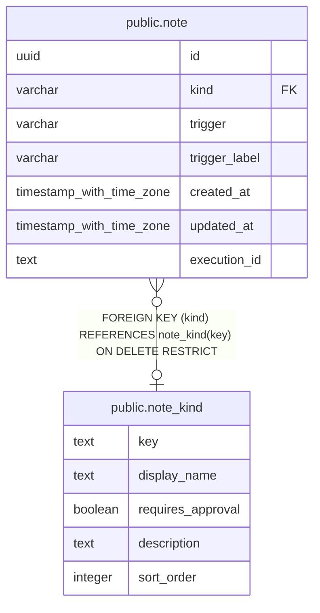

# public.note_kind

## Description

ノートの分類と、その分類に適用するレビュー設定を定義する。

## Columns

| Name              | Type    | Default | Nullable | Children                      | Parents | Comment                                                        |
| ----------------- | ------- | ------- | -------- | ----------------------------- | ------- | -------------------------------------------------------------- |
| key               | text    |         | false    | [public.note](public.note.md) |         | ノート分類を識別するキー。                                     |
| display_name      | text    |         | false    |                               |         | ノート分類の表示名。                                           |
| requires_approval | boolean | false   | false    |                               |         | この分類のエージェント作成バージョンに承認を要求するかどうか。 |
| description       | text    |         | true     |                               |         | ノート分類の説明。                                             |
| sort_order        | integer | 0       | false    |                               |         | 分類一覧の表示順。                                             |

## Constraints

| Name                         | Type        | Definition                           |
| ---------------------------- | ----------- | ------------------------------------ |
| note_kind_key_nonblank_check | CHECK       | CHECK ((key ~ '[^[:space:]]'::text)) |
| note_kind_pkey               | PRIMARY KEY | PRIMARY KEY (key)                    |

## Indexes

| Name           | Definition                                                               |
| -------------- | ------------------------------------------------------------------------ |
| note_kind_pkey | CREATE UNIQUE INDEX note_kind_pkey ON public.note_kind USING btree (key) |

## Relations

---

> Generated by [tbls](https://github.com/k1LoW/tbls)
