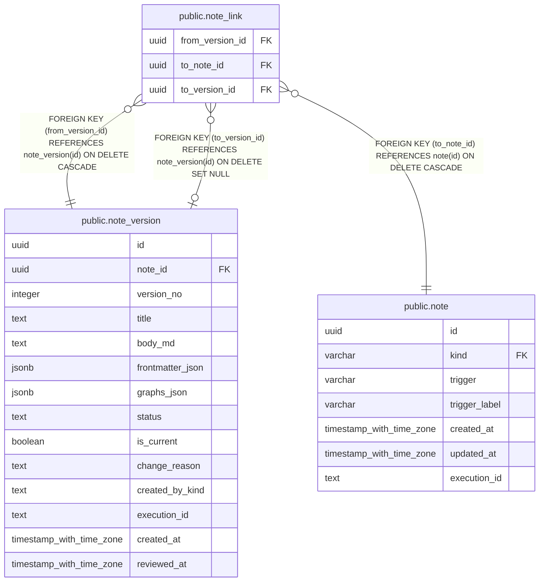

# public.note_link

## Description

ノートバージョン本文から別のノートへのリンクを保持する。

## Columns

| Name            | Type | Default | Nullable | Children | Parents                                       | Comment                                                                           |
| --------------- | ---- | ------- | -------- | -------- | --------------------------------------------- | --------------------------------------------------------------------------------- |
| from_version_id | uuid |         | false    |          | [public.note_version](public.note_version.md) | リンクを記述したノートバージョン。                                                |
| to_note_id      | uuid |         | false    |          | [public.note](public.note.md)                 | リンク先ノート。                                                                  |
| to_version_id   | uuid |         | true     |          | [public.note_version](public.note_version.md) | 固定リンク先のノートバージョン。null の場合はリンク先の現行バージョンに追従する。 |

## Constraints

| Name                           | Type        | Definition                                                                  |
| ------------------------------ | ----------- | --------------------------------------------------------------------------- |
| note_link_to_note_id_fkey      | FOREIGN KEY | FOREIGN KEY (to_note_id) REFERENCES note(id) ON DELETE CASCADE              |
| note_link_from_version_id_fkey | FOREIGN KEY | FOREIGN KEY (from_version_id) REFERENCES note_version(id) ON DELETE CASCADE |
| note_link_to_version_id_fkey   | FOREIGN KEY | FOREIGN KEY (to_version_id) REFERENCES note_version(id) ON DELETE SET NULL  |
| note_link_pkey                 | PRIMARY KEY | PRIMARY KEY (from_version_id, to_note_id)                                   |

## Indexes

| Name                                     | Definition                                                                                                          |
| ---------------------------------------- | ------------------------------------------------------------------------------------------------------------------- |
| note_link_pkey                           | CREATE UNIQUE INDEX note_link_pkey ON public.note_link USING btree (from_version_id, to_note_id)                    |
| idx_note_link_to_note_id_from_version_id | CREATE INDEX idx_note_link_to_note_id_from_version_id ON public.note_link USING btree (to_note_id, from_version_id) |
| idx_note_link_to_version_id              | CREATE INDEX idx_note_link_to_version_id ON public.note_link USING btree (to_version_id)                            |

## Relations

---

> Generated by [tbls](https://github.com/k1LoW/tbls)
