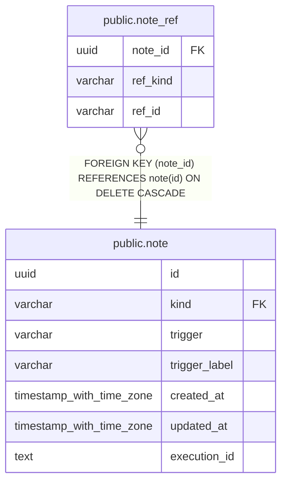

# public.note_ref

## Description

ノート本文やグラフから抽出した一級参照へのリンクを保持する。

## Columns

| Name     | Type    | Default | Nullable | Children | Parents                       | Comment                                                                  |
| -------- | ------- | ------- | -------- | -------- | ----------------------------- | ------------------------------------------------------------------------ |
| note_id  | uuid    |         | false    |          | [public.note](public.note.md) | 参照を含むノート。                                                       |
| ref_kind | varchar |         | false    |          |                               | 参照先の型。stock / indicator / group のいずれか。                       |
| ref_id   | varchar |         | false    |          |                               | 参照先を識別する ID。group は分類軸 key とグループ key を / で連結する。 |

## Constraints

| Name                    | Type        | Definition                                                                                                                                 |
| ----------------------- | ----------- | ------------------------------------------------------------------------------------------------------------------------------------------ |
| note_ref_ref_kind_check | CHECK       | CHECK (((ref_kind)::text = ANY ((ARRAY['stock'::character varying, 'indicator'::character varying, 'group'::character varying])::text[]))) |
| note_ref_note_id_fkey   | FOREIGN KEY | FOREIGN KEY (note_id) REFERENCES note(id) ON DELETE CASCADE                                                                                |
| note_ref_pkey           | PRIMARY KEY | PRIMARY KEY (note_id, ref_kind, ref_id)                                                                                                    |

## Indexes

| Name                 | Definition                                                                                   |
| -------------------- | -------------------------------------------------------------------------------------------- |
| note_ref_pkey        | CREATE UNIQUE INDEX note_ref_pkey ON public.note_ref USING btree (note_id, ref_kind, ref_id) |
| idx_note_ref_kind_id | CREATE INDEX idx_note_ref_kind_id ON public.note_ref USING btree (ref_kind, ref_id)          |

## Relations

---

> Generated by [tbls](https://github.com/k1LoW/tbls)
