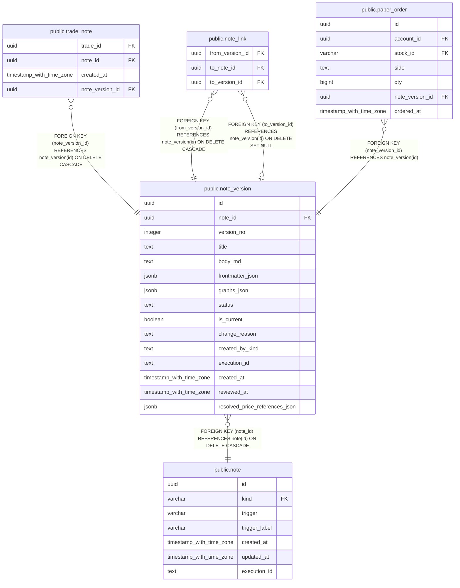

# public.note_version

## Description

ノートの本文・メタデータとレビュー状態をバージョンごとに保持する。

## Columns

| Name                           | Type                     | Default           | Nullable | Children                                                                                                                      | Parents                       | Comment                                            |
| ------------------------------ | ------------------------ | ----------------- | -------- | ----------------------------------------------------------------------------------------------------------------------------- | ----------------------------- | -------------------------------------------------- |
| id                             | uuid                     | gen_random_uuid() | false    | [public.trade_note](public.trade_note.md) [public.note_link](public.note_link.md) [public.paper_order](public.paper_order.md) |                               |                                                    |
| note_id                        | uuid                     |                   | false    |                                                                                                                               | [public.note](public.note.md) | このバージョンが属するノート。                     |
| version_no                     | integer                  |                   | false    |                                                                                                                               |                               | ノート内で連番となるバージョン番号。               |
| title                          | text                     |                   | false    |                                                                                                                               |                               | ノートのタイトル。                                 |
| body_md                        | text                     |                   | false    |                                                                                                                               |                               | ノート本文の Markdown。                            |
| frontmatter_json               | jsonb                    | '{}'::jsonb       | false    |                                                                                                                               |                               | ノートに付随する構造化メタデータ。                 |
| graphs_json                    | jsonb                    | '[]'::jsonb       | false    |                                                                                                                               |                               | ノートに付随するグラフ定義の配列。                 |
| status                         | text                     | 'unread'::text    | false    |                                                                                                                               |                               | このバージョンのレビュー状態。                     |
| is_current                     | boolean                  | false             | false    |                                                                                                                               |                               | ノートの現行バージョンかどうか。                   |
| change_reason                  | text                     |                   | true     |                                                                                                                               |                               | バージョン更新の理由。                             |
| created_by_kind                | text                     |                   | false    |                                                                                                                               |                               | バージョンを作成した主体の種別。                   |
| execution_id                   | text                     |                   | true     |                                                                                                                               |                               | バージョンを作成したタスク実行の識別子。           |
| created_at                     | timestamp with time zone | CURRENT_TIMESTAMP | false    |                                                                                                                               |                               |                                                    |
| reviewed_at                    | timestamp with time zone |                   | true     |                                                                                                                               |                               | このバージョンをレビューした時刻。                 |
| resolved_price_references_json | jsonb                    | '{}'::jsonb       | false    |                                                                                                                               |                               | 本文中の価格参照リンクと実行時に解決した値の対応。 |

## Constraints

| Name                               | Type        | Definition                                                                                             |
| ---------------------------------- | ----------- | ------------------------------------------------------------------------------------------------------ |
| note_version_created_by_kind_check | CHECK       | CHECK ((created_by_kind = ANY (ARRAY['human'::text, 'llm'::text])))                                    |
| note_version_status_check          | CHECK       | CHECK ((status = ANY (ARRAY['approved'::text, 'unread'::text, 'rejected'::text, 'superseded'::text]))) |
| note_version_note_id_fkey          | FOREIGN KEY | FOREIGN KEY (note_id) REFERENCES note(id) ON DELETE CASCADE                                            |
| note_version_pkey                  | PRIMARY KEY | PRIMARY KEY (id)                                                                                       |

## Indexes

| Name                                | Definition                                                                                                          |
| ----------------------------------- | ------------------------------------------------------------------------------------------------------------------- |
| note_version_pkey                   | CREATE UNIQUE INDEX note_version_pkey ON public.note_version USING btree (id)                                       |
| note_version_note_id_version_no_key | CREATE UNIQUE INDEX note_version_note_id_version_no_key ON public.note_version USING btree (note_id, version_no)    |
| idx_note_version_current            | CREATE UNIQUE INDEX idx_note_version_current ON public.note_version USING btree (note_id) WHERE (is_current = true) |

## Relations

---

> Generated by [tbls](https://github.com/k1LoW/tbls)
