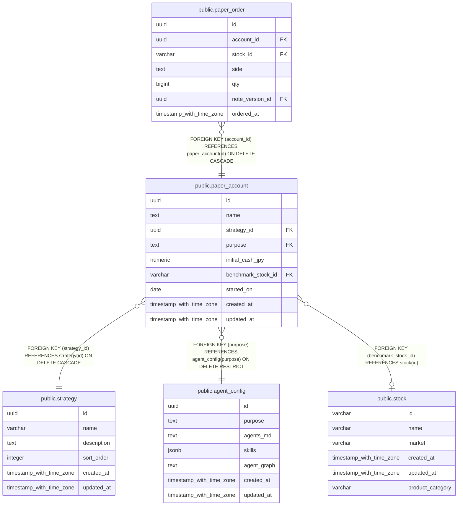

# public.paper_account

## Description

戦略と agent 設定ごとの仮想取引口座を保持する。

## Columns

| Name               | Type                     | Default           | Nullable | Children                                    | Parents                                       | Comment                               |
| ------------------ | ------------------------ | ----------------- | -------- | ------------------------------------------- | --------------------------------------------- | ------------------------------------- |
| id                 | uuid                     | gen_random_uuid() | false    | [public.paper_order](public.paper_order.md) |                                               |                                       |
| name               | text                     |                   | false    |                                             |                                               | 口座を識別する一意な名前。            |
| strategy_id        | uuid                     |                   | false    |                                             | [public.strategy](public.strategy.md)         | 口座が属する戦略。                    |
| purpose            | text                     |                   | false    |                                             | [public.agent_config](public.agent_config.md) | 口座を紐づける agent 設定の目的キー。 |
| initial_cash_jpy   | numeric                  |                   | false    |                                             |                                               | 口座の開始時点の現金。単位は円。      |
| benchmark_stock_id | varchar                  |                   | true     |                                             | [public.stock](public.stock.md)               | 成績比較に使う銘柄。                  |
| started_on         | date                     |                   | false    |                                             |                                               | 口座の運用開始日。                    |
| created_at         | timestamp with time zone | CURRENT_TIMESTAMP | false    |                                             |                                               |                                       |
| updated_at         | timestamp with time zone | CURRENT_TIMESTAMP | false    |                                             |                                               |                                       |

## Constraints

| Name                                  | Type        | Definition                                                                |
| ------------------------------------- | ----------- | ------------------------------------------------------------------------- |
| paper_account_initial_cash_jpy_check  | CHECK       | CHECK ((initial_cash_jpy > (0)::numeric))                                 |
| paper_account_strategy_id_fkey        | FOREIGN KEY | FOREIGN KEY (strategy_id) REFERENCES strategy(id) ON DELETE CASCADE       |
| paper_account_benchmark_stock_id_fkey | FOREIGN KEY | FOREIGN KEY (benchmark_stock_id) REFERENCES stock(id)                     |
| paper_account_purpose_fkey            | FOREIGN KEY | FOREIGN KEY (purpose) REFERENCES agent_config(purpose) ON DELETE RESTRICT |
| paper_account_pkey                    | PRIMARY KEY | PRIMARY KEY (id)                                                          |
| paper_account_name_key                | UNIQUE      | UNIQUE (name)                                                             |

## Indexes

| Name                                 | Definition                                                                                                         |
| ------------------------------------ | ------------------------------------------------------------------------------------------------------------------ |
| paper_account_pkey                   | CREATE UNIQUE INDEX paper_account_pkey ON public.paper_account USING btree (id)                                    |
| paper_account_name_key               | CREATE UNIQUE INDEX paper_account_name_key ON public.paper_account USING btree (name)                              |
| uidx_paper_account_strategy_purpose  | CREATE UNIQUE INDEX uidx_paper_account_strategy_purpose ON public.paper_account USING btree (strategy_id, purpose) |
| idx_paper_account_purpose            | CREATE INDEX idx_paper_account_purpose ON public.paper_account USING btree (purpose)                               |
| idx_paper_account_benchmark_stock_id | CREATE INDEX idx_paper_account_benchmark_stock_id ON public.paper_account USING btree (benchmark_stock_id)         |

## Relations

---

> Generated by [tbls](https://github.com/k1LoW/tbls)
