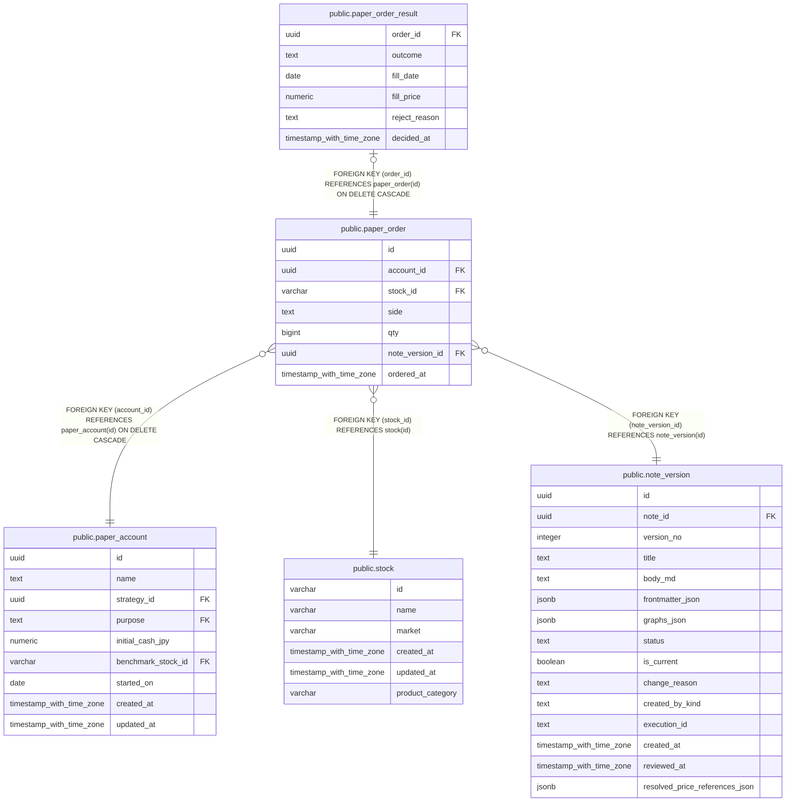

# public.paper_order

## Description

仮想口座に対して記録した不変の売買注文を保持する。

## Columns

| Name            | Type                     | Default           | Nullable | Children                                                  | Parents                                         | Comment                                    |
| --------------- | ------------------------ | ----------------- | -------- | --------------------------------------------------------- | ----------------------------------------------- | ------------------------------------------ |
| id              | uuid                     | gen_random_uuid() | false    | [public.paper_order_result](public.paper_order_result.md) |                                                 |                                            |
| account_id      | uuid                     |                   | false    |                                                           | [public.paper_account](public.paper_account.md) | 注文を記録した仮想口座。                   |
| stock_id        | varchar                  |                   | false    |                                                           | [public.stock](public.stock.md)                 | 注文対象の日本株。                         |
| side            | text                     |                   | false    |                                                           |                                                 | 買い注文または売り注文。                   |
| qty             | bigint                   |                   | false    |                                                           |                                                 | 注文数量。                                 |
| note_version_id | uuid                     |                   | false    |                                                           | [public.note_version](public.note_version.md)   | 注文の根拠として記録したノートバージョン。 |
| ordered_at      | timestamp with time zone | CURRENT_TIMESTAMP | false    |                                                           |                                                 | 注文を記録した時刻。                       |

## Constraints

| Name                             | Type        | Definition                                                              |
| -------------------------------- | ----------- | ----------------------------------------------------------------------- |
| paper_order_qty_check            | CHECK       | CHECK (((qty > 0) AND ((qty % (100)::bigint) = 0)))                     |
| paper_order_side_check           | CHECK       | CHECK ((side = ANY (ARRAY['buy'::text, 'sell'::text])))                 |
| paper_order_stock_id_fkey        | FOREIGN KEY | FOREIGN KEY (stock_id) REFERENCES stock(id)                             |
| paper_order_note_version_id_fkey | FOREIGN KEY | FOREIGN KEY (note_version_id) REFERENCES note_version(id)               |
| paper_order_account_id_fkey      | FOREIGN KEY | FOREIGN KEY (account_id) REFERENCES paper_account(id) ON DELETE CASCADE |
| paper_order_pkey                 | PRIMARY KEY | PRIMARY KEY (id)                                                        |

## Indexes

| Name                               | Definition                                                                                                 |
| ---------------------------------- | ---------------------------------------------------------------------------------------------------------- |
| paper_order_pkey                   | CREATE UNIQUE INDEX paper_order_pkey ON public.paper_order USING btree (id)                                |
| idx_paper_order_account_ordered_at | CREATE INDEX idx_paper_order_account_ordered_at ON public.paper_order USING btree (account_id, ordered_at) |
| idx_paper_order_stock_id           | CREATE INDEX idx_paper_order_stock_id ON public.paper_order USING btree (stock_id)                         |
| idx_paper_order_note_version_id    | CREATE INDEX idx_paper_order_note_version_id ON public.paper_order USING btree (note_version_id)           |

## Relations

---

> Generated by [tbls](https://github.com/k1LoW/tbls)
