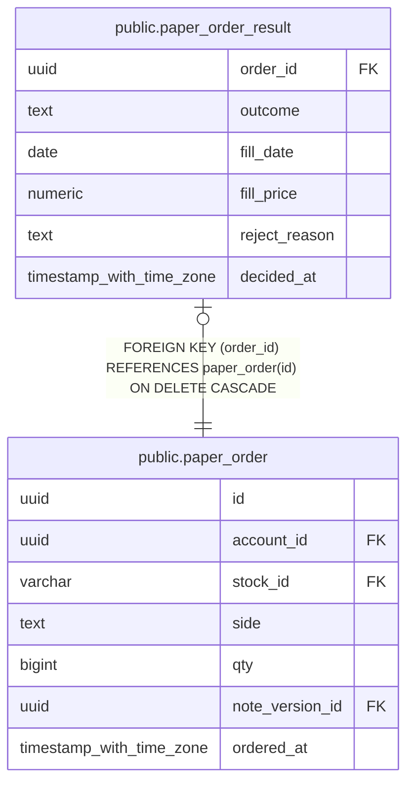

# public.paper_order_result

## Description

仮想注文を約定または却下した結果を保持する。

## Columns

| Name          | Type                     | Default | Nullable | Children | Parents                                     | Comment                              |
| ------------- | ------------------------ | ------- | -------- | -------- | ------------------------------------------- | ------------------------------------ |
| order_id      | uuid                     |         | false    |          | [public.paper_order](public.paper_order.md) | 判定した注文。                       |
| outcome       | text                     |         | false    |          |                                             | 注文が約定したか却下されたかを表す。 |
| fill_date     | date                     |         | true     |          |                                             | 注文が約定した日。                   |
| fill_price    | numeric                  |         | true     |          |                                             | 日足の始値を使った約定単価。         |
| reject_reason | text                     |         | true     |          |                                             | 注文を却下した理由。                 |
| decided_at    | timestamp with time zone |         | false    |          |                                             | 注文結果を確定した時刻。             |

## Constraints

| Name                             | Type        | Definition                                                                                                                                                                                                                                         |
| -------------------------------- | ----------- | -------------------------------------------------------------------------------------------------------------------------------------------------------------------------------------------------------------------------------------------------- |
| paper_order_result_check         | CHECK       | CHECK ((((outcome = 'filled'::text) AND ((fill_date IS NOT NULL) AND (fill_price IS NOT NULL) AND (reject_reason IS NULL))) OR ((outcome = 'rejected'::text) AND ((fill_date IS NULL) AND (fill_price IS NULL) AND (reject_reason IS NOT NULL))))) |
| paper_order_result_outcome_check | CHECK       | CHECK ((outcome = ANY (ARRAY['filled'::text, 'rejected'::text])))                                                                                                                                                                                  |
| paper_order_result_order_id_fkey | FOREIGN KEY | FOREIGN KEY (order_id) REFERENCES paper_order(id) ON DELETE CASCADE                                                                                                                                                                                |
| paper_order_result_pkey          | PRIMARY KEY | PRIMARY KEY (order_id)                                                                                                                                                                                                                             |

## Indexes

| Name                    | Definition                                                                                      |
| ----------------------- | ----------------------------------------------------------------------------------------------- |
| paper_order_result_pkey | CREATE UNIQUE INDEX paper_order_result_pkey ON public.paper_order_result USING btree (order_id) |

## Relations

---

> Generated by [tbls](https://github.com/k1LoW/tbls)
