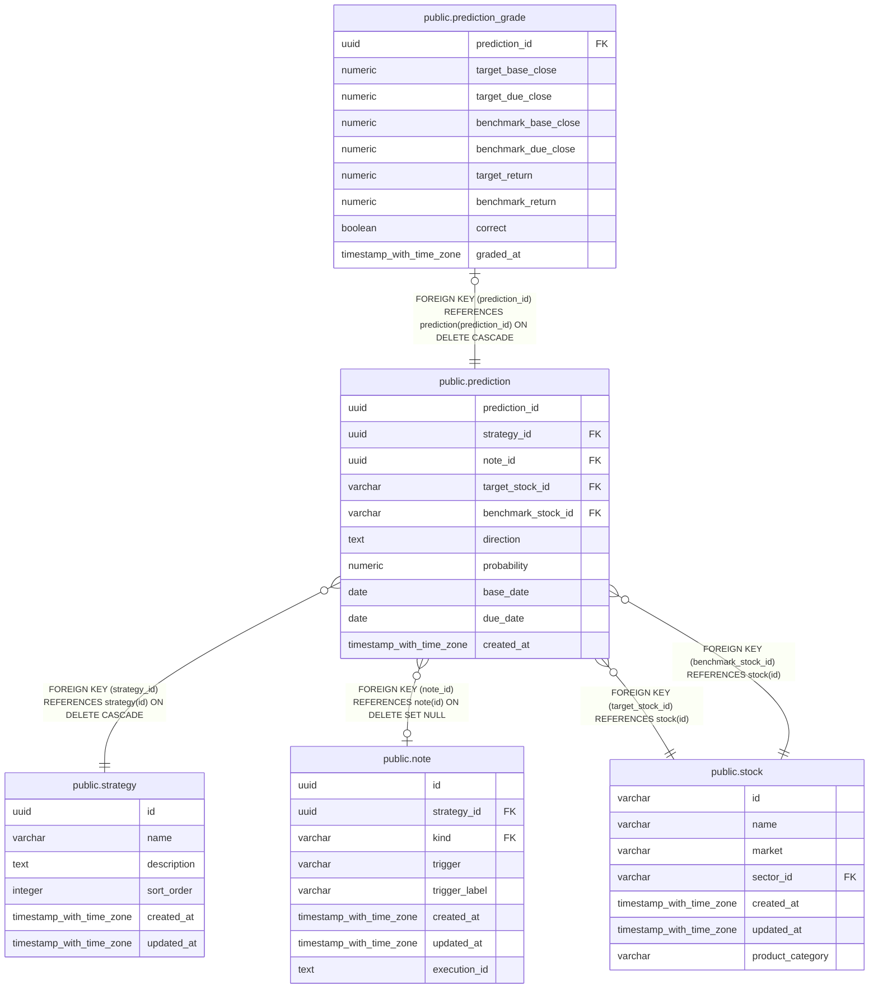

# public.prediction

## Description

戦略に記録した、対象銘柄と比較銘柄の将来リターンに関する予測。

## Columns

| Name               | Type                     | Default           | Nullable | Children                                              | Parents                               | Comment                                      |
| ------------------ | ------------------------ | ----------------- | -------- | ----------------------------------------------------- | ------------------------------------- | -------------------------------------------- |
| prediction_id      | uuid                     |                   | false    | [public.prediction_grade](public.prediction_grade.md) |                                       | 予測を識別する ID。                          |
| strategy_id        | uuid                     |                   | false    |                                                       | [public.strategy](public.strategy.md) | 予測を所有する戦略。                         |
| note_id            | uuid                     |                   | true     |                                                       | [public.note](public.note.md)         | 予測の根拠として関連付けたノート。           |
| target_stock_id    | varchar                  |                   | false    |                                                       | [public.stock](public.stock.md)       | 比較対象となる銘柄の ID。                    |
| benchmark_stock_id | varchar                  |                   | false    |                                                       | [public.stock](public.stock.md)       | リターンを比較する銘柄の ID。                |
| direction          | text                     |                   | false    |                                                       |                                       | 対象銘柄が比較銘柄を上回るか下回るかの予測。 |
| probability        | numeric                  |                   | false    |                                                       |                                       | 予測した方向が実現する確率。                 |
| base_date          | date                     |                   | false    |                                                       |                                       | 比較の起点とする終値の日付。                 |
| due_date           | date                     |                   | false    |                                                       |                                       | 比較の終点とする終値の日付。                 |
| created_at         | timestamp with time zone | CURRENT_TIMESTAMP | false    |                                                       |                                       |                                              |

## Constraints

| Name                               | Type        | Definition                                                                      |
| ---------------------------------- | ----------- | ------------------------------------------------------------------------------- |
| prediction_check                   | CHECK       | CHECK (((target_stock_id)::text <> (benchmark_stock_id)::text))                 |
| prediction_check1                  | CHECK       | CHECK ((due_date > base_date))                                                  |
| prediction_direction_check         | CHECK       | CHECK ((direction = ANY (ARRAY['outperform'::text, 'underperform'::text])))     |
| prediction_probability_check       | CHECK       | CHECK ((probability = ANY (ARRAY[0.55, 0.6, 0.65, 0.7, 0.75, 0.8, 0.85, 0.9]))) |
| prediction_strategy_id_fkey        | FOREIGN KEY | FOREIGN KEY (strategy_id) REFERENCES strategy(id) ON DELETE CASCADE             |
| prediction_benchmark_stock_id_fkey | FOREIGN KEY | FOREIGN KEY (benchmark_stock_id) REFERENCES stock(id)                           |
| prediction_target_stock_id_fkey    | FOREIGN KEY | FOREIGN KEY (target_stock_id) REFERENCES stock(id)                              |
| prediction_note_id_fkey            | FOREIGN KEY | FOREIGN KEY (note_id) REFERENCES note(id) ON DELETE SET NULL                    |
| prediction_pkey                    | PRIMARY KEY | PRIMARY KEY (prediction_id)                                                     |

## Indexes

| Name                        | Definition                                                                                        |
| --------------------------- | ------------------------------------------------------------------------------------------------- |
| prediction_pkey             | CREATE UNIQUE INDEX prediction_pkey ON public.prediction USING btree (prediction_id)              |
| idx_prediction_strategy_due | CREATE INDEX idx_prediction_strategy_due ON public.prediction USING btree (strategy_id, due_date) |

## Relations

---

> Generated by [tbls](https://github.com/k1LoW/tbls)
