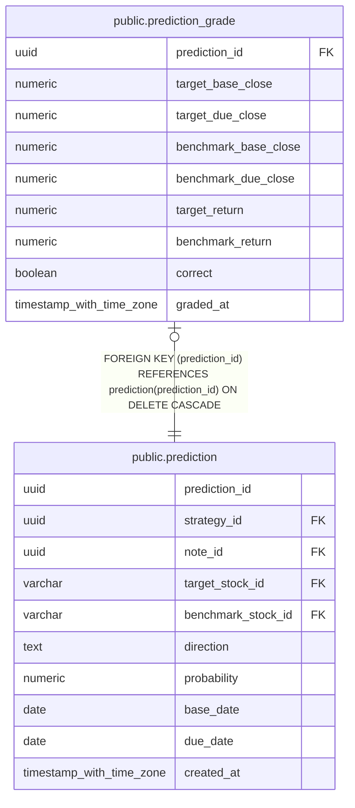

# public.prediction_grade

## Columns

| Name                 | Type                     | Default           | Nullable | Children | Parents                                   | Comment |
| -------------------- | ------------------------ | ----------------- | -------- | -------- | ----------------------------------------- | ------- |
| prediction_id        | uuid                     |                   | false    |          | [public.prediction](public.prediction.md) |         |
| target_base_close    | numeric                  |                   | false    |          |                                           |         |
| target_due_close     | numeric                  |                   | false    |          |                                           |         |
| benchmark_base_close | numeric                  |                   | false    |          |                                           |         |
| benchmark_due_close  | numeric                  |                   | false    |          |                                           |         |
| target_return        | numeric                  |                   | false    |          |                                           |         |
| benchmark_return     | numeric                  |                   | false    |          |                                           |         |
| correct              | boolean                  |                   | false    |          |                                           |         |
| graded_at            | timestamp with time zone | CURRENT_TIMESTAMP | false    |          |                                           |         |

## Constraints

| Name                                | Type        | Definition                                                                         |
| ----------------------------------- | ----------- | ---------------------------------------------------------------------------------- |
| prediction_grade_prediction_id_fkey | FOREIGN KEY | FOREIGN KEY (prediction_id) REFERENCES prediction(prediction_id) ON DELETE CASCADE |
| prediction_grade_pkey               | PRIMARY KEY | PRIMARY KEY (prediction_id)                                                        |

## Indexes

| Name                  | Definition                                                                                       |
| --------------------- | ------------------------------------------------------------------------------------------------ |
| prediction_grade_pkey | CREATE UNIQUE INDEX prediction_grade_pkey ON public.prediction_grade USING btree (prediction_id) |

## Relations

---

> Generated by [tbls](https://github.com/k1LoW/tbls)
