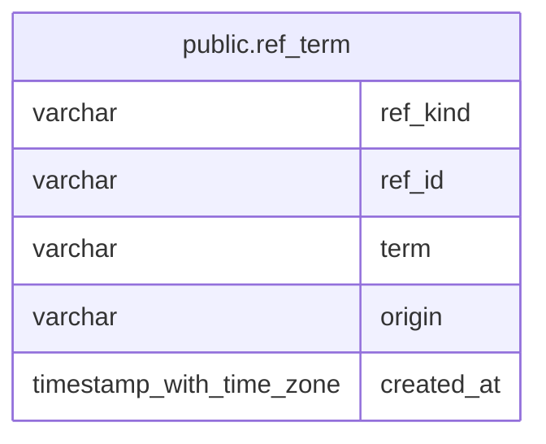

# public.ref_term

## Description

銘柄・指標・業種・テーマに対する別名を保持する。

## Columns

| Name       | Type                     | Default           | Nullable | Children | Parents | Comment                      |
| ---------- | ------------------------ | ----------------- | -------- | -------- | ------- | ---------------------------- |
| ref_kind   | varchar                  |                   | false    |          |         | 別名が指す参照種別。         |
| ref_id     | varchar                  |                   | false    |          |         | 別名が指す参照先 ID。        |
| term       | varchar                  |                   | false    |          |         | 参照先を検索するための別名。 |
| origin     | varchar                  |                   | false    |          |         | 別名を登録した主体の種別。   |
| created_at | timestamp with time zone | CURRENT_TIMESTAMP | false    |          |         |                              |

## Constraints

| Name                    | Type        | Definition                                                                                                                                                              |
| ----------------------- | ----------- | ----------------------------------------------------------------------------------------------------------------------------------------------------------------------- |
| ref_term_origin_check   | CHECK       | CHECK (((origin)::text = ANY ((ARRAY['human'::character varying, 'llm'::character varying])::text[])))                                                                  |
| ref_term_ref_kind_check | CHECK       | CHECK (((ref_kind)::text = ANY ((ARRAY['stock'::character varying, 'indicator'::character varying, 'sector'::character varying, 'theme'::character varying])::text[]))) |
| ref_term_pkey           | PRIMARY KEY | PRIMARY KEY (ref_kind, ref_id, term)                                                                                                                                    |

## Indexes

| Name          | Definition                                                                                |
| ------------- | ----------------------------------------------------------------------------------------- |
| ref_term_pkey | CREATE UNIQUE INDEX ref_term_pkey ON public.ref_term USING btree (ref_kind, ref_id, term) |

## Relations

---

> Generated by [tbls](https://github.com/k1LoW/tbls)
