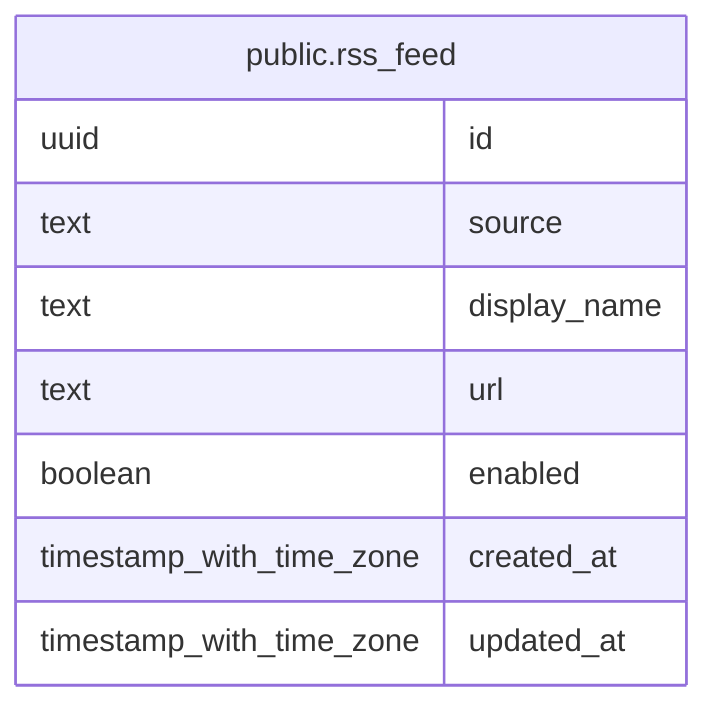

# public.rss_feed

## Columns

| Name         | Type                     | Default           | Nullable | Children | Parents | Comment |
| ------------ | ------------------------ | ----------------- | -------- | -------- | ------- | ------- |
| id           | uuid                     | gen_random_uuid() | false    |          |         |         |
| source       | text                     |                   | false    |          |         |         |
| display_name | text                     |                   | false    |          |         |         |
| url          | text                     |                   | false    |          |         |         |
| enabled      | boolean                  | true              | false    |          |         |         |
| created_at   | timestamp with time zone | CURRENT_TIMESTAMP | false    |          |         |         |
| updated_at   | timestamp with time zone | CURRENT_TIMESTAMP | false    |          |         |         |

## Constraints

| Name                | Type        | Definition       |
| ------------------- | ----------- | ---------------- |
| rss_feed_pkey       | PRIMARY KEY | PRIMARY KEY (id) |
| rss_feed_source_key | UNIQUE      | UNIQUE (source)  |

## Indexes

| Name                | Definition                                                                      |
| ------------------- | ------------------------------------------------------------------------------- |
| rss_feed_pkey       | CREATE UNIQUE INDEX rss_feed_pkey ON public.rss_feed USING btree (id)           |
| rss_feed_source_key | CREATE UNIQUE INDEX rss_feed_source_key ON public.rss_feed USING btree (source) |

## Relations

---

> Generated by [tbls](https://github.com/k1LoW/tbls)
