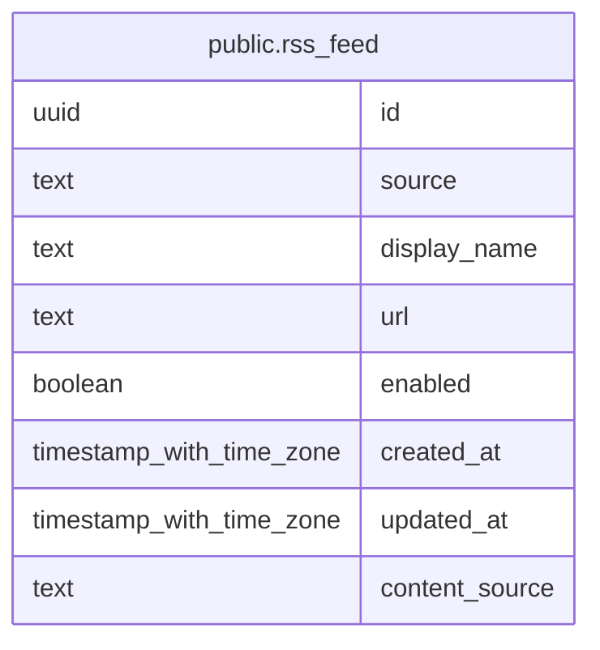

# public.rss_feed

## Description

ニュース取り込み元となる RSS フィードを管理する。

## Columns

| Name           | Type                     | Default           | Nullable | Children | Parents | Comment                                        |
| -------------- | ------------------------ | ----------------- | -------- | -------- | ------- | ---------------------------------------------- |
| id             | uuid                     | gen_random_uuid() | false    |          |         |                                                |
| source         | text                     |                   | false    |          |         | フィードを識別するキー。                       |
| display_name   | text                     |                   | false    |          |         | フィードの表示名。                             |
| url            | text                     |                   | false    |          |         | RSS フィードの URL。                           |
| enabled        | boolean                  | true              | false    |          |         | フィードを取り込み対象とするかどうか。         |
| created_at     | timestamp with time zone | CURRENT_TIMESTAMP | false    |          |         |                                                |
| updated_at     | timestamp with time zone | CURRENT_TIMESTAMP | false    |          |         |                                                |
| content_source | text                     | 'none'::text      | false    |          |         | 本文の取得元。none / feed / crawl のいずれか。 |

## Constraints

| Name                          | Type        | Definition                                                                        |
| ----------------------------- | ----------- | --------------------------------------------------------------------------------- |
| rss_feed_content_source_check | CHECK       | CHECK ((content_source = ANY (ARRAY['none'::text, 'feed'::text, 'crawl'::text]))) |
| rss_feed_pkey                 | PRIMARY KEY | PRIMARY KEY (id)                                                                  |
| rss_feed_source_key           | UNIQUE      | UNIQUE (source)                                                                   |

## Indexes

| Name                | Definition                                                                      |
| ------------------- | ------------------------------------------------------------------------------- |
| rss_feed_pkey       | CREATE UNIQUE INDEX rss_feed_pkey ON public.rss_feed USING btree (id)           |
| rss_feed_source_key | CREATE UNIQUE INDEX rss_feed_source_key ON public.rss_feed USING btree (source) |

## Relations

---

> Generated by [tbls](https://github.com/k1LoW/tbls)
