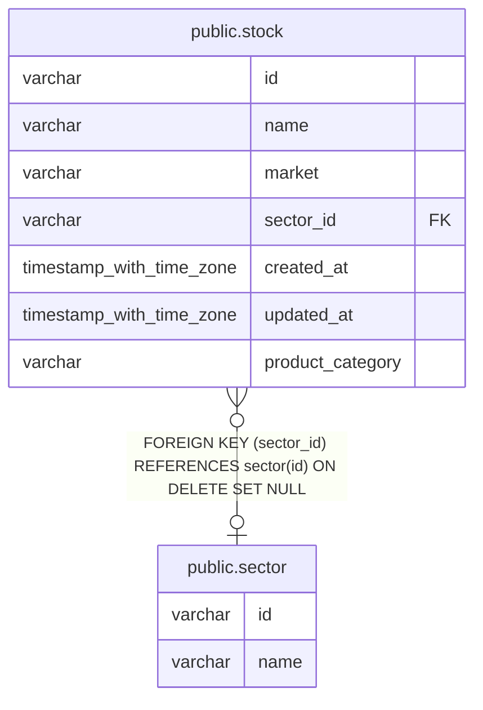

# public.sector

## Columns

| Name | Type    | Default | Nullable | Children                        | Parents | Comment |
| ---- | ------- | ------- | -------- | ------------------------------- | ------- | ------- |
| id   | varchar |         | false    | [public.stock](public.stock.md) |         |         |
| name | varchar |         | false    |                                 |         |         |

## Constraints

| Name        | Type        | Definition       |
| ----------- | ----------- | ---------------- |
| sector_pkey | PRIMARY KEY | PRIMARY KEY (id) |

## Indexes

| Name        | Definition                                                        |
| ----------- | ----------------------------------------------------------------- |
| sector_pkey | CREATE UNIQUE INDEX sector_pkey ON public.sector USING btree (id) |

## Relations

---

> Generated by [tbls](https://github.com/k1LoW/tbls)
