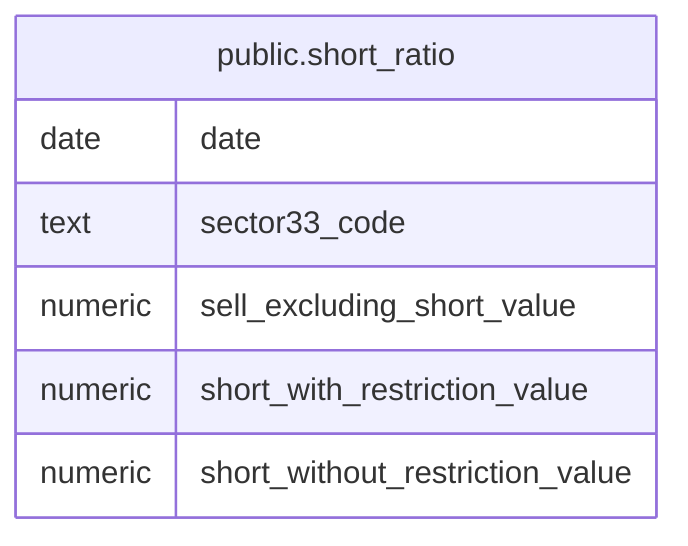

# public.short_ratio

## Columns

| Name                            | Type    | Default | Nullable | Children | Parents | Comment |
| ------------------------------- | ------- | ------- | -------- | -------- | ------- | ------- |
| date                            | date    |         | false    |          |         |         |
| sector33_code                   | text    |         | false    |          |         |         |
| sell_excluding_short_value      | numeric |         | true     |          |         |         |
| short_with_restriction_value    | numeric |         | true     |          |         |         |
| short_without_restriction_value | numeric |         | true     |          |         |         |

## Constraints

| Name             | Type        | Definition                        |
| ---------------- | ----------- | --------------------------------- |
| short_ratio_pkey | PRIMARY KEY | PRIMARY KEY (date, sector33_code) |

## Indexes

| Name                               | Definition                                                                                              |
| ---------------------------------- | ------------------------------------------------------------------------------------------------------- |
| short_ratio_pkey                   | CREATE UNIQUE INDEX short_ratio_pkey ON public.short_ratio USING btree (date, sector33_code)            |
| idx_short_ratio_sector33_code_date | CREATE INDEX idx_short_ratio_sector33_code_date ON public.short_ratio USING btree (sector33_code, date) |

## Relations

---

> Generated by [tbls](https://github.com/k1LoW/tbls)
